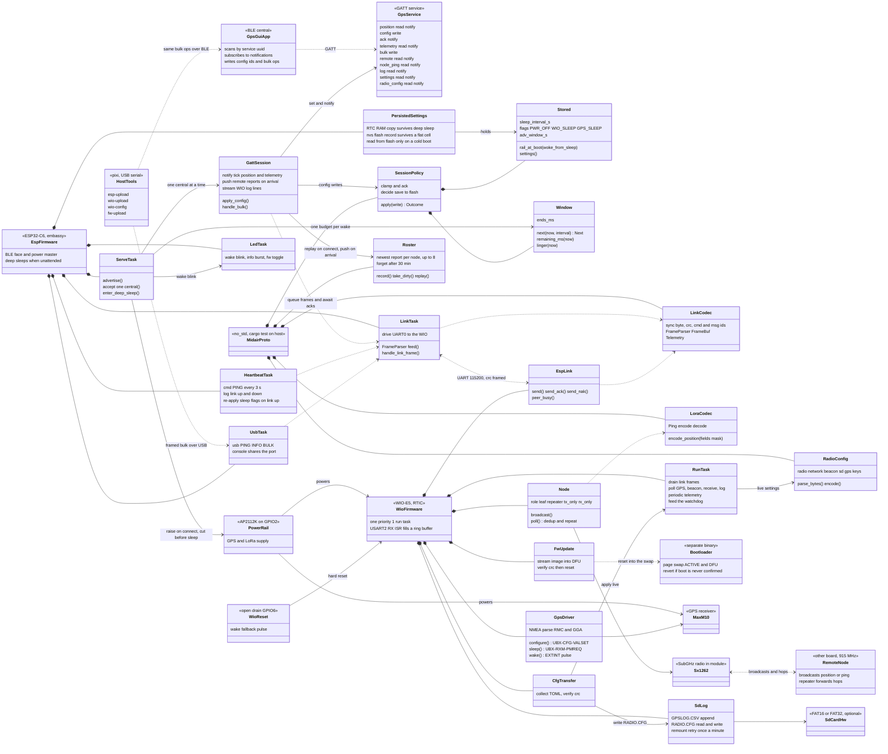
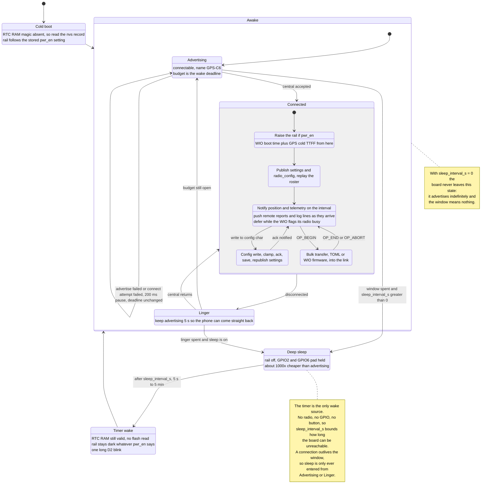
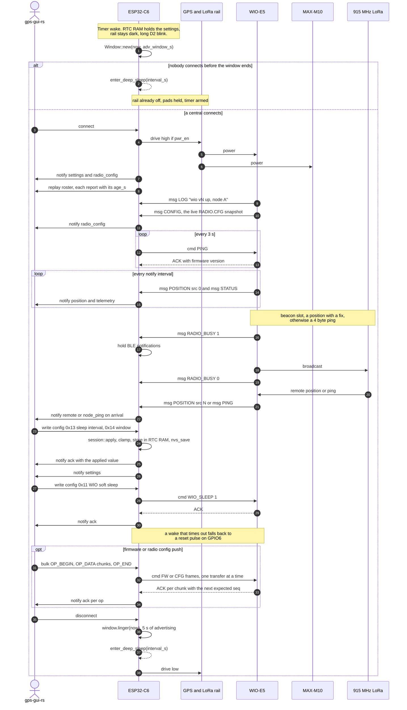
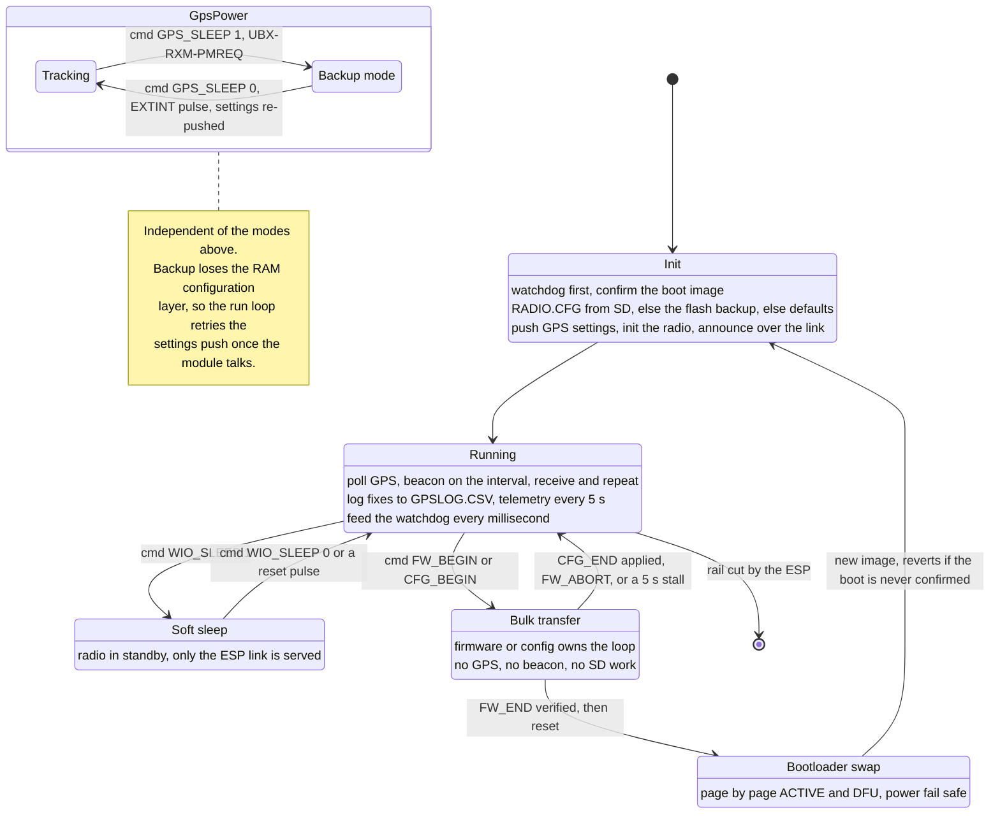

# Architecture

UML views of the telemetry-in-midair board: what the parts are, how the
ESP32-C6 moves between deep sleep, advertising and a BLE connection, what a
session actually does, and the modes the WIO-E5 runs in.

## Structure

Two MCUs on one board. The ESP32-C6 is the BLE face and the power master
(it owns the GPS/LoRa rail); the WIO-E5 does GPS, LoRa and SD. They talk
over a framed UART link. Everything host-testable - the session policy, the
roster, the link and LoRa codecs, the radio config parser - lives in the
shared `midair-proto` crate.

## ESP32-C6 power and BLE lifecycle

The whole sleep story. Sleep is off until an app writes `0x13`; while it is
set the board wakes on the timer, advertises for the `0x14` window and goes
back down. The window is a deadline for the wake, not a per-attempt
timeout - no retry can push it out, only a disconnect (which buys a 5 s
linger).

## A BLE session end to end

One wake that somebody answers. Note where the rail comes up: not on the
wake, only on the connect, which is why an app should expect the WIO's boot
and a GPS cold fix after connecting to a sleeping board.

## WIO-E5 modes

The WIO has no deep sleep of its own - the ESP cutting the rail is what
makes it cheap. What it does have is soft sleep (radio to standby, link
still answering), GPS backup mode, and two modes that take over the loop.

