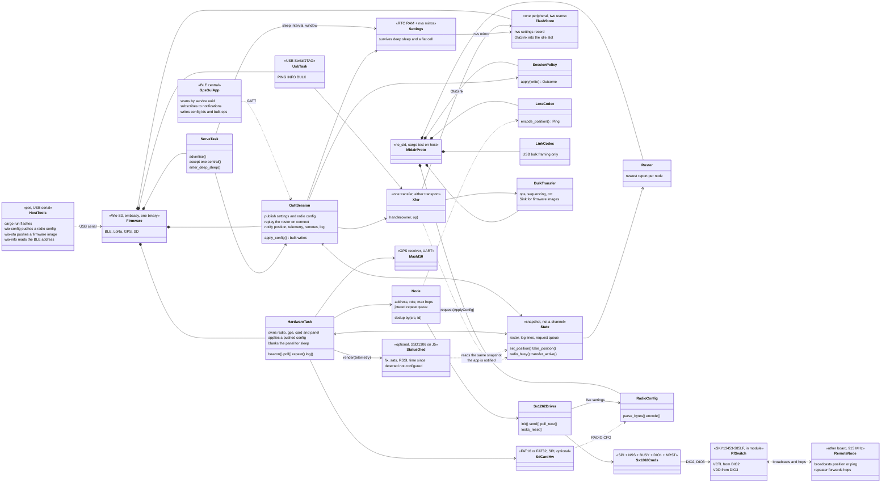
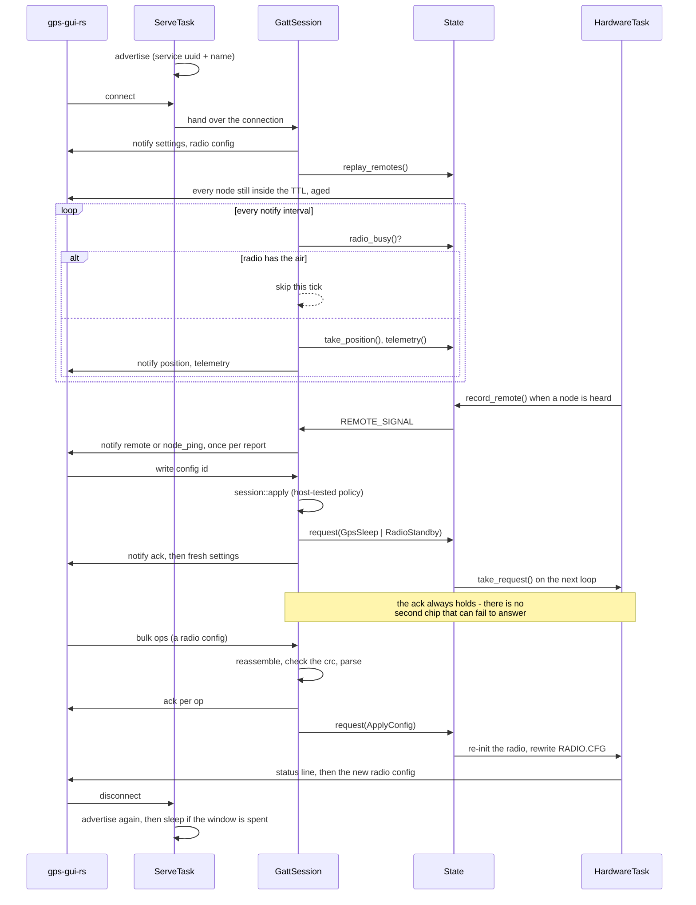
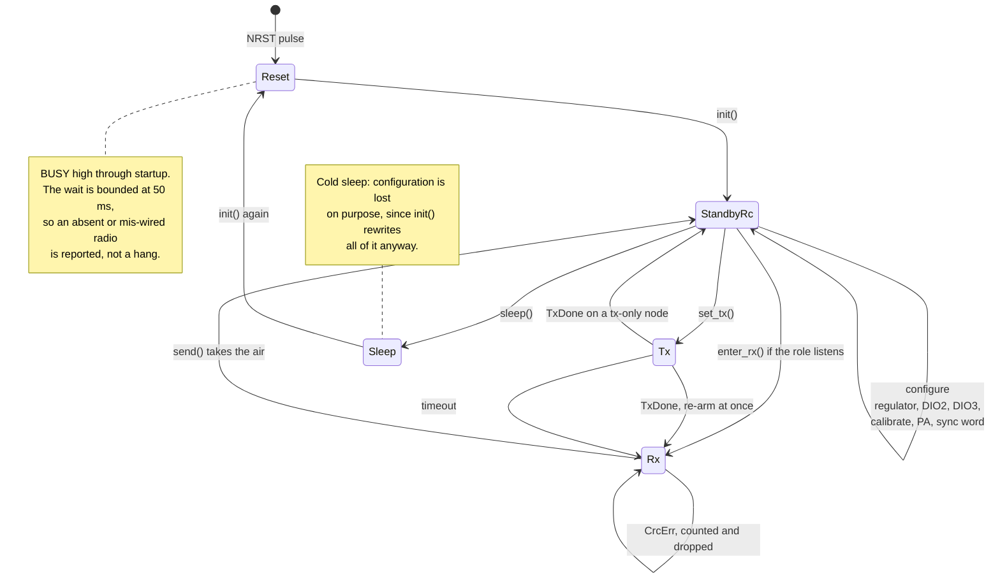
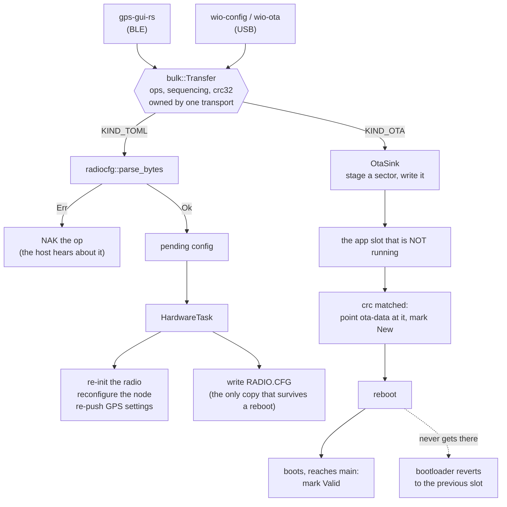
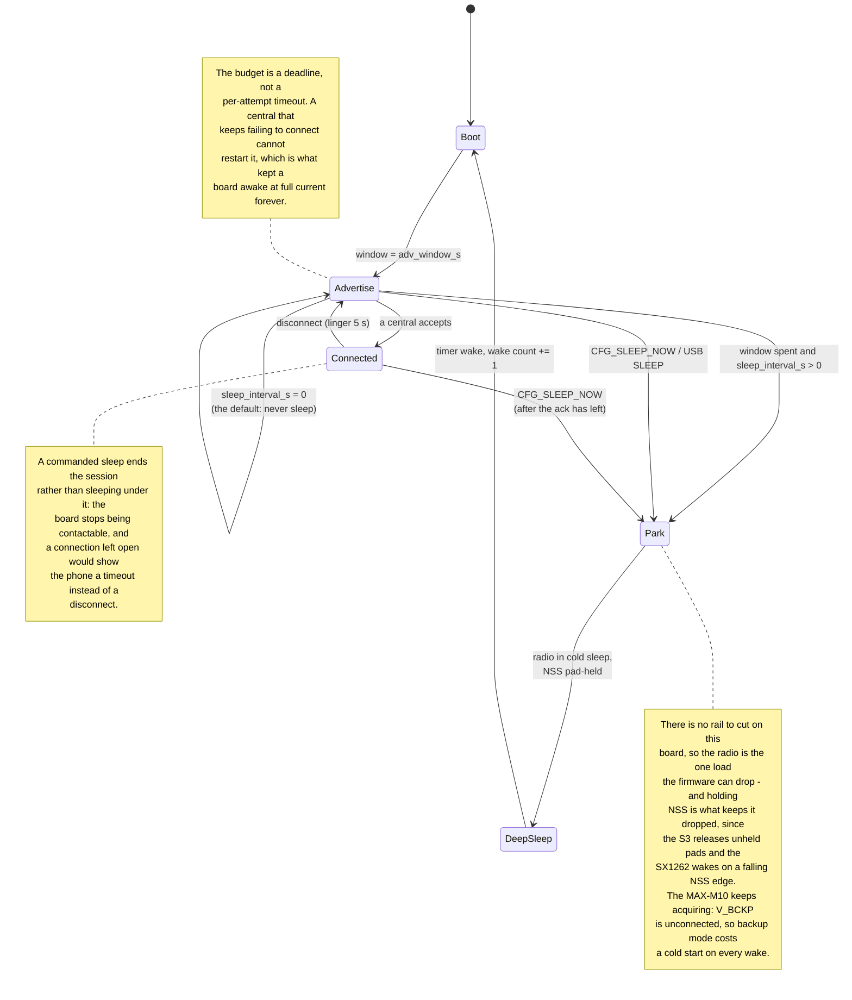

# Architecture

UML views of the telemetry-in-midair board: what the parts are, how the RF
path is wired and why that wiring is a safety constraint, what a BLE session
does, and the modes the radio runs in.

The board is one Seeed Wio-S3 module (ESP32-S3R8 + SX1262 + TCXO in one can)
on the `wio-s3-max-gps` carrier, with a u-blox MAX-M10 GPS and a microSD
card. It replaced a two-MCU design - an ESP32-C6 for BLE and power, a
WIO-E5 for GPS/LoRa/SD, a framed UART link between them - and roughly a
third of the old firmware existed only to bridge that split.

## Structure

One MCU holds every role. Everything host-testable - the session policy,
the roster, the LoRa codec, the radio config parser, the USB framing - lives
in the shared `midair-proto` crate and runs under `cargo test`.

`State` is a snapshot, not a channel, and deliberately: every consumer wants
the latest position and never a backlog. It is also what removed the link
protocol - the BLE session never touches hardware, it reads what the
hardware task published and signals back through a `Request`.

## The RF path, and why two registers are not tunable

This is the part of the design where a wrong value destroys hardware rather
than degrading a link, so it gets its own view. Everything below is from
the Wio-S3 module datasheet, Table 2 (SX1262 pin mapping) and Table 3
(SKY13453-385LF truth table).

Two consequences the firmware must not let a config override:

- **`SetDio2AsRfSwitchCtrl` (0x9D) must be enabled.** DIO2 is the switch's
  VCTL. Left off, VCTL never rises, the switch parks on the path that is not
  the PA, and every transmission ramps +22 dBm into an isolated port.
- **`SetDio3AsTcxoCtrl` (0x97) must name at least 2.7 V.** DIO3 is the
  switch's VDD as well as the TCXO supply, and the switch is specified
  2.5 - 3.5 V. Its truth table calls anything outside that *undefined*, so a
  lower setting leaves the switch in no known state while the PA transmits
  into it.

Both were inherited from the WIO-E5, whose radio is on-die with no bonded
DIO2 and whose TCXO is a 1.8 V part fed by nothing else. `RadioConfig`
now defaults them to this board's hardware, and `Sx1262Driver::init`
enforces them regardless of what a config asks for, logging when it
overrides. The keys remain in `RADIO.CFG` to be read, not retuned.

## A BLE session end to end

Notifications hold while the radio has the air. A LoRa transmit at 22 dBm
beside a 2.4 GHz radio is a supply problem, not a protocol one; on the
two-MCU board this was a `RADIO_BUSY` link message negotiated in both
directions, and here it is a bool.

## Radio modes

A transmit-only node never arms the receiver - idling in standby instead of
continuous RX is the whole reason that role exists. A listening node
re-enters RX immediately after `TxDone`, because every millisecond out of RX
is a chance to miss someone else's broadcast.

Receive polling checks DIO1 as a GPIO before paying for an SPI round trip,
which is most of what an idle node does. On the WIO-E5 there was no such
pin - DIO1 was an internal NVIC vector - so every poll cost a transaction.

## Where the config and the firmware live

Both arrive the same way - a bulk transfer over BLE or the USB console -
and the shared `midair_proto::bulk` state machine is what makes "one at a
time" a property of the object rather than a flag someone has to check.
Where they end up is what differs: a config is small, has to be parsed
whole, and belongs on the card; an image is hundreds of kilobytes and goes
straight to flash as it arrives.

Two things about the OTA path are load-bearing rather than incidental. The
destination is checked against the slot the code is *executing* from, read
from the MMU rather than from ota-data - the two disagree on every board
just flashed over USB, and writing an image over the running slot destroys
the firmware mid-transfer rather than failing. And ota-data is normalized at
boot when it names no slot at all, which is the state a USB flash leaves it
in, because the arithmetic that picks the *other* slot has nothing to work
from otherwise.

## The wake / advertise / sleep cycle

The two commanded transitions exist because the timed ones only fire when a
window expires with nobody connected - so without them the only way to sleep
a board in front of you is to disconnect and wait. Sleeping is asked for
through `state::SLEEP_NOW_SIGNAL` rather than done where it is requested:
`apply_config` runs inside the GATT session with the ack still unbuilt, and
the loop that owns the `Rtc` is the one that can wait for the link to finish.

Settings live in RTC fast RAM so a wake check costs no flash read, and are
mirrored into the `nvs` partition so they also survive a flat cell. Only the
settings that decide whether a board is reachable at all are mirrored; the
GPS and radio sleep flags are not, because a board that cold-boots with its
GPS running is the safer of the two failures.

## What the board forces on the firmware

Board facts that firmware cannot work around, from the carrier design:
there is no rail to cut (GPS and SD sit on +3V3, so `Action::Rail` logs and
does nothing), GPS `EXTINT` is not routed (backup mode wakes on UART traffic
instead), `TIMEPULSE` is unconnected so there is no PPS discipline, and
there is no battery sense divider so telemetry cannot report cell voltage.

The Wi-Fi/BT RF port reaches test point BLE1 and stops there, so the 2.4 GHz
side has no antenna on the board as drawn - BLE works at bench range on
board parasitics.
