# Architecture

UML views of the telemetry-in-midair board: what the parts are, how the RF
path is wired and why that wiring is a safety constraint, what a BLE session
does, and the modes the radio runs in.

The board is one Seeed Wio-S3 module (ESP32-S3R8 + SX1262 + TCXO in one can)
on the `wio-s3-max-gps` carrier, with a u-blox MAX-M10 GPS. It replaced a two-MCU design - an ESP32-C6 for BLE and power, a
WIO-E5 for GPS/LoRa/SD, a framed UART link between them - and roughly a
third of the old firmware existed only to bridge that split.

## Structure

One MCU holds every role. Everything host-testable - the session policy,
the roster, the LoRa codec, the radio config parser, the USB framing - lives
in the shared `midair-proto` crate and runs under `cargo test`.

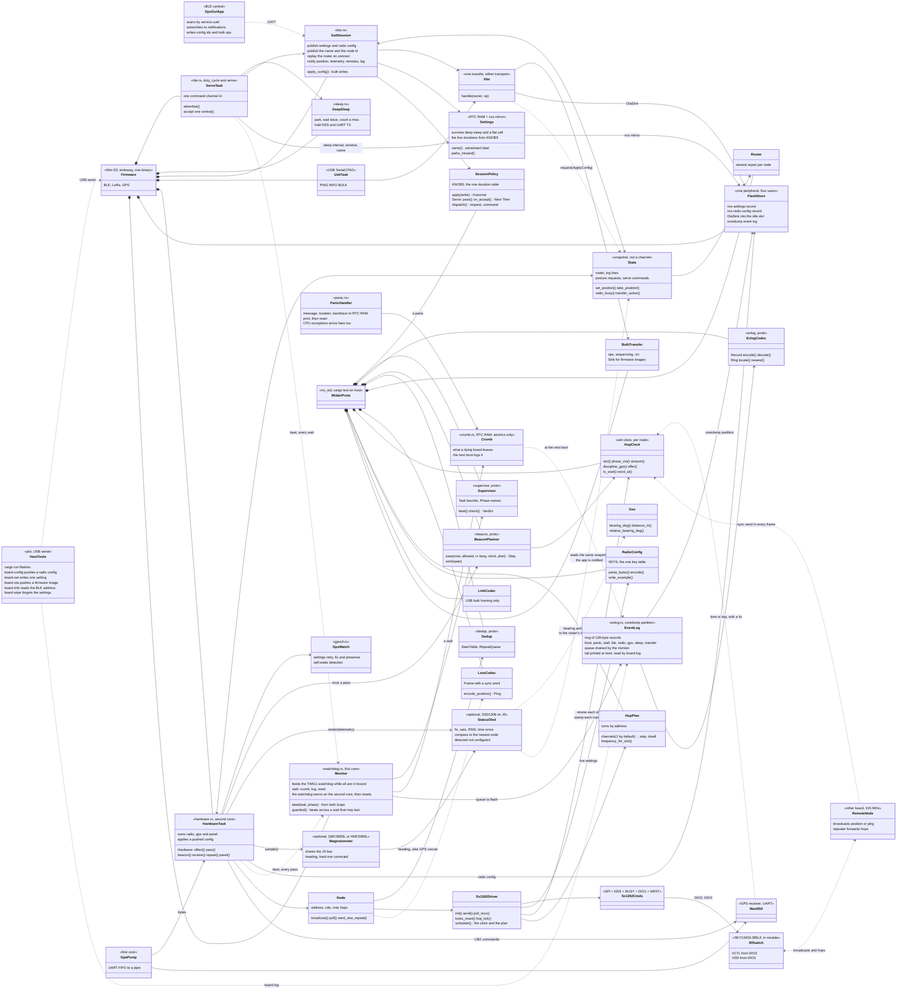

`State` is a snapshot, not a channel, and deliberately: every consumer wants
the latest position and never a backlog. It is also what removed the link
protocol - the BLE session never touches hardware, it reads what the
hardware task published and asks through a `Request`. The other direction
is one channel: a config write on either transport sends the serve loop a
`ServeCommand` - a nap, a moved mode - which whichever wait the loop is in
picks up.

`Monitor` is the one thing that watches the two loops rather than serving
them. Both beat into its atomics with the phase they are in; it reads them
every half second and feeds a timer-group watchdog only while every task
is inside its bound. A task past its bound, or a panic on either core, is
written to RTC RAM with atomics alone, then to the event log, then the
board resets - and if the write to flash blocks, the watchdog resets the
board with the RTC copy intact for the next boot to log. Before this a
panic on either core stopped both, silently: the panicking core spun with
its critical section held and the other core stopped at its next one.

The watchdog itself has two stages, because the one failure the monitor
cannot write down is its own core stopping - and on this chip that stops
the other core's timers too, so the whole board freezes with nothing
said. Five seconds before the reset a warning interrupt fires on the
*second* core, whose handler writes each loop's last phase and the
monitor's silence into RTC RAM. On the bench a first core stopped on
purpose came back thirty seconds later logged as `core 0 silent 25 s:
serve loop last in advertise 25 s ago, hardware loop in status 0 s ago`.

## The RF path, and why two registers are not tunable

This is the part of the design where a wrong value destroys hardware rather
than degrading a link, so it gets its own view. Everything below is from
the Wio-S3 module datasheet, Table 2 (SX1262 pin mapping) and Table 3
(SKY13453-385LF truth table).

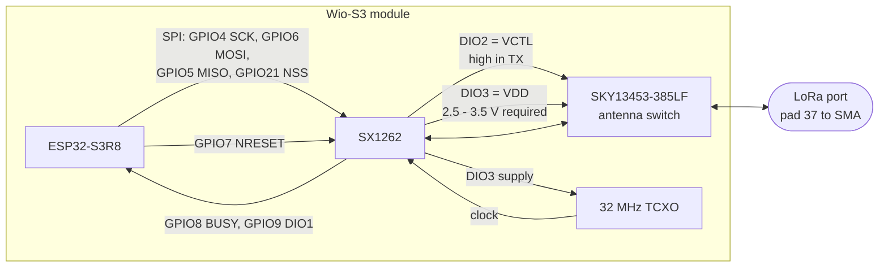

Two consequences the firmware must not let a config override:

- **`SetDio2AsRfSwitchCtrl` (0x9D) must be enabled.** DIO2 is the switch's
  VCTL. Left off, VCTL never rises, the switch parks on the path that is not
  the PA, and every transmission ramps +22 dBm into an isolated port.
- **`SetDio3AsTcxoCtrl` (0x97) must name at least 2.7 V.** DIO3 is the
  switch's VDD as well as the TCXO supply, and the switch is specified
  2.5 - 3.5 V. Its truth table calls anything outside that *undefined*, so a
  lower setting leaves the switch in no known state while the PA transmits
  into it.

Both were inherited from the WIO-E5, whose radio is on-die with no bonded
DIO2 and whose TCXO is a 1.8 V part fed by nothing else. `RadioConfig`
now defaults them to this board's hardware, and `Sx1262Driver::init`
enforces them regardless of what a config asks for, logging when it
overrides. The keys remain in `RADIO.CFG` to be read, not retuned.

## A BLE session end to end

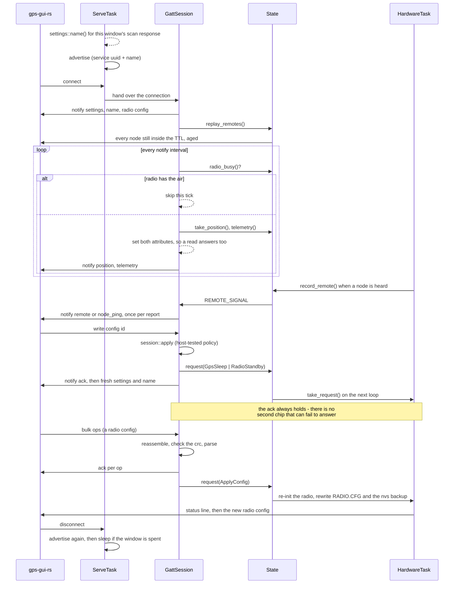

Notifications hold while the radio has the air. A LoRa transmit at 22 dBm
beside a 2.4 GHz radio is a supply problem, not a protocol one; on the
two-MCU board this was a `RADIO_BUSY` link message negotiated in both
directions, and here it is a bool.

## Radio modes

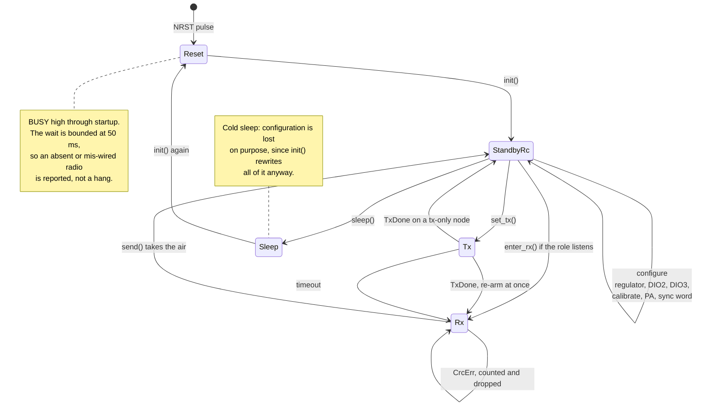

A transmit-only node never arms the receiver - idling in standby instead of
continuous RX is the whole reason that role exists. A listening node
re-enters RX immediately after `TxDone`, because every millisecond out of RX
is a chance to miss someone else's broadcast.

Receive polling checks DIO1 as a GPIO before paying for an SPI round trip,
which is most of what an idle node does. On the WIO-E5 there was no such
pin - DIO1 was an internal NVIC vector - so every poll cost a transaction.

## The slot clock

Time is cut into slots, and every node has to agree on where one begins:
it is what gives each node its own turn to transmit in, and - on a plan
with more than one channel - which channel to be on. The agreement is a
clock, and the clock is set by whatever the node has: its own GPS, the
frames it hears, or nothing. The default plan is one channel wide, so by
default the clock is the whole of it and nothing ever retunes.

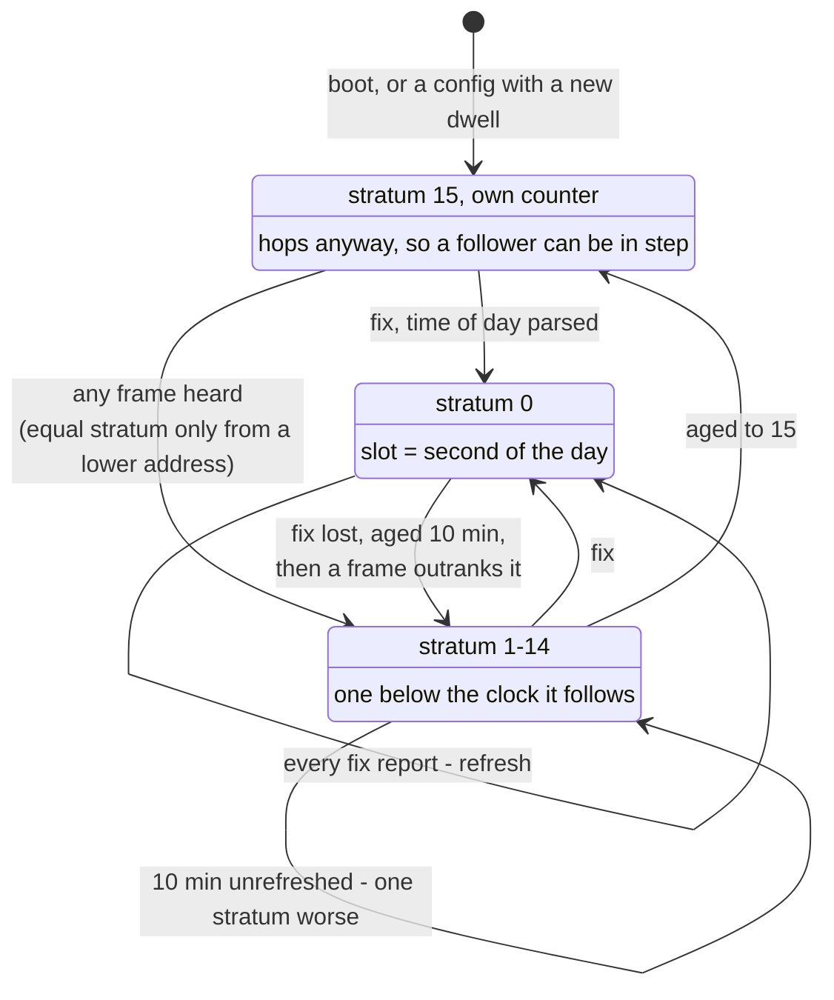

The stratum is the tie-breaker, not the accuracy: an aged clock is a few
milliseconds off against a 100 ms guard. It exists so that a network cut
off from GPS settles on one reference (the lowest address among equals)
instead of every node holding to its own.

Two things keep a clock honest that the diagram does not show. A pass of
the hardware loop that comes late - after a transmit, after a config apply
- stamps what it reads with a time that could be anywhere in the gap, so
it never disciplines a clock that is already set; the next second's GPS
sentence, or the next frame from the same sender, does. And the sync word
is stamped for the instant the preamble leaves the antenna, which on a
listening node is a millisecond after the command because the oscillator
is kept running between modes.

Inside a slot, nodes take turns. The window is cut into as many lean
beacons as fit back to back - two at the default modulation - and a
node's address picks its turn; with a beacon interval of several slots the
address picks the slot of the interval first, so `turns x interval`
consecutive addresses never overlap. Half of each turn's slack is left
empty as a guard against two clocks that disagree. The transmit is planned
by the hardware task for a random point in the turn and made only when
that instant arrives, so the wait never holds the receiver; a plan the
clock has moved out from under is made again rather than waited for. The
receiver retunes at the slot boundary unless a frame is arriving, in which
case it stays for the frame - for the header time while only a preamble
has been seen, since the detector fires on noise, and for the longest
frame the modulation allows once a header has.

```mermaid
gantt
    title One slot at the default dwell - two nodes taking turns, and a receiver following them
    dateFormat x
    axisFormat %L ms

    section Node 1
    guard                        :done,    g1, 0, 100ms
    turn 1 start range           :active,  w1, 100, 56ms
    beacon 289 ms on air         :crit,    b1, 130, 289ms
    guard between turns          :done,    t1, 445, 55ms

    section Node 2
    turn 2 start range           :active,  w2, 500, 56ms
    beacon 289 ms on air         :crit,    b2, 540, 289ms
    guard                        :done,    g2, 900, 100ms

    section Receiver
    on channel of slot s         :active,  r1, 0, 1000ms
    preamble seen, hop held      :milestone, m1, 180, 0ms
    frame lands, clock offered   :milestone, m2, 419, 0ms
    second frame lands           :milestone, m3, 829, 0ms
    retune to slot s+1 (a no-op on one channel) :crit, r2, 1000, 2ms
    on channel of slot s+1       :active,  r3, 1002, 300ms
```

The window is the slot less a guard at each end and less the frame, so a
planned beacon always ends before the far guard. A frame the window cannot
hold - the default beacon at BW125 is 1.15 s - starts at the near guard and
runs into the next slot; the hold on the receiver is what still gets it
through, at the cost of that node occupying one channel longer than a hop
should. A frame longer than a turn but shorter than the window is sent
too, and overlaps the next address's turn every slot; the app's Radio page
says so before it is pushed.

The plan's capacity is a number the operator has to respect: at the
default modulation two addresses may beacon every second, ten every five
seconds. Two nodes that share a turn overlap on every transmission and
cannot hear each other to notice, so a third node that hears both reports
it (`hop: node N shares this node's turn`). `docs/RADIO-AUDIT.md` has the
simulation this schedule was chosen from.

## Where the config and the firmware live

Both arrive the same way - a bulk transfer over BLE or the USB console -
and the shared `midair_proto::bulk` state machine is what makes "one at a
time" a property of the object rather than a flag someone has to check.
Where they end up is what differs: a config is small, has to be parsed
whole, and is kept as text in the board's flash; an image is hundreds of
kilobytes and goes straight to flash as it arrives.

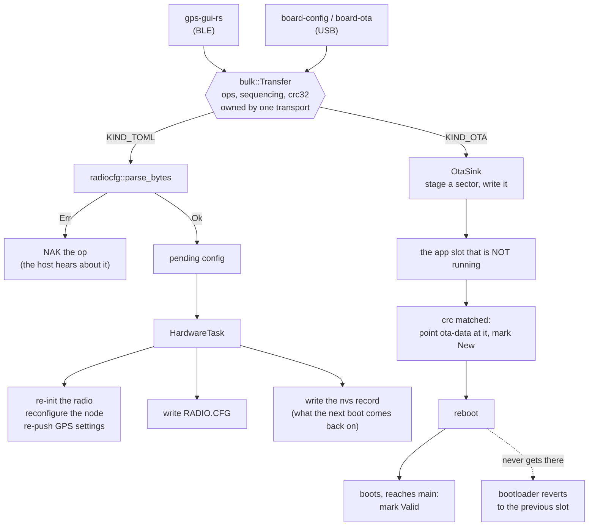

Two things about the OTA path are load-bearing rather than incidental. The
destination is checked against the slot the code is *executing* from, read
from the MMU rather than from ota-data - the two disagree on every board
just flashed over USB, and writing an image over the running slot destroys
the firmware mid-transfer rather than failing. And ota-data is normalized at
boot when it names no slot at all, which is the state a USB flash leaves it
in, because the arithmetic that picks the *other* slot has nothing to work
from otherwise.

## The modes, and the wake / advertise / sleep cycle

The board has three modes and spends most of its life in the first. Two of
them persist (`mode` in RTC RAM, mirrored to nvs); idle deliberately does
not, because a board that came back from a reset still believing it was idle
would sit at awake current with nobody coming.

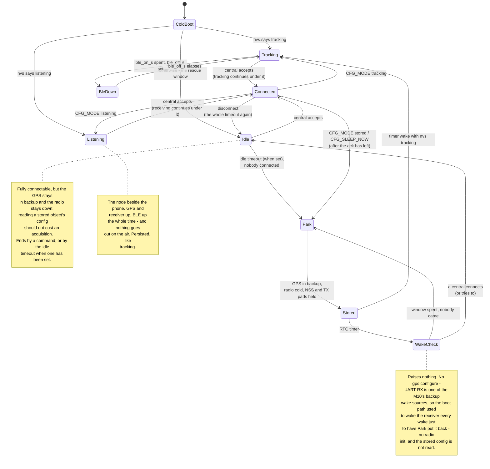

Each duty-cycle knob belongs to exactly one mode, which is what stops them
competing: `sleep_interval_s` is Stored's cadence and `adv_window_s` its
window, `idle_timeout_s` is how long Idle lasts (off by default), and
`ble_off_s` with `ble_on_s` is Tracking's modem cycle. Listening reads none
of them. Before the modes existed both cycles were tested in one place, deep
sleep always won, and `ble_off_s` was dead config on any board that had a
wake-check cadence; and until the on period had a knob of its own the
tracker's window was the wake check's, which suited neither.

`sleep_interval_s = 0` is therefore also "never store this board *on its
own*": with no cadence to sleep on the idle timeout has nowhere to send it,
so it stays awake and reachable. That is the bench setting, and it is what an
unconfigured board does. An explicit `CFG_MODE stored` still sleeps - it
borrows the ceiling, because a command is not ambiguous the way a timeout
running out on a board nobody configured is.

**A connect during a wake check is a doorbell, not a leash.** It used to be
that only a held session kept a stored board up, so reaching one meant
catching the window, connecting, and then not letting go. Now the connect
*attempt* promotes the board to Idle with the timeout armed, and the app can
take its time - including reconnecting after a handshake that fizzled, which
phones do routinely. A misfire costs one idle timeout of awake current.

Waking without advertising is not available on this hardware: a BLE
peripheral cannot cheaply observe that someone is scanning for it, so
advertise-and-connect is the only remote wake there is. That is why
`sleep_interval_s` keeps its five-minute cap - it is also the worst case for
reaching a stored board - and why a wake button on an RTC GPIO is on the
board-changes list.

The two commanded transitions exist because the timed ones only fire when a
window expires with nobody connected - so without them the only way to sleep
a board in front of you is to disconnect and wait. Sleeping is asked for
through the serve loop's command channel (`state::command`) rather than
done where it is requested: `apply_config` runs inside the GATT session
with the ack still unbuilt, and the loop that owns the `Rtc` is the one
that can wait for the link to finish.

Settings live in RTC fast RAM so a wake check costs no flash read, and are
mirrored into the `nvs` partition so they also survive a flat cell. Only the
settings that decide whether a board is reachable at all are mirrored, and
the mode is now one of them - which resolves an inversion. The board's name
is kept there for a related reason: a wake check advertises before anything
has read the radio config, so a name kept with that would be a name a
sleeping board could not tell anyone. The GPS and radio
sleep flags are deliberately *not* saved, because "a board that cold-boots
with its GPS running is the safer failure" - true for a tracker, and it
drains the cell of a device in a bag. The mode answers both: a cold boot
lands in Idle, which is reachable *and* has the GPS down, and only an
explicit stored `tracking` raises everything.

The radio config is the partition's other tenant, one sector along, and it
is stored for the opposite reason: not because it is needed before the
radio comes up, but because it is the only copy. Until 2026-09-11 an SD
card held a second one that won at boot; the card is no longer driven, and
the record is what every push writes and every boot reads. Without it a
board came back on firmware defaults, and the
node address is the one setting nothing can guess back.

## The states over time

The diagram above says what follows what. This says what the board can
still *do* while it is in each state, and for how long.

Two charts, because the two duty cycles belong to different modes: the
first is Tracking's and the second is Stored's. They cannot both be running,
and now they cannot be confused either - `at_expiry` asks the mode which one
applies rather than testing both settings in one place.

Read the axis with one caveat. The window, off-period and sleep-interval
lengths are the config keys and are exact; the beacon spacing is the
interval without its jitter; and **boot, Park and the session timings are
illustrative** - no boot or wake time has ever been measured on this board,
and the connect, transfer and disconnect instants in the third chart are one
plausible session rather than a recorded one.

### Tracking: the awake duty cycle

`mode = tracking`, `ble_on_s = 15`, `ble_off_s = 30`. The modem goes
down; the tracker does not. `sleep_interval_s` is ignored here whatever it
is set to - a tracker that deep-sleeps is not tracking.

```mermaid
gantt
    title Awake duty cycle - only BLE is duty-cycled
    dateFormat X
    axisFormat %M:%S

    section Board state
    Boot (cold)             :done,   s1, 0, 4s
    Advertise               :active, s2, 4, 5s
    Connected               :crit,   s3, 9, 25s
    Linger 5 s              :active, s4, 34, 5s
    BLE down 30 s           :done,   s5, 39, 30s
    Advertise               :active, s6, 69, 15s
    BLE down 30 s           :done,   s7, 84, 30s

    section BLE
    stack built             :milestone, b0, 4, 0s
    advertising - anyone may connect :active, b1, 4, 5s
    in session - CONNECTIONS_MAX is 1 :crit, b2, 9, 25s
    advertising - the phone may return :active, b3, 34, 5s
    stack dropped - the modem goes :milestone, b4, 39, 0s
    advertising - anyone may connect :active, b5, 69, 15s
    stack dropped           :milestone, b6, 84, 0s

    section LoRa
    continuous RX           :active, r1, 3, 111s
    beacon                  :milestone, r2, 5, 0s
    beacon                  :milestone, r3, 25, 0s
    beacon                  :milestone, r4, 45, 0s
    beacon                  :milestone, r5, 65, 0s
    beacon                  :milestone, r6, 85, 0s
    beacon                  :milestone, r7, 105, 0s

    section GPS
    tracking - never gated  :active, g1, 1, 113s

    section USB console
    alive throughout        :active, u1, 0, 114s

    section J5 panel
    refreshing              :active, o1, 4, 110s
```

Nothing below the BLE lane changes shape. That is the whole point of this
cycle: a board in a BLE-down period is still beaconing, still logging and
still answering the USB console - it is only unreachable from a phone,
for at most `ble_off_s`.

The BLE lane is coarser than the controller is. Inside every advertising
band the controller powers its own PHY down between advertisements, and
between the connection events of an idle connection - modem sleep, which
the vendored esp-radio implements and upstream does not. It is too fine to
draw here, at tens of milliseconds against a chart in seconds, and it does
not change what the board can do at any instant. It does mean this lane's
current is no longer flat: dropping the stack is what takes the modem to
nothing, but it is no longer the only thing between advertisements.

Two timings worth reading off the chart. A **session is not bounded by the
window** - the deadline is only consulted at the top of the serve loop, so a
phone that stays connected keeps the board up indefinitely. And the
**linger** after a disconnect is spent advertising rather than merely awake,
so the phone can come straight back.

### Stored: the deep-sleep duty cycle

`mode = stored`, `adv_window_s = 15`, `sleep_interval_s = 45`. The chip goes
away and so does everything else - the receiver into backup, the radio into
cold sleep, the panel dark.

What the floor actually is has never been measured. The chip is microamps
and the radio is 9.3 uA; the M10 in backup on `VCC` alone is unknown, since
`V_BCKP` is unfed on this board and the timed-PMREQ experiment proves the
domain survives rather than what it costs. That measurement is the one this
whole mode hangs on - see `docs/POWER.md`.

```mermaid
gantt
    title Deep-sleep duty cycle - everything stops except the ungated GPS
    dateFormat X
    axisFormat %M:%S

    section Board state
    Boot (cold)             :done,   t1, 0, 4s
    Advertise               :active, t2, 4, 15s
    Park                    :crit,   t3, 19, 1s
    Deep sleep 45 s         :done,   t4, 20, 45s
    Boot (wake check)       :done,   t5, 65, 4s
    Advertise               :active, t6, 69, 3s
    Connected               :crit,   t7, 72, 28s
    Linger 5 s              :active, t8, 100, 5s
    Park                    :crit,   t9, 105, 1s
    Deep sleep 45 s         :done,   t10, 106, 45s

    section BLE
    reachable by a phone    :active, c1, 4, 15s
    unreachable             :done,   c2, 19, 50s
    reachable by a phone    :active, c3, 69, 36s
    unreachable             :done,   c4, 105, 46s

    section LoRa
    continuous RX           :active, q1, 3, 16s
    beacon                  :milestone, q2, 5, 0s
    cold sleep - 9.3 uA     :done,  q3, 19, 46s
    continuous RX           :active, q4, 68, 37s
    beacon                  :milestone, q5, 70, 0s
    beacon                  :milestone, q6, 90, 0s
    cold sleep - 9.3 uA     :done,  q7, 105, 46s

    section GPS
    acquiring     :active, p1, 1, 18s
    PMREQ backup - re-issued by every Park :done, p2, 19, 46s
    still in backup - the wake check never speaks to it :done, p3, 65, 40s
    backup        :done, p4, 105, 46s

    section USB console
    alive                   :active, v1, 0, 19s
    dead - the chip is off  :done,   v2, 19, 46s
    alive                   :active, v3, 65, 40s
    dead - the chip is off  :done,   v4, 105, 46s

    section J5 panel
    refreshing              :active, n1, 4, 15s
    blanked by Park         :done,   n2, 19, 46s
    refreshing              :active, n3, 69, 36s
    blanked by Park         :done,   n4, 105, 46s
```

The GPS lane is the change worth reading. It used to run unbroken through
both sleeps - the MAX-M10 has no rail to cut, so a sleeping board carried a
receiver that was still acquiring at around 30 mA - and worse, the boot path
ran `gps.configure` on every wake, whose UART traffic is one of the M10's
backup wake sources. A wake check therefore woke the receiver just to have
the next Park put it back, forever. Park now parks the receiver and the wake
check speaks to neither it nor the radio.

Two pads are held across the sleep for the same reason: NSS (GPIO21),
because the SX1262 leaves cold sleep on a falling edge, and UART TX (GPIO2),
because a floating edge there is UART activity to a receiver that wakes on
it. SD CS (GPIO44) has the same problem and no fix in firmware - the S3's
RTC pins stop at 21.

`Park` is drawn a second wide to stay legible and is normally one 10 ms pass
of the hardware loop. It only becomes long when a beacon is already in
flight, which it then waits out: 289 ms at the defaults, and up to 9.7 s at
the slowest settings the config accepts.

The SD lane stops at `Park` because `Park` closes it properly.
`log_position` buffers into RAM and only `sdlog.poll` writes it out, on a
5 s cadence, so at 1 Hz there are 0-5 fixes in the buffer at any instant -
and deep sleep is a full reset, so before `PrepareSleep` flushed they were
simply lost. The gap always landed at the end of the wake, which is the part
a reader would use to work out where the board was when it went down. On a
15 s window that was up to a third of each wake's log.

### Inside one connected window

What a session can be doing, and what each thing suspends while it runs.

```mermaid
gantt
    title One session - notifications transfers and the interlocks between them
    dateFormat X
    axisFormat %Ss

    section Session
    connected               :crit, x1, 0, 52s
    roster replayed - settings and radio config published :milestone, x2, 0, 0s
    disconnect              :milestone, x3, 52, 0s

    section BLE out
    position notify every 1000 ms :active, y1, 0, 52s
    remote reports pushed as heard :active, y2, 0, 52s
    status lines - a transfer does not gate these :active, y3, 0, 52s

    section USB console
    firmware text            :active, y4, 0, 20s
    quiet - the transfer owns the IN FIFO :done, y5, 20, 15s
    firmware text            :active, y6, 35, 17s

    section LoRa
    beacon - notifications hold :milestone, z1, 10, 0s
    beacon declined - a transfer owns the board :milestone, z2, 30, 0s
    beacon                   :milestone, z3, 40, 0s

    section Bulk transfer
    config push - console quiet beacon held :crit, w1, 20, 15s
    ApplyConfig - radio re-init GPS re-pushed both config stores rewritten :active, w2, 35, 2s

    section Commanded sleep
    CFG_SLEEP_NOW written    :milestone, k1, 50, 0s
    ack leaves then the session ends :active, k2, 50, 2s
    Park then deep sleep     :crit, k3, 52, 1s
```

Three interlocks show up here, and all three exist for the same reason -
one board, one supply, one USB FIFO:

- A beacon in flight holds BLE notifications (`state::radio_busy`), because
  22 dBm of LoRa PA beside a 2.4 GHz radio is a supply problem. Holds, not
  skips: the notifier waits for TxDone and then sends, so a beacon every
  second costs the phone a few hundred milliseconds of latency rather
  than every other update.
- A bulk transfer holds the beacon *and* silences the console
  (`state::transfer_active`), because the console and the transfer's ack
  frames share the USB Serial/JTAG IN FIFO with no arbitration. Only the
  console half is gated: `status_println!` still queues every line to the
  log characteristic, so a phone watching the log sees what the console
  cannot show it.
- A commanded sleep is taken after the session ends, not under it, so the
  ack has left before the board disappears.

### Every state, and what is possible in it

| State | Entered by | Connectable | LoRa | GPS | SD log | USB console | Leaves when | Draw |
|-|-|-|-|-|-|-|-|-|
| **Boot (tracking)** | power-on or timer wake with nvs `tracking` | no | init | configured | mounted | yes | init done (never measured) | ~126 mA |
| **Boot (idle)** | any other cold boot | no | cold sleep | parked | mounted | yes | init done | ~90 mA |
| **Boot (wake check)** | timer wake, any other mode | no | untouched | untouched | **not mounted** | yes | init done | ~90 mA |
| **Advertise** | boot, or a spent BLE-down period | yes | beacon + RX in tracking, else down | per mode | per mode | yes | a central connects, the budget expires, or `SLEEP_NOW` | ~90-130 mA |
| **Connected** | a central accepts | in session | as above | per mode | per mode | yes | disconnect, `CFG_MODE stored` or `CFG_SLEEP_NOW` | ~90-130 mA |
| **Linger** | disconnect while tracking | yes | beacon + RX | tracking | yes | yes | 5 s, or the phone returns | ~126-130 mA |
| **Idle** | a cold boot, or a wake-check promotion | yes | cold sleep | backup | mounted, idle | yes | `idle_timeout_s` when set, or a mode command | ~90 mA (unmeasured) |
| **Listening** | `CFG_MODE listening`, or a boot with nvs `listening` | yes | RX only, never keys up | tracking | mounted, logging | yes | a mode command | ~126 mA less the PA (unmeasured) |
| **BLE down** | `ble_on_s` spent while tracking with `ble_off_s` set | **no** | beacon + RX | tracking | yes | yes | `ble_off_s` elapses, or USB `SLEEP` | **60 mA** |
| **Park** | any path into deep sleep | no | going to cold sleep | going to backup | **flushed and unmounted** | yes | everything parked, or the TX budget expires | ~126 mA |
| **Deep sleep** | a spent budget in stored/idle, or a commanded sleep | no | cold sleep, NSS held | backup, TX pad held | unmounted | **no** | the timer fires - a full reset | **unmeasured** |

Every draw in that table was measured, or estimated, with the BLE PHY
powered continuously - the vendored esp-radio has since been taught the
controller's modem sleep, which powers it down between advertisements and
between the connection events of an idle connection. So the BLE-bearing
rows are now upper bounds.

The two unmeasured numbers are the two that decide whether any of this is
worth it: what Idle costs, which is the same question as what modem sleep
is worth, and what a stored board's floor is with the receiver in backup on
`VCC` alone.

Three of these are modal rather than positional - they overlay whichever
state the board is in:

| Overlay | Set by | What it changes |
|-|-|-|
| **Radio standby** (`PFLAG_RADIO_STANDBY`) | `CFG_RADIO_STANDBY`, survives deep sleep | The hardware loop skips the beacon and the receiver and polls at 20 Hz. The receiver, the card, the panel, telemetry and the status line keep running, because a board that is idle rather than asleep is one somebody may be looking at. |
| **GPS backup** (`PFLAG_GPS_SLEEP`) | `CFG_GPS_SLEEP`, survives deep sleep | The receiver is parked with `UBX-RXM-PMREQ`. It loses its settings, so the loop re-pushes them when sentences resume. |
| **Transfer active** | a bulk op over BLE or USB | Beacon held off, console quiet, and the transfer is bounded so a host that walks away cannot hold the board. |

The old board's GPS/LoRa rail switch (config id `0x10`) is gone from the
policy: this carrier has no such rail, and the id is reserved and refused
rather than accepted and ignored.

## The state space, walked

Everything above describes what the board is meant to do. This is how the
parts that decide it are checked against every ordering of what can happen
to them - not the timing, which `tools/radio_sim.py` models, but the
discrete states: which mode the hardware is in against which the settings
report, what a request does when it lands between a park and a sleep,
whether a wake check can be left dark for good.

The decisions live in `midair-proto` as values with a `step`, and the
firmware and the app drive them. `explore/` (`midair-explore`) walks every
reachable state of a model built from those values, breadth first, checks
an invariant in each, and stops at the first violation with the shortest
trace that produces it - which is what makes a violation a bug report
rather than a log. Because the machines are the code the firmware runs,
a new mode, request or effect that is not handled fails to compile before
it fails to explore; the models are in `proto/tests/statespace_*.rs` and
`gps-gui-rs/src/ble/statespace.rs`, and `docs/STATESPACE.md` is the
report.

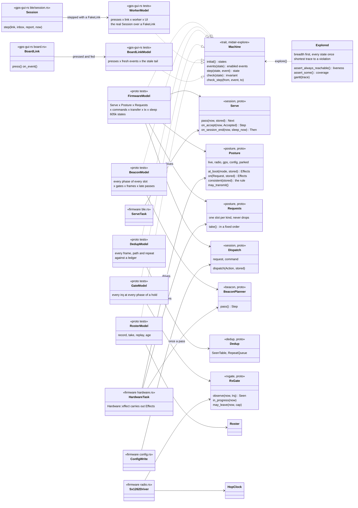

What the composed firmware model holds in every state, and what it
checks there:

```mermaid
stateDiagram-v2
    direction LR
    [*] --> Advertising : cold boot, every persisted mode and flag set
    Advertising --> Connected : connect (a wake check is promoted)
    Advertising --> Advertising : handshake fizzled, hold the window
    Advertising --> Parking : budget spent in stored or idle, or a nap commanded
    Advertising --> Down : on period spent while tracking
    Connected --> Advertising : disconnect, linger or idle re-arm
    Connected --> Parking : the session that asked for a sleep ends
    Down --> Advertising : off period over, or the mode moved
    Down --> Parking : a nap commanded over the console
    Parking --> Asleep : the hardware loop signals the park done
    Asleep --> Advertising : timer wake, boot_mode decides the flavor

    note right of Parking
        Invariant: nothing arriving after
        the park can raise the receiver
        or the radio again.
    end note
    note right of Asleep
        Invariant: radio asleep, GPS parked,
        parked, and the park finished.
    end note
    note left of Connected
        Every write, over BLE or the console,
        goes through session::apply and
        session::dispatch; the loop drains
        posture::Requests on its next pass.
        Invariant once drained: the hardware
        is in the mode the settings report,
        with the receiver and the radio where
        the override flags say.
    end note
```

Time in that model is two-valued: an event happens either before the
serve budget's deadline or at it, which is all the policy ever asks, so the
deadline is one of a handful of values and the state stays finite.
Liveness is checked as well as safety - from every state the board can
still be advertised, commanded into tracking and put to sleep - which is
how "the board is never left dark for good" is stated as a test.

## What the board forces on the firmware

Board facts that firmware cannot work around, from the carrier design:
there is no rail to cut (GPS and SD sit on +3V3, and the config id the old
board switched one with is refused), GPS `EXTINT` is not routed (backup mode wakes on UART traffic
instead), `TIMEPULSE` is unconnected so there is no PPS discipline, and
there is no battery sense divider so telemetry cannot report cell voltage.

The Wi-Fi/BT RF port reaches test point BLE1 and stops there, so the 2.4 GHz
side has no antenna on the board as drawn - BLE works at bench range on
board parasitics.
