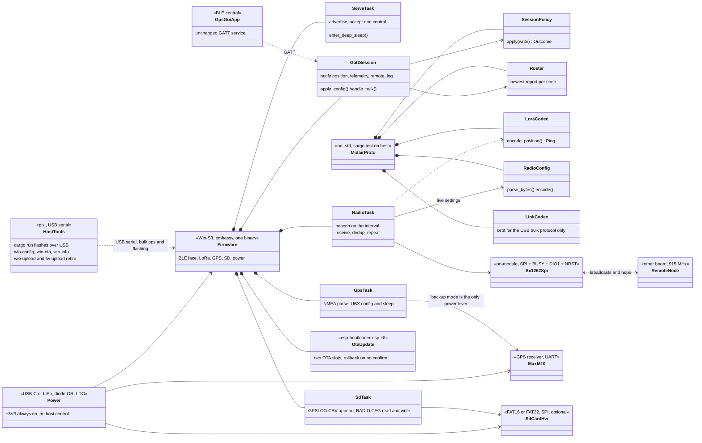

# Porting to the Wio-S3 board

The next board replaces both MCUs with one Seeed Wio-S3 module: an
ESP32-S3R8 (dual Xtensa LX7, 16 MB flash, 8 MB PSRAM) with a Semtech
SX1262 and a TCXO in the same 21.6 x 16.5 mm can. Today's board is an
ESP32-C6 (BLE face, power master) plus a WIO-E5 (STM32WLE5: GPS, LoRa,
SD) talking over a framed UART link. The new module absorbs both roles,
so this is not a chip swap - it collapses the two-MCU split that most of
the firmware is built around.

## Module facts that drive the design

| | |
|-|-|
| MCU | ESP32-S3R8, dual Xtensa LX7 to 240 MHz, 16 MB flash, 8 MB PSRAM |
| Radio | SX1262, EU868 / US915, +20.9 dBm, -137 dBm, on-module TCXO |
| Antennas | Two RF ports: Wi-Fi/BLE and LoRa, IPEX or bare-pad version |
| Supply | 3.0 - 3.6 V |
| Current | 9.3 uA deep sleep, 1.43 mA standby, 5.5 mA LoRa RX, 125 mA LoRa TX at 22 dBm |
| Pads | 38, of which GPIO 1-3, 11-20, 38-48 are free, plus BOOT (GPIO0) and RST |

Three consequences worth stating up front:

- **A separate BLE antenna comes for free.** The module brings out the
  Wi-Fi/BT RF port on its own connector, which closes the "need antenna
  for BLE, remove the W.FL, add a 31 mm wire" item in `TODO.md`.
- **Wi-Fi becomes available.** The C6 had it too, but with a single MCU
  and 8 MB of PSRAM the "Wi-Fi server, hotspot style" idea stops
  competing with the link task for room.
- **Xtensa, not RISC-V.** The ESP32-S3 is not a RISC-V part, so the
  `stable` toolchain and `riscv32imac-unknown-none-elf` target the `esp/`
  crate uses today are replaced by the `esp` channel from `espup` and
  `xtensa-esp32s3-none-elf`. That is a one-time setup cost for every
  build host and for CI.

## Target structure

## What the merge deletes

Roughly a third of the current firmware exists only because there were
two chips:

- **The UART link.** `wio/src/esplink.rs`, the `LinkTask` and
  `HeartbeatTask` on the ESP side, and the ack/nak/retry handling around
  every command become direct calls or an `embassy-sync` channel. The
  3 s PING that proves the link is alive has nothing left to prove.
- **The WIO firmware update path.** `wio/bootloader/` (page-swap, revert
  if the boot is never confirmed), `wio/src/fwupdate.rs`, the `FW_*`
  link commands and `tools/fw-upload` all go. The ESP-IDF bootloader
  already does two-slot OTA with rollback, and `esp-bootloader-esp-idf`
  is in the dependency list today.
- **The power-master dance.** No rail to cut for a second MCU, no
  open-drain reset pulse on GPIO6, no "wake the WIO, fall back to a
  reset" retry. On the board as drawn no rail stays at all - see below.
- **`RADIO_BUSY` as a protocol message.** BLE notifications currently
  defer while the WIO flags its radio busy, negotiated over the link.
  Same-chip, this is a local mutex around the LoRa TX window.
- **The `WIO_SLEEP` soft-sleep mode.** The WIO's soft sleep existed
  because the ESP could not power it down mid-session. One MCU has one
  sleep story.

`proto/src/link.rs` still earns its place: the host tools speak the same
framed bulk protocol over USB, so the codec stays even though the UART
transport goes.

## What survives, and how hard the port is

| Piece | Port |
|-|-|
| `proto/` session, roster, lora, radiocfg | None. Host-tested, no HAL in it. |
| `wio/src/radio.rs` (747 lines) | Transport only - see below. |
| `wio/src/gps.rs` NMEA + UBX | Swap the STM32 USART for an esp-hal UART; the parse and UBX-CFG-VALSET / RXM-PMREQ logic is HAL-free. |
| `wio/src/sdcard.rs`, `sdlog.rs` | SPI-mode SD, so the `embedded-sdmmc` stack carries over on an esp-hal SPI bus. |
| `wio/src/node.rs` roles and dedup | None beyond the radio trait. |
| `esp/src/bin/main.rs` GATT, sleep, nvs | Mostly intact; `trouble-host` and `esp-radio` support the S3. Delete the link plumbing. |
| `wio/src/watchdog.rs` | Replace IWDG with the S3 RWDT/TWDT. |

**The radio driver is the good news.** The STM32WLE5's SubGHz peripheral
*is* an SX1262 die reached over an internal SPI, and it takes the same
opcodes. `Sx1262Driver` already drops to raw command buffers in places
(`subghz_xfer`). Porting it means writing a thin command layer -
NSS + BUSY-wait + SPI transfer - and re-expressing the typed
`stm32wlxx_hal::subghz` structs (`LoRaModParams`, `CfgIrq`,
`TxParams`, ...) as the byte sequences they already compile down to.
Every tuned value stays: the PA config, the OCP, the CAD and sync-word
work, the sign-extended SNR fix. `lora-phy` 3.0.1 is the alternative,
but it would mean re-deriving the config surface `RadioConfig` drives
today, and its last release predates the current embedded-hal churn - I
would keep the hand-written driver.

Two real differences from the WL: the RF switch is inside the module
rather than on PA4/PA5, and DIO1 is a real interrupt line to an ESP GPIO
instead of an internal NVIC vector. Confirm both against the module
schematic before writing the driver.

The RF switch difference does not gain a setting - it removes two. On the
WL, `SetDio2AsRfSwitchCtrl` (0x9D) is absent from the opcode table
entirely: the die has no bonded DIO2, so switching is an MCU GPIO job and
the register could never be a config key. The Wio-S3's SX1262 is discrete
and DIO2 is a real pin, so it looked like a board-description key
alongside `dcdc_enabled` and `tcxo_volts`.

Table 2 of the datasheet says otherwise. DIO2 is the VCTL of an
SKY13453-385LF and DIO3 is that same switch's VDD, so on this board there
is exactly one correct value for each, and both defaulted wrong: the key
was off (the WL had no DIO2 to drive) and DIO3 was set to 1.8 V (the WL's
TCXO is a 1.8 V part, but the switch is specified 2.5 - 3.5 V and calls
anything else undefined). Either mistake ramps +22 dBm into an isolated
port. They are now defaulted to the board's hardware *and* enforced in
`Sx1262Driver::init`, which logs when it overrides a config.

Note what this is *not*: the module's u.FL-versus-RF-pad choice is two
SKUs (100020327 with IPEX, 100079384 with bare pads), not a switch, so
no register selects it. The 2.4 GHz port has no equivalent control at
all - the ESP32-S3 has no antenna switch.

## Pin map

Read from the carrier design in `~/gps/wio-s3-max-gps` (U1 Wio-S3,
U5 MAX-M10N), not proposed - the board exists.

| Function | GPIO | Net | Note |
|-|-|-|-|
| GPS UART RX (from GPS TXD) | GPIO1 | `Net-(U1-GPIO1)` | U5 pad 2 |
| GPS UART TX (to GPS RXD) | GPIO2 | `Net-(U1-GPIO2)` | U5 pad 3 |
| SD CS | GPIO44 | `/SPI-CS` | 10k pull-up R16 |
| SD MOSI | GPIO45 | `/SPI-COTI` | 10k pull-up R17 - **strapping pin, see below** |
| SD SCK | GPIO46 | `/SPI-SCK` | 10k pull-up R19 - strapping pin |
| SD MISO | GPIO3 | `/SPI-CITO` | 10k pull-up R18 - strapping pin |
| LED D5 | GPIO43 | `Net-(D5-K)` | active low (R21 to +3V3 on the anode); also UART0_TX |
| LED D2 | GPIO14 | `Net-(D2-K)` | active low (R20 to +3V3 on the anode) |
| USB D- / D+ | GPIO19 / GPIO20 | | USB-C J3, console and host tools |
| J5 JST SH 4-pin | GPIO10, GPIO11 | `Net-(J5-Pin_3/4)` | plus GND and +3V3; I2C-shaped |
| J1 header 1x07 | GPIO41, 40, 39, 38, 47 | `Net-(J1-Pin_3..7)` | pin 1 GND, pin 2 +3V3 |
| BOOT / RST | GPIO0 / RST | | test points BOOT1 / RST1 |
| Free | GPIO12, 13, 15, 16, 17, 18, 42, 48 | | nothing routed to them |

`GPIO33-37` are not on the pads: the R8 part uses octal PSRAM, which
takes them. `GPIO26-32` are the flash interface. Neither is available
whatever a generic ESP32-S3 pin table suggests.

The LoRa RF port (U1 pad 37) goes to the SMA J6. The Wi-Fi/BT port
(U1 pad 18) goes to test point BLE1 and stops there - there is no 2.4 GHz
antenna on the board as drawn.

**Three of the four SD lines sit on ESP32-S3 strapping pins.** GPIO45
selects VDD_SPI: low is 3.3 V, high is 1.8 V, sampled at reset. R17 used
to hold it high, which on a module without `VDD_SPI_FORCE` burned means
the part comes out of reset expecting 1.8 V flash and does not boot -
R17 is DNP as of board V2. GPIO46 pulled high (R19) still disables the
ROM boot log and GPIO3 pulled high (R18) still moves the JTAG source;
both are survivable. Worth confirming the eFuse state on a real module
regardless.

## What the board forces on the firmware

Three of these are not "port this file", they change what the firmware
can do:

- **There is no power rail to cut.** The GPS `VCC` and `V_IO` are tied
  straight to +3V3, and the SD is on +3V3 too. The only load switch on
  the board (U3, SiP32431) feeds the GPS *active antenna* and is driven
  by the GPS's own `LNA_EN`, not by a host GPIO. So `ServeTask`'s rail
  control, `Stored::rail_at_boot`, the `PFLAG_PWR_OFF` flag and the
  RTC pad hold all lose their meaning. Deep sleep drops the S3 to ~10 uA
  but leaves a MAX-M10 acquiring beside it, which is the dominant draw.
- **GPS backup mode is the only power lever.** `/EXT_INT_GPS` is not
  routed to the MCU, but that does not strand the module: UBX-RXM-PMREQ
  requests EXTINT0 *and* UART RX as wake sources, and the WIO firmware
  already relied on both - `wake()` pulses EXTINT and then sends bytes.
  So sleep and wake work on this board over the UART alone. What backup
  does cost is the module's RAM configuration layer, so the run loop has
  to re-push settings on every wake.
- **Two LEDs, both active low.** The current firmware drives three
  (D5/D6 LoRa TX/RX on the WIO, D2 on the ESP) and all active high. The
  blink patterns need re-assigning to D5 (GPIO43) and D2 (GPIO14), and
  the levels inverted.

Smaller ones: `GPIO43` is UART0_TX, so the ROM bootloader's boot log
will flicker D5 on every reset (cosmetic, and the console is on USB
anyway); GPS `TIMEPULSE` is unconnected, so no PPS discipline is
available; and there is no battery sense divider, so telemetry cannot
report the LiPo voltage without a board change.

## Phasing

1. ~~**Toolchain and skeleton.**~~ **Done.** `s3/` builds on the `esp`
   channel for `xtensa-esp32s3-none-elf` and links to an Xtensa ELF:
   esp-hal 1.0, esp-rtos with embassy, USB Serial/JTAG console, D5
   heartbeat on GPIO43. `cd s3 && cargo run --release` flashes it.
   One difference from the C6 crate worth knowing: that one's `build.rs`
   installs a `--error-handling-script` linker arg, which is lld-only -
   Xtensa links through `xtensa-esp32s3-elf-gcc`, which rejects it.
2. **Radio.** **Written, not yet run.** `s3/src/sx1262.rs` is the command
   layer (NSS, BUSY, the opcodes) and `s3/src/radio.rs` is the driver,
   ported with its tuned values and reasoning intact. Two things the WL
   could not do are in: DIO1 is a real pin, so an idle listening node
   pays a GPIO read per poll instead of an SPI round trip, and the
   transmit wait is `.await` rather than a spin feeding the watchdog, so
   nothing else is locked out for the 9.7 s a SF12/BW62.5 beacon can
   take. Bench test against an existing board - the air format does not
   change, so a ported node must talk to an unported one.

   No longer blocked: the module datasheet's Table 2 publishes the
   internal wiring, and `s3/src/bin/main.rs` runs it. The inference that
   preceded it (GPIO4-10, the only run of pins the module does not bring
   out to a pad) was wrong in three places and destroyed a board - see
   `NOTES.md`. Table 2 also settles the RF path: DIO2 is the antenna
   switch's VCTL and DIO3 is its VDD, which makes `dio2_rf_switch` and
   `tcxo_volts` hardware facts rather than settings.
3. **GPS and SD.** **Written, not yet run.** `s3/src/gps.rs` is the
   MAX-M10 driver - NMEA folding, UBX-CFG-VALSET, backup mode - on an
   esp-hal UART, with the waits awaiting instead of spinning.
   `s3/src/sdlog.rs` is the FAT logger. The WIO-E5's 348-line SPI-mode SD
   driver does *not* come across: it existed only because
   `stm32wlxx-hal` stopped at embedded-hal 0.2, which ruled out
   `embedded-sdmmc`'s own driver. esp-hal implements 1.0, so the upstream
   driver does the job and that file is simply deleted.
4. **BLE and session.** **Written, not yet run.** The GATT service is
   byte-identical to the C6's - same UUIDs from the shared crates - so
   gps-gui-rs needs no change. Advertising, connect, the settings publish
   and the position/telemetry stream are in, and config writes go through
   the same host-tested `session::apply`. The link is gone: an action
   that was a frame and a wait for the WIO's answer is now a signal the
   hardware loop picks up, so the ack the policy built always holds.
   `RADIO_BUSY` went the same way - it is a bool, not two frames.

   4b is done too: the bulk transfer handler, the remote-node roster
   replay on connect, the status/log stream, the radio-config read-back,
   and the USB console `wio-config` speaks. The transfer state machine
   moved into `proto/src/bulk.rs`, where `cargo test` can drive it - on
   the two-MCU board it was split across two firmwares and neither half
   could be tested at all.

   The beacon was never part of any step and turned out to be missing
   outright: the board could hear the network but had no `send()` call
   anywhere, so the DIO2/DIO3 work had never been exercised on air.
   `s3/src/node.rs` is the WIO's broadcast node ported over, and the
   hardware loop beacons a position or a no-fix ping on the configured
   interval - re-checking the radio first, since an SX1262 that browned
   out comes back with its antenna switch unpowered.
5. **Sleep and OTA.** **Written, not yet run.** Settings live in RTC fast
   RAM with an `nvs` mirror, so they survive a deep sleep and a flat cell,
   and a spent advertising window ends in a real `sleep_deep`. The radio is
   parked first - there is no rail to cut on this board, so it is the one
   load the firmware can drop.

   Firmware update is the ESP-IDF bootloader's two slots, driven by
   `s3/src/flash.rs` and `tools/wio_ota.py`; `partitions.csv` replaces the
   single-app default and the flash runner erases `otadata` so a USB flash
   always wins over whatever an OTA left selected. `wio-upload` and
   `fw-upload` were already gone with step 6.

   Two hazards found on the way in. `OtaUpdater::next_partition` picks the
   *running* slot when `otadata` is erased, because `Factory` has no OTA
   app number and the subtraction underflows - `otadata` is normalized at
   boot and the destination is checked against the booted slot regardless.
   And writing an image at the transfer's 192-byte chunk size would erase
   each flash sector twenty-one times over, so writes are staged a sector
   at a time.
6. ~~**Cleanup.**~~ **Done.** `wio/`, `wio/bootloader/` and `esp/` are
   deleted, along with the `cmd`/`msg` link command sets and the host
   tools that only served the split. `ARCHITECTURE.md` is rewritten
   around the single-MCU design. What survives in `proto/src/link.rs` is
   the framing and the bulk transfer the host tools speak over USB.

Every step is written. What is left is bench work: nothing in `s3/` has
been run on hardware, and the first transmission is the one that proves the
antenna switch is being driven rather than the PA being ramped into an
isolated port.

## Open questions

- **Does the board get another spin?** The board-side changes this port
  needs are listed in `BOARD-REVIEW.md` in the `wio-s3-max-gps` repo.
  GPS EXTINT and the GPIO45 strapping pull-up are the two that firmware
  cannot work around.
- ~~**Repo shape.**~~ **Settled.** A new crate beside the working ones,
  deleted at step 6, which is what happened.
- **Wi-Fi in scope now, or later?** It changes the sleep budget and the
  partition table, so it is cheaper to decide before step 5 than after.
- ~~**Is the SX1262 pin map published?**~~ **Answered.** Table 2 of the
  module datasheet (v1.2) gives it, along with the antenna switch part
  number and its truth table.
