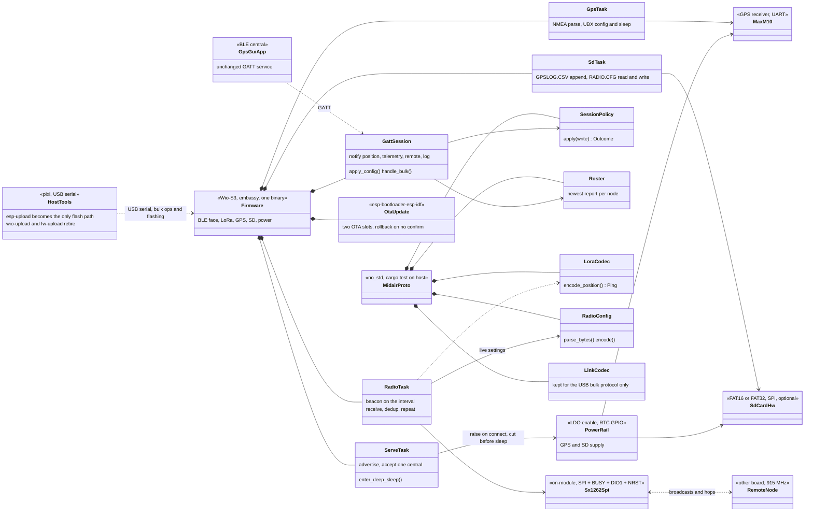

# Porting to the Wio-S3 board

The next board replaces both MCUs with one Seeed Wio-S3 module: an
ESP32-S3R8 (dual Xtensa LX7, 16 MB flash, 8 MB PSRAM) with a Semtech
SX1262 and a TCXO in the same 21.6 x 16.5 mm can. Today's board is an
ESP32-C6 (BLE face, power master) plus a WIO-E5 (STM32WLE5: GPS, LoRa,
SD) talking over a framed UART link. The new module absorbs both roles,
so this is not a chip swap - it collapses the two-MCU split that most of
the firmware is built around.

## Module facts that drive the design

| | |
|-|-|
| MCU | ESP32-S3R8, dual Xtensa LX7 to 240 MHz, 16 MB flash, 8 MB PSRAM |
| Radio | SX1262, EU868 / US915, +20.9 dBm, -137 dBm, on-module TCXO |
| Antennas | Two RF ports: Wi-Fi/BLE and LoRa, IPEX or bare-pad version |
| Supply | 3.0 - 3.6 V |
| Current | 9.3 uA deep sleep, 1.43 mA standby, 5.5 mA LoRa RX, 125 mA LoRa TX at 22 dBm |
| Pads | 38, of which GPIO 1-3, 11-20, 38-48 are free, plus BOOT (GPIO0) and RST |

Three consequences worth stating up front:

- **A separate BLE antenna comes for free.** The module brings out the
  Wi-Fi/BT RF port on its own connector, which closes the "need antenna
  for BLE, remove the W.FL, add a 31 mm wire" item in `TODO.md`.
- **Wi-Fi becomes available.** The C6 had it too, but with a single MCU
  and 8 MB of PSRAM the "Wi-Fi server, hotspot style" idea stops
  competing with the link task for room.
- **Xtensa, not RISC-V.** The ESP32-S3 is not a RISC-V part, so the
  `stable` toolchain and `riscv32imac-unknown-none-elf` target the `esp/`
  crate uses today are replaced by the `esp` channel from `espup` and
  `xtensa-esp32s3-none-elf`. That is a one-time setup cost for every
  build host and for CI.

## Target structure

## What the merge deletes

Roughly a third of the current firmware exists only because there were
two chips:

- **The UART link.** `wio/src/esplink.rs`, the `LinkTask` and
  `HeartbeatTask` on the ESP side, and the ack/nak/retry handling around
  every command become direct calls or an `embassy-sync` channel. The
  3 s PING that proves the link is alive has nothing left to prove.
- **The WIO firmware update path.** `wio/bootloader/` (page-swap, revert
  if the boot is never confirmed), `wio/src/fwupdate.rs`, the `FW_*`
  link commands and `tools/fw-upload` all go. The ESP-IDF bootloader
  already does two-slot OTA with rollback, and `esp-bootloader-esp-idf`
  is in the dependency list today.
- **The power-master dance.** No rail to cut for a second MCU, no
  open-drain reset pulse on GPIO6, no "wake the WIO, fall back to a
  reset" retry. A rail stays only for the GPS and the SD card.
- **`RADIO_BUSY` as a protocol message.** BLE notifications currently
  defer while the WIO flags its radio busy, negotiated over the link.
  Same-chip, this is a local mutex around the LoRa TX window.
- **The `WIO_SLEEP` soft-sleep mode.** The WIO's soft sleep existed
  because the ESP could not power it down mid-session. One MCU has one
  sleep story.

`proto/src/link.rs` still earns its place: the host tools speak the same
framed bulk protocol over USB, so the codec stays even though the UART
transport goes.

## What survives, and how hard the port is

| Piece | Port |
|-|-|
| `proto/` session, roster, lora, radiocfg | None. Host-tested, no HAL in it. |
| `wio/src/radio.rs` (747 lines) | Transport only - see below. |
| `wio/src/gps.rs` NMEA + UBX | Swap the STM32 USART for an esp-hal UART; the parse and UBX-CFG-VALSET / RXM-PMREQ logic is HAL-free. |
| `wio/src/sdcard.rs`, `sdlog.rs` | SPI-mode SD, so the `embedded-sdmmc` stack carries over on an esp-hal SPI bus. |
| `wio/src/node.rs` roles and dedup | None beyond the radio trait. |
| `esp/src/bin/main.rs` GATT, sleep, nvs | Mostly intact; `trouble-host` and `esp-radio` support the S3. Delete the link plumbing. |
| `wio/src/watchdog.rs` | Replace IWDG with the S3 RWDT/TWDT. |

**The radio driver is the good news.** The STM32WLE5's SubGHz peripheral
*is* an SX1262 die reached over an internal SPI, and it takes the same
opcodes. `Sx1262Driver` already drops to raw command buffers in places
(`subghz_xfer`). Porting it means writing a thin command layer -
NSS + BUSY-wait + SPI transfer - and re-expressing the typed
`stm32wlxx_hal::subghz` structs (`LoRaModParams`, `CfgIrq`,
`TxParams`, ...) as the byte sequences they already compile down to.
Every tuned value stays: the PA config, the OCP, the CAD and sync-word
work, the sign-extended SNR fix. `lora-phy` 3.0.1 is the alternative,
but it would mean re-deriving the config surface `RadioConfig` drives
today, and its last release predates the current embedded-hal churn - I
would keep the hand-written driver.

Two real differences from the WL: the RF switch is inside the module
rather than on PA4/PA5, and DIO1 is a real interrupt line to an ESP GPIO
instead of an internal NVIC vector. Confirm both against the module
schematic before writing the driver.

## Proposed pin map

Free pads are plentiful, so the constraints are the strapping pins
(GPIO0, 3, 45, 46), USB (GPIO19/20), and deep-sleep pad hold, which
needs an RTC GPIO (0-21 on the S3).

| Function | Pad | Note |
|-|-|-|
| GPS UART TX / RX | GPIO17 / GPIO18 | UART1 |
| GPS EXTINT (wake) | GPIO16 | |
| SD SCK / MOSI / MISO / CS | GPIO12 / 11 / 13 / 14 | SPI2, separate bus from the internal SX1262 |
| GPS + SD rail enable | GPIO2 | RTC GPIO, so the level survives deep sleep as today |
| LED D5 / D6 | GPIO47 / GPIO48 | LoRa TX / RX blink |
| USB D- / D+ | GPIO19 / GPIO20 | console and host tools, as on the C6 |
| BOOT / RST | GPIO0 / RST | keep both on a header for recovery |

`GPIO33-37` are not on the pads: the R8 part uses octal PSRAM, which
takes them. `GPIO26-32` are the flash interface. Neither is available
whatever a pin table suggests.

## Phasing

1. **Toolchain and skeleton.** `espup`, a new crate targeting
   `xtensa-esp32s3-none-elf`, blink an LED, bring up USB serial. Proves
   the build host before any porting.
2. **Radio.** Port `Sx1262Driver` onto an SPI transport, external DIO1
   and NRST. Test against an existing board on the bench - the air
   format does not change, so a ported node must talk to an unported one.
3. **GPS and SD.** Move `gps.rs` and the SD stack over. At this point
   the board is a working node with no BLE.
4. **BLE and session.** Fold `esp/src/bin/main.rs` in, minus the link
   task; wire `GattSession` to call the radio and GPS directly.
5. **Sleep and OTA.** Redo the sleep story for one MCU, move firmware
   update to ESP-IDF OTA, retire `wio-upload` and `fw-upload`.
6. **Cleanup.** Delete `wio/`, `wio/bootloader/`, the UART link, and
   rewrite `ARCHITECTURE.md` around the single-MCU design.

Steps 2 and 3 are independently testable against the current fleet,
which is what makes this tractable.

## Open questions

- **Does the rest of the board carry over unchanged?** This plan assumes
  the same MAX-M10 GPS, the same SPI SD card, the same 915 MHz plan, and
  that only the two MCUs are replaced.
- **Which Wio-S3 variant?** IPEX or bare-pad, and US915 for both RF
  ports.
- **Repo shape.** A new crate (`s3/`) built up beside the working `esp/`
  and `wio/`, deleting them at step 6, or `esp/` mutated in place. The
  new crate keeps a flashable fleet during the port; in-place keeps the
  git history on the GATT code.
- **Wi-Fi in scope now, or later?** It changes the sleep budget and the
  partition table, so it is cheaper to decide before step 5 than after.
- **Is the SX1262 pin map published?** The introduction page does not
  give the internal ESP32-S3 to SX1262 assignments. The module datasheet
  or reference schematic is needed before step 2, and it is the one
  blocking fact in this plan.
