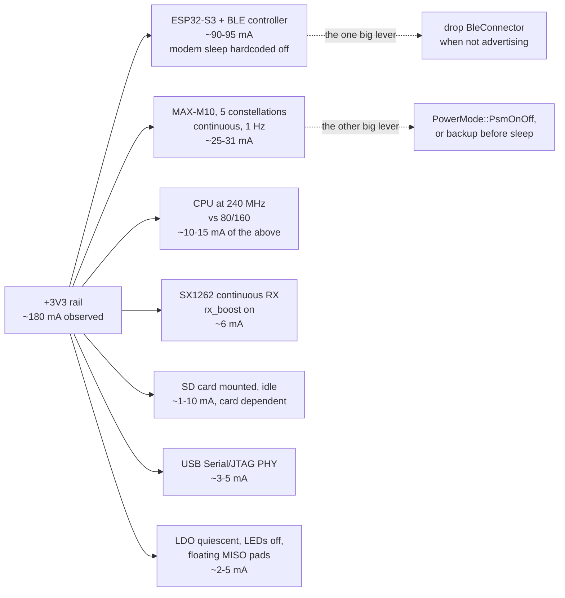

# Wio-S3 power investigation

Measured: ~180 mA "passive" (awake, nothing transmitting), and deep sleep
that does not look like sleep. This is a read of the firmware and the two
crates it delegates power to, against the module's own numbers.

Nothing here is a single broken line. The board has no power management in
the awake state at all, one dependency silently removes the biggest saving
the chip offers, and the deep-sleep path parks exactly one of the four
loads it could park. The 180 mA is those three facts added up.

## The module's own numbers, for calibration

`Wio-S3_Module_Datasheet_V1.0.pdf`, Table 7, all at 3.3 V:

| Mode | Data (avg) |
|-|-|
| LoRa RX, 915 MHz | 5.7 mA |
| LoRa TX, 915 MHz, 22 dBm | 127 mA |
| BLE advertising + LoRa TX 915 MHz 22 dBm | 158 mA |
| ESP32-S3 light sleep + LoRa standby | 1.43 mA |
| ESP32-S3 deep sleep + LoRa sleep | 9.3 uA |

The useful one is the third: 158 mA with the LoRa PA keyed at 22 dBm
(127 mA on its own) leaves about **31 mA for "BLE advertising"**. Seeed
measured that with ESP-IDF defaults, which enable BT modem sleep. This
firmware cannot get 31 mA, for the reason in finding 1.

## Where the 180 mA goes



Adding the estimates gives ~130-150 mA. The remainder is measurement path
(if the ammeter is on the 5 V USB side rather than +3V3, a boost or a
charger's quiescent draw is in the number too) and an SD card that idles
hotter than the low end of that range. Worth resolving before chasing
anything below finding 4.

---

## 1. esp-radio hardcodes BLE modem sleep off - biggest single item

`esp-radio-0.17.0/src/ble/os_adapter_esp32c3_s3.rs`, in `create_ble_config`:

```rust
    // keep them aligned with BT_CONTROLLER_INIT_CONFIG_DEFAULT in ESP-IDF
    // ideally _some_ of these values should be configurable
    esp_bt_controller_config_t {
        ...
        sleep_mode: 0,
        sleep_clock: 0,
```

Literals, not config fields. ESP-IDF defaults `CONFIG_BT_CTRL_MODEM_SLEEP`
to on; esp-radio does not. With `sleep_mode: 0` the BT controller never
powers its PHY down between advertising events, so the part sits in
"RF working" - roughly 90-95 mA on an S3 - continuously, instead of the
~31 mA the module datasheet reports. There is no firmware knob for this in
esp-radio 0.17.

What there *is*: `BleConnector` owns a `PhyInitGuard`, and

```rust
impl Drop for BleConnector<'_> {
    fn drop(&mut self) {
        crate::ble::ble_deinit();
    }
}
```

**Dropping the connector powers the BLE modem down.** That is the lever.
Today `main` builds the connector once at
[main.rs:363-367](s3/src/bin/main.rs#L363-L367) and holds it for the life
of the program, so BLE is at full current even on a node that is only
beaconing over LoRa with no phone within a mile.

Restructuring `serve` so the trouble-host stack is built inside the
advertising window and torn down when the window closes is the single
largest saving available in the awake state - about 90 mA for the whole
time between windows. It is also the only way to get a useful "LoRa node,
no BLE" mode, which is what a deployed tracker actually is most of the
time.

Smaller, free, same file: the BLE config is `Default::default()`, and

```rust
    /// 9 dBm
    #[default]
    P9,
```

BLE TX power defaults to **+9 dBm**. A phone at arm's length does not need
that, and it is the worst possible current spike to have beside a LoRa PA -
which is exactly what `state::radio_busy()` exists to keep apart. Set
`default_tx_power` to `TxPower::N0` or `N3` in the `ble::Config` at
[main.rs:365](s3/src/bin/main.rs#L365).

## 2. The GPS is the whole deep-sleep budget, and sleep does not park it

[`enter_deep_sleep`](s3/src/bin/main.rs#L406-L426) parks the radio and
nothing else. The comment is honest about it:

> The MAX-M10 keeps acquiring throughout, which is the dominant draw and a
> board fact rather than a firmware choice; `CFG_GPS_SLEEP` is the lever
> for that and it is the app's to pull.

It is a board fact that there is no rail to cut. It is not a board fact
that the receiver has to stay awake: `Gps::sleep` already sends UBX-RXM-PMREQ
with the backup flag, which takes the M10 to tens of uA, and `Gps::wake`
already brings it back with UART traffic. The machinery exists and the
deep-sleep path just does not use it.

So today a "deep sleep" measures ~25-31 mA, not 9.3 uA - a 3000x miss
against the datasheet, which is almost certainly what "not sleeping
properly" is. Sending `Request::GpsSleep(true)` alongside `PrepareSleep`,
and waking the receiver on the next boot, is the fix. The cost is
acquisition time on each wake: a warm start from BBR is a few seconds, and
BBR survives backup mode, so it is not a cold start every window.

If the wake budget cannot absorb that, `PowerMode::PsmOnOff` (already in
`GpsConfig`, defaulted to `Full`) is the middle option and helps the awake
case too.

## 3. Nothing is held across deep sleep, so two chips wake themselves up

esp-hal's S3 deep-sleep prep clears `dg_pad_force_unhold` and
`dg_pad_force_noiso` (`esp-hal-1.0.0/src/rtc_cntl/sleep/esp32s3.rs:641`),
so every pad the firmware has not explicitly held goes high-Z when the
digital domain drops. The firmware holds none. Two of those matter:

- **GPIO21, SX1262 NSS.** The SX1262 leaves sleep on a *falling edge* of
  NSS. A floating NSS on a board that is otherwise quiet will produce one.
  The radio that `PrepareSleep` just put into cold sleep comes back to
  STDBY_RC and sits there for the whole interval. GPIO21 is inside the S3's
  RTC GPIO range (0-21), so `RtcPin::rtcio_pad_hold(true)` covers it - the
  same trick the C6 firmware already uses for its LDO enable and WIO reset
  lines, including the "reconfigure first, then release" ordering on wake.
- **GPIO44, SD CS.** Not an RTC pin (S3 RTC GPIOs stop at 21), so it needs
  the digital pad hold register rather than `rtcio_pad_hold`, which esp-hal
  1.0 does not expose - a PAC write to `RTC_CNTL_DIG_PAD_HOLD`. A card left
  with CS undefined does not reliably return to standby.

GPIO43 and GPIO14 (the LED cathodes) also float, which is precisely the
"biased just under Vf" condition the pin sweep in `NOTES.md` fixed for the
awake case and then did not carry into sleep. GPIO14 is RTC-capable;
GPIO43 is not.

## 4. `PrepareSleep` can be missed, and the timeout then sleeps hot

```rust
    state::SLEEP_READY.reset();
    state::request(Request::PrepareSleep);
    // Far longer than the 10 ms pass the loop takes to notice; if it is
    // wedged, sleeping anyway beats staying awake at full current.
    let _ = with_timeout(Duration::from_secs(1), state::SLEEP_READY.wait()).await;
```

The 1 s budget assumes the hardware loop is at the top of its pass. It is
not always: `node.broadcast()` awaits for the length of a transmission,
which is 289 ms at the SF12/BW500 default and up to ~9.7 s at the slowest
settings `RadioConfig` accepts - the driver's own `tx_poll_timeout_ms`
comment says so. A `PrepareSleep` issued during a beacon is not seen for
that long, the timeout fires, and the board deep-sleeps with the SX1262
still in continuous RX. The MCU wakes and re-`init`s the radio, so nothing
looks wrong afterwards; the cost is 5.7 mA silently added to every sleep
interval that happened to start during a beacon.

Two ways out, and they compose: raise the timeout above
`cfg.tx_poll_timeout_ms()`, and have the beacon branch decline to start
when a sleep is pending rather than only when `transfer_active()`.

## 5. 240 MHz buys nothing this firmware uses

```rust
    let config = esp_hal::Config::default().with_cpu_clock(CpuClock::max());
```

[main.rs:186](s3/src/bin/main.rs#L186). `CpuClock::max()` on the S3 is
240 MHz. The workload is a 100 Hz poll loop, a 9600-baud UART, an 8 MHz SPI
burst per beacon and a 400 kHz SD bus. `CpuClock::_80MHz` or `_160MHz`
saves on the order of 10-15 mA for no loss - esp-radio needs 80 MHz, not
240. Second core is correctly left in reset (`esp_rtos::start` only, no
`start_second_core`), and the idle path is genuinely idle: esp-rtos's
Xtensa idle hook is `waiti 0`
(`esp-rtos-0.2.0/src/task/xtensa.rs:17`). The 10 ms poll loop is not the
problem and is not worth restructuring.

## 6. Sleep is off unless an app turns it on

`Stored::new()` has `sleep_interval_s: 0`, and `Window::next` returns
`Sleep` only when `sleep_interval_s > 0`. A board that has never been
configured over BLE **never deep-sleeps at all** - it advertises forever at
whatever the awake number is.

That is a deliberate policy (`an_unconfigured_board_is_awake_and_powered`
is a test, not an accident) and it is the right default for a board you
have to be able to reach. But if the measurement was taken on a
freshly-flashed board expecting it to sleep on its own, this is the
explanation, and it is a settings question rather than a bug. Confirm with
the console: a board that is sleeping prints
`deep sleep for N s (radio parked, gps still acquiring)`.

## 7. Two SPI MISO pads float, which the pin sweep missed

`esp-hal`'s `Spi::with_miso` applies `InputConfig::default()`, i.e.
`Pull::None`, and enables the input buffer
(`esp-hal-1.0.0/src/spi/master.rs:1042-1051`). An SPI peripheral only drives
MISO while its CS is low, so:

- **GPIO5** (SX1262 MISO) floats except during a transaction.
- **GPIO3** (SD MISO) floats permanently when no card is fitted.

This is exactly the mid-rail input-buffer condition the sweep in `NOTES.md`
chased across GPIO10-13, 15-18, 38-42, 47 and 48 - it just did not cover
the pins the peripherals had already claimed. Cost is small, sub-mA to a
few mA if the pad picks up enough noise to switch, but it is the cheapest
item on this list and the argument for fixing it is already written down.

## Order to work in

1. **Resolve the measurement path first.** +3V3 rail or 5 V USB input? The
   estimate above only closes to ~130-150 mA, and the gap is most likely
   upstream of the module.
2. Read the periodic status line while measuring. `radio rx` is the
   expected mode; `radio tx` or an `err` word with 0x0020 set would change
   this whole analysis.
3. Findings 1 (BLE TX power, one line) and 5 (CPU clock, one line) - both
   free, both measurable immediately.
4. Finding 2 (GPS backup before sleep) - the deep-sleep number is
   meaningless until this lands.
5. Finding 3 (pad holds) - needed for finding 2's number to hold up.
6. Finding 1's larger half: duty-cycle the BLE controller. Biggest win,
   biggest change, and it wants the cheap measurements above first so the
   ~90 mA claim is confirmed on this board rather than assumed.
