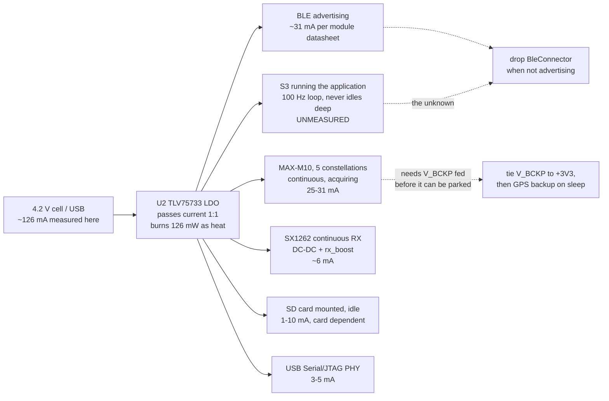

# Wio-S3 power investigation

Measured: **~140 mA at the 4.2 V regulator input**, awake, BLE connected,
GPS tracking and nothing transmitting. It was 180 mA before the clock came
down to 160 MHz and the unused pins were parked. The same scenario on the
two-MCU board this one replaces measures **66 mA**.

That comparison is the most useful number in this document and it arrived
after the first two drafts, so read this one as the corrected version. The
74 mA gap is not a firmware regression. Roughly 50 mA of it is the part
swap - an S3's BLE radio costs about twice a C6's for the same job - and
roughly 20 mA is a hardware feature the old board had and this one does
not: a GPIO under the GPS and LoRa rail. Neither board ever gets BLE modem
sleep, because the crate in the middle hardcodes it off, and that is where
the recoverable current is.

## Where the measurement was taken, and what it means

The 4.2 V node is the output of the diode-OR (D3 battery / D4 USB, both
`DM3CS-SF` Schottky) and the input to **U2, a `TLV75733PDBVR`** - a linear
regulator, not a switcher. That settles the one thing the first draft of
this report left open, and it settles it the unhelpful way:

**An LDO passes its load current straight through.** Input current equals
output current plus a quiescent draw of about 25 uA. So the 140 mA is not a
higher-voltage-side number that divides down - it *is* the +3V3 load, and
the budget below has to account for all of it rather than for the ~110 mA a
switching regulator would have implied.

Two consequences the topology adds on its own, neither of them firmware's:

- **126 mW is burned as heat in U2** ((4.2 - 3.3) V x 140 mA), which is
  about 21% of the power drawn from the cell. A buck in that position would
  put roughly that fraction back - the same 3.3 V load would cost around
  115 mA at 4.2 V instead of 140 mA. In a SOT-23-5 it is also about a 25 C
  rise on the part itself.
- **The diode costs usable cell range.** The LDO needs ~3.35 V in to hold
  3.3 V out at this current; the Schottky drops ~0.3-0.4 V on top, so the
  rail starts sagging with the cell still around 3.7 V. That is well short
  of a LiPo's empty, and it is capacity that is simply not reachable.

## The module's own numbers, for calibration

`Wio-S3_Module_Datasheet_V1.0.pdf`, Table 7, all at 3.3 V:

| Mode | Data (avg) |
|-|-|
| LoRa RX, 915 MHz | 5.7 mA |
| LoRa TX, 915 MHz, 22 dBm | 127 mA |
| BLE advertising + LoRa TX 915 MHz 22 dBm | 158 mA |
| ESP32-S3 light sleep + LoRa standby | 1.43 mA |
| ESP32-S3 deep sleep + LoRa sleep | 9.3 uA |

The useful one is the third: 158 mA with the LoRa PA keyed at 22 dBm
(127 mA on its own) leaves about **31 mA for "BLE advertising"**.

**Treat that as an anchor, not a target.** It is a subtraction across two
separate rows, which assumes everything else about them was identical, and
the conditions are not stated - in particular whether modem sleep was on,
which on this chip family is not the ESP-IDF default (see finding 1). It
is evidence that a duty-cycled BLE advertiser on this module costs tens of
milliamps rather than ninety, and it is not a number to plan against. The
real one comes off a meter.

## The two-MCU board is the calibration that matters

`README.md` keeps the predecessor's bench figures. Two of them carry the
whole diagnosis:

| Scenario, old two-MCU board | |
|-|-|
| Everything running, no SD (BLE connected, fix, LoRa TX pulses) | 66 mA |
| ESP only, BLE connected | 46 mA |

The second line is the one to read twice. **46 mA is a C6 doing nothing but
BLE**, with the AP2112K on GPIO2 holding the GPS and the WIO-E5 off - that
firmware only raises the rail when a central actually connects. So the old
board's headline 66 mA is 46 mA of BLE plus 20 mA for an entire second MCU,
a GPS and a LoRa radio.

### What that comparison does *not* say, and a draft that said it anyway

Earlier revisions of this document put a "95-100 mA, datasheet class"
figure against the S3's BLE and concluded the module's radio simply costs
twice the C6's. **Table 7 of the module's own datasheet contradicts that**,
and it is a measurement of this exact part:

| Row | |
|-|-|
| BLE advertising + LoRa Tx 915 MHz 22 dBm | 158 mA |
| LoRa Tx 915 MHz 22 dBm (note: *WiFi & BLE off*) | 127 mA |
| LoRa Rx 915 MHz | 5.7 mA |
| WiFi Rx 802.11b (LoRa sleeping) | 104 mA |

BLE advertising on this module is worth about **31 mA**, not 95. The ~95
figure is an ESP32-S3 chip number for continuous receive - the state the
WiFi Rx row is actually measuring - and a BLE advertiser does not sit in
it. So "the S3's radio is the gap" was never supported, and every estimate
built on it in this document was wrong by roughly the same amount.

The **real** structural difference is one the rail gate half-hides:

| | Old (C6 + WIO-E5) | New (Wio-S3) |
|-|-|-|
| What the ESP does | **BLE and nothing else** | BLE *plus* the whole application |
| 100 Hz poll loop, GPS UART, radio SPI, SD, panel | on the STM32WL | on the S3 |
| That subsystem's measured cost | **20 mA**, MCU included | not separable |
| Rail gate under GPS/LoRa | AP2112K on GPIO2 | **none - U2 feeds everything** |
| **Same scenario** | **66 mA** | **126 mA** |

The old board's 46 mA is an ESP that had *nothing to do* - a WIO-E5 was
running the loop, draining the GPS UART, clocking the radio and the card,
and the entire package cost 20 mA because an STM32WL doing that work is
cheap. The S3 now does all of it, at 80 MHz, and never enters a low-power
state between ticks. Whatever that costs is inside the unattributed
remainder below, and this document has no measurement that separates it.

## Where the 126 mA goes, and what is still unattributed



| Load | Basis | At 3.3 V |
|-|-|-|
| BLE advertising | module datasheet Table 7 | ~31 mA |
| MAX-M10, five constellations, continuous | u-blox | 25-31 mA |
| SX1262 continuous RX, DC-DC and `rx_boost` on | module datasheet | ~6 mA |
| USB Serial/JTAG PHY | estimate | 3-5 mA |
| LEDs off, LDO quiescent, leakage | estimate | ~1 mA |
| 0.91" OLED on J5, *if fitted* | estimate | 5-15 mA |
| SD card mounted and idle, *if fitted* | estimate | 1-10 mA |
| **Accounted for** | | **66-99 mA** |
| **Measured** | | **126 mA** |
| **Unattributed** | | **27-60 mA** |

There is no antenna line because **U3 is unpopulated and the GPS antenna is
a wire** - see the section below. The bias tee drives nothing.

**This does not close, and saying so is the point.** Three drafts closed it
by putting a large speculative number against the S3's BLE, and the module
datasheet says that number is wrong. What is left is a real gap with one
obvious candidate and no measurement behind it: the S3 is running the whole
application - a 100 Hz poll loop, a GPS UART, radio SPI, the card and the
panel - which on the old board was a separate MCU costing 20 mA all in.
An S3 core that never reaches a low-power state is tens of milliamps on its
own, and nothing here has measured it.

**Stop estimating and start subtracting.** The isolation measurements are
item 1 of the work order.

Worth stating plainly what this means for runtime: 126 mA is roughly four
to six hours from the LiPo sizes this board takes, and about a fifth of
that is heat in U2.

### The antenna question, closed

**U3 is not fitted, and the GPS antenna is a wire.** That settles it as a
build fact, and it costs nothing to leave alone:

- The board is *designed* for an active antenna - `U5.VCC_RF` -> U3
  (SiP32431) -> R15 10R -> L1 27nH -> the SMA J2 center pin - but with the
  load switch depopulated the DC path is open at U3. No current leaves
  `VCC_RF`, whatever `LNA_EN` does.
- A wire soldered to the SMA center pin is a passive monopole, so there is
  no LNA to feed and nothing on the far end that wants DC. The
  DC-shorted-patch failure mode that earlier drafts worried about cannot
  happen either, because the feed is broken one component earlier.
- R15 and L1 are left as an open stub off the RF node. At 1575 MHz a 27 nH
  shunt into an open is not a load worth counting.

So the antenna line is **0 mA**, the R15 probe is unnecessary, and the
budget above has to close on the other loads alone - which it does. The
only thing left of this section is the note below, which is about a config
key that was never worth adding.

`Gps::configure` writes signal enables, `CFG-PM-OPERATEMODE`,
`CFG-RATE-MEAS`, `CFG-NAVSPG-DYNMODEL` and the NMEA message rates, and no
`CFG-HW-ANT_*` key at all. On this build that is the right answer for a
second reason: with U3 absent, there is no supply to supervise.

### There is no "configure for passive", and the manual is explicit

The plan was `CFG-HW-ANT_CFG_VOLTCTRL = 0` as a new `GpsConfig` key. The
MAX-M10N integration manual (UBXDOC-304424225, Table 22) says that does not
do what we both assumed:

| Mode/feature | LNA_EN state |
|-|-|
| Normal operation | **High** |
| Software standby mode | Low |
| Hardware backup mode | Low |
| LEAP mode | Duty cycling high-low |
| Antenna supervisor: supply power down on short detect | Low |

**LNA_EN is high in normal operation regardless of the antenna supervisor.**
The supervisor does not gate it - it can only pull it *low*, and only on a
detected short, which needs a sense circuit on `CFG-HW-ANT_SUP_SHORT_PIN`
that this board does not have. `VOLTCTRL` is already disabled by default
(section 3.4.1: an unconfigured receiver reports antenna status "DON'T
KNOW"), so writing 0 to it changes nothing at all.

The pin also has no polarity control - "The polarity cannot be changed" -
and it is shared with the module's *internal* LNA, so it is not a pin the
firmware may repurpose.

So the honest answer is: **the DC feed cannot be turned off in firmware**,
and no config key has been added, because a setting that does nothing is
worse than no setting.

On this build it is moot anyway: **U3 is unpopulated**, so the feed is
already broken a component upstream of anything `LNA_EN` could reach, and
depopulating R15 as well would be belt and braces on a path that is
already open. Fitting U3 is the decision that would bring any of this back,
and it should only be made alongside an actual active antenna.

Worth keeping from the original note: `CFG-PM-OPERATEMODE` set to a
power-save mode duty-cycles `LNA_EN` as a side effect (the LEAP row above).
That is a receiver power decision that happens to touch the antenna, not an
antenna setting, and `power_mode` is already a config key - see item 3 in
the work order.

**With a wire antenna and no U3, this is a non-issue and not a saving.**

## 1. esp-radio hardcodes BLE modem sleep off - biggest single item

`esp-radio-0.17.0/src/ble/os_adapter_esp32c3_s3.rs`, in `create_ble_config`:

```rust
    // keep them aligned with BT_CONTROLLER_INIT_CONFIG_DEFAULT in ESP-IDF
    // ideally _some_ of these values should be configurable
    esp_bt_controller_config_t {
        ...
        sleep_mode: 0,
        sleep_clock: 0,
```

Literals, not config fields. With `sleep_mode: 0` the BT controller never
powers its PHY down between advertising or connection events, so the part
sits in "RF working" - a ~95 mA figure on an S3, against the C6's measured
46 - for as long as the controller exists. There is no firmware knob for
it in esp-radio 0.17.

**Upstream is not doing anything wrong, and earlier drafts of this document
said it was.** The claim here used to be that ESP-IDF defaults
`CONFIG_BT_CTRL_MODEM_SLEEP` to on and esp-radio silently diverged. It does
not: on the C3/S3 controller `BT_CTRL_MODEM_SLEEP` is `default n`
(`components/bt/controller/esp32c3/Kconfig.in`), so the published crate is
doing exactly what its comment says - tracking
`BT_CONTROLLER_INIT_CONFIG_DEFAULT`. Modem sleep is an opt-in in both
places. That makes this a supported configuration someone chose not to
select, rather than a saving a dependency took away, and it lowers
confidence in the ~31 mA estimate that was partly resting on the same bad
assumption.

The values, from `esp_bt.h`, are `ESP_BT_SLEEP_MODE_1 = 1` and
`ESP_BT_SLEEP_CLOCK_MAIN_XTAL = 1`; mode 1 is the only sleep mode the
controller implements, and main crystal is what menuconfig's low-power
clock choice defaults to. The 32 kHz options need an external crystal
(`RTC_CLK_SRC_EXT_CRYS`) or accept the internal RC's accuracy, which is far
outside BLE's 500 ppm.

What there *is*: `BleConnector` owns a `PhyInitGuard`, and

```rust
impl Drop for BleConnector<'_> {
    fn drop(&mut self) {
        crate::ble::ble_deinit();
    }
}
```

**Dropping the connector powers the BLE modem down.** That is the lever.
Today `main` builds the connector once at
[main.rs:363-367](s3/src/bin/main.rs#L363-L367) and holds it for the life
of the program, so BLE is at full current even on a node that is only
beaconing over LoRa with no phone within a mile.

Restructuring `serve` so the trouble-host stack is built inside the
advertising window and torn down when the window closes is the single
largest saving available in the awake state - about 90 mA for the whole
time between windows. It is also the only way to get a useful "LoRa node,
no BLE" mode, which is what a deployed tracker actually is most of the
time.

Same file, and it looked free until it was tried: the BLE config is
`Default::default()`, and

```rust
    /// 9 dBm
    #[default]
    P9,
```

BLE TX power defaults to **+9 dBm**. A phone at arm's length does not need
that, and it is the worst possible current spike to have beside a LoRa PA -
which is exactly what `state::radio_busy()` exists to keep apart.

**It cannot be lowered.** `esp-radio` re-exports `Config` but not the
`TxPower` enum its own `with_default_tx_power` builder takes: both
`ble::npl` and `ble_os_adapter_chip_specific` are `pub(crate)`, so the
setter is public and its argument is unnameable from outside the crate.
It cannot be lowered *from outside the crate*. The vendored copy solves it
in one line - a `pub use` beside the existing `Config` re-export - and the
firmware now runs at **0 dBm**. On this board the extra 9 dB was buying
nothing anyway: `WIFI/BT_ANT` runs to test point BLE1 and stops, so range
is whatever the stub couples at either power.

### The cheaper route to most of the same current: patch the two literals

Dropping the connector saves ~90 mA *between* advertising windows and
nothing at all while a phone is connected. Modem sleep saves ~60 mA in both
states, and the entire change is two values in a vendored esp-radio:

```rust
// esp-radio-0.17.0/src/ble/os_adapter_esp32c3_s3.rs, create_ble_config
sleep_mode: 1,   // ESP-IDF CONFIG_BT_CTRL_SLEEP_MODE_EFF, which defaults on
sleep_clock: 1,  // ESP-IDF main-XTAL low-power clock
```

plus a `[patch.crates-io]` entry pointing at the copy. Confirm both values
against ESP-IDF's `esp_bt.h` for the S3 before trusting them; the point is
that the module datasheet's implied ~31 mA for BLE advertising is what
ESP-IDF gets with whatever these are, so the target is known rather than
guessed.

**It is unproven and may simply not work.** The C3/S3 path runs through
`npl.rs`, whose init calls
`ble_os_adapter_chip_specific::disable_sleep_mode()` - and for this chip
that function's whole body is the comment `// nothing`. The sleep phase
callbacks (`btdm_sleep_enter_phase1` and the rest) are present in the OSI
table, but nothing in the crate exercises them, and a controller that asks
to sleep and gets a stub back hangs rather than saves.

It is still the first thing to try, because it is an afternoon against a
restructuring, it helps in the connected state that dropping the connector
cannot touch, and it fails loudly: the board either advertises at ~35 mA or
stops advertising.

## 2. The GPS is the whole deep-sleep budget, and V_BCKP is why it stays

[`enter_deep_sleep`](s3/src/bin/main.rs#L494) parks the radio and nothing
else, so a deep sleep measures around 25-31 mA rather than the datasheet's
9.3 uA. That is the number behind "not sleeping properly".

**The first draft of this report called that a defect and it is not.** The
obvious fix - send `Gps::sleep` (UBX-RXM-PMREQ backup) alongside the
existing `PrepareSleep`, since the machinery is already there - is wrong on
*this* board, and the board repo says why:

> **U5 V_BCKP** goes only to test point BCKP1. No 3V3 feed, no coin cell, so
> every power-up is a cold start with no almanac - minutes of TTFF instead
> of seconds. u-blox recommends tying it to 3V3.
>
> -- `wio-s3-max-gps/BOARD-REVIEW.md`

The M10's backup domain - the RTC, the BBR that holds the ephemeris, and the
UART-RX wake source itself - is supplied by V_BCKP. Unconnected, backup mode
has nothing keeping it alive. Two consequences, and the second is worse than
the power it would save:

- Every wake would be a **cold start**, minutes of TTFF. On a 60 s wake
  cadence a tracker that backs its GPS up between windows never gets a fix
  at all. Leaving the receiver running is what keeps it tracking across the
  MCU's sleep, and that is the trade the existing comment is describing when
  it calls the draw "a board fact rather than a firmware choice".
- The UART-RX wake source lives in that same unpowered domain, so it is not
  established that a board told to back its GPS up can wake it again without
  a power cycle. `CFG_GPS_SLEEP` (0x12) already exposes this and is the right
  place for it: an explicit lever someone chooses, not something the sleep
  path does on everyone's behalf.

**So the firmware change here is: none.** The fix is the board's - tie V_BCKP
to +3V3, already open in `BOARD-REVIEW.md`. This investigation raises its
priority sharply: it is not only "minutes of TTFF instead of seconds", it is
the gate on the entire sleep story. With V_BCKP fed, backing the GPS up
during deep sleep becomes both safe and obviously correct (BBR survives, so
wakes are warm starts), and deep sleep goes from ~30 mA to something near
the datasheet's 9.3 uA. Until then that is the floor and no amount of
firmware moves it.

Earlier drafts hedged this at 30-50 mA on the chance that an active
antenna's LNA was being fed through U3 alongside the receiver. **U3 is
unpopulated and the antenna is a wire**, so there is no LNA in the picture
and the number is the receiver's own **25-31 mA**. That is still the
largest single load on a sleeping board by a wide margin, and the argument
is unchanged - only simpler.

## 3. Nothing is held across deep sleep, so two chips wake themselves up

esp-hal's S3 deep-sleep prep clears `dg_pad_force_unhold` and
`dg_pad_force_noiso` (`esp-hal-1.0.0/src/rtc_cntl/sleep/esp32s3.rs:641`),
so every pad the firmware has not explicitly held goes high-Z when the
digital domain drops. The firmware holds none. Two of those matter:

- **GPIO21, SX1262 NSS.** The SX1262 leaves sleep on a *falling edge* of
  NSS. A floating NSS on a board that is otherwise quiet will produce one.
  The radio that `PrepareSleep` just put into cold sleep comes back to
  STDBY_RC and sits there for the whole interval. GPIO21 is inside the S3's
  RTC GPIO range (0-21), so `RtcPin::rtcio_pad_hold(true)` covers it - the
  same trick the C6 firmware already uses for its LDO enable and WIO reset
  lines, including the "reconfigure first, then release" ordering on wake.
- **GPIO44, SD CS.** Not an RTC pin (S3 RTC GPIOs stop at 21), so it needs
  the digital pad hold register rather than `rtcio_pad_hold`, which esp-hal
  1.0 does not expose - a PAC write to `RTC_CNTL_DIG_PAD_HOLD`. A card left
  with CS undefined does not reliably return to standby.

GPIO43 and GPIO14 (the LED cathodes) also float, which is precisely the
"biased just under Vf" condition the pin sweep in `NOTES.md` fixed for the
awake case and then did not carry into sleep. GPIO14 is RTC-capable;
GPIO43 is not.

## 4. `PrepareSleep` can be missed, and the timeout then sleeps hot

```rust
    state::SLEEP_READY.reset();
    state::request(Request::PrepareSleep);
    // Far longer than the 10 ms pass the loop takes to notice; if it is
    // wedged, sleeping anyway beats staying awake at full current.
    let _ = with_timeout(Duration::from_secs(1), state::SLEEP_READY.wait()).await;
```

The 1 s budget assumes the hardware loop is at the top of its pass. It is
not always: `node.broadcast()` awaits for the length of a transmission,
which is 289 ms at the SF12/BW500 default and up to ~9.7 s at the slowest
settings `RadioConfig` accepts - the driver's own `tx_poll_timeout_ms`
comment says so. A `PrepareSleep` issued during a beacon is not seen for
that long, the timeout fires, and the board deep-sleeps with the SX1262
still in continuous RX. The MCU wakes and re-`init`s the radio, so nothing
looks wrong afterwards; the cost is 5.7 mA silently added to every sleep
interval that happened to start during a beacon.

Two ways out, and they compose: raise the timeout above
`cfg.tx_poll_timeout_ms()`, and have the beacon branch decline to start
when a sleep is pending rather than only when `transfer_active()`.

## 5. 240 MHz buys nothing this firmware uses

```rust
    let config = esp_hal::Config::default().with_cpu_clock(CpuClock::max());
```

[main.rs:186](s3/src/bin/main.rs#L186). `CpuClock::max()` on the S3 is
240 MHz. The workload is a 100 Hz poll loop, a 9600-baud UART, an 8 MHz SPI
burst per beacon and a 400 kHz SD bus. `CpuClock::_80MHz` or `_160MHz`
saves on the order of 10-15 mA for no loss - esp-radio needs 80 MHz, not
240. Second core is correctly left in reset (`esp_rtos::start` only, no
`start_second_core`), and the idle path is genuinely idle: esp-rtos's
Xtensa idle hook is `waiti 0`
(`esp-rtos-0.2.0/src/task/xtensa.rs:17`). The 10 ms poll loop is not the
problem and is not worth restructuring.

## 6. Sleep is off unless an app turns it on

`Stored::new()` has `sleep_interval_s: 0`, and `Window::next` returns
`Sleep` only when `sleep_interval_s > 0`. A board that has never been
configured over BLE **never deep-sleeps at all** - it advertises forever at
whatever the awake number is.

That is a deliberate policy (`an_unconfigured_board_is_awake_and_powered`
is a test, not an accident) and it is the right default for a board you
have to be able to reach. But if the measurement was taken on a
freshly-flashed board expecting it to sleep on its own, this is the
explanation, and it is a settings question rather than a bug. Confirm with
the console: a board that is sleeping prints
`deep sleep for N s (radio parked, gps still acquiring)`.

## 7. Two SPI MISO pads float, which the pin sweep missed

`esp-hal`'s `Spi::with_miso` applies `InputConfig::default()`, i.e.
`Pull::None`, and enables the input buffer
(`esp-hal-1.0.0/src/spi/master.rs:1042-1051`). An SPI peripheral only drives
MISO while its CS is low, so:

- **GPIO5** (SX1262 MISO) floats except during a transaction.
- **GPIO3** (SD MISO) floats permanently when no card is fitted.

This is exactly the mid-rail input-buffer condition the sweep in `NOTES.md`
chased across GPIO10-13, 15-18, 38-42, 47 and 48 - it just did not cover
the pins the peripherals had already claimed. Cost is small, sub-mA to a
few mA if the pad picks up enough noise to switch, but it is the cheapest
item on this list and the argument for fixing it is already written down.

## What has landed

Findings 3, 4, 5 and 7 are fixed, and sleep is now something a board can be
*told* to do rather than only left to:

| | |
|-|-|
| 3 | SX1262 NSS is pad-held through the sleep (GPIO21 is an RTC pin). SD CS on GPIO44 is not fixable this way - the S3's RTC pins stop at 21 - and is still open. |
| 4 | The park budget is the running config's own transmit deadline, and the hardware loop declines to start a beacon with a sleep pending. |
| 5 | 240 -> 160 -> 80 MHz. 80 is esp-radio's own documented floor; it refuses to start below it. |
| 7 | Both MISO pads pulled up, through a frozen `InputSignal` because `with_miso` overwrites the pull otherwise. |
| new | `CFG_SLEEP_NOW` (BLE), `SLEEP` (USB console), `pixi run wio-sleep`, and a Sleep now control on the app's Beacon page. |
| new | A wake counter in RTC RAM. A deep sleep is a full reset, so from the console a board on its cadence and a board resetting in a loop print the same banner - the wake number is what separates them. |
| 1a | **esp-radio is vendored under `s3/vendor/esp-radio`** with `sleep_mode`/`sleep_clock` set to 1, and `TxPower` re-exported so BLE TX drops from +9 to 0 dBm. Wired through `[patch.crates-io]`; deleting that block reverts it. Builds clean - whether the controller actually sleeps is a bench question, not a build one. |

Finding 6 stands as designed - an unconfigured board never sleeping on its
own is the right default for something you have to be able to reach - but
finding a board that will not sleep no longer means reading the policy: the
sleep-now command works regardless of it.

## Two things that look like levers and are not

**Unused peripherals are already clock-gated, and not by luck.**
`esp_hal::init` calls `system::disable_peripherals()`
(esp-hal-1.0.0/src/system.rs:37), which gates and resets every peripheral
outside a small `KEEP_ENABLED` set. Each driver then holds a refcounted
`PeripheralGuard` that enables on construction and disables on `Drop`
(same file, 54-77). This firmware constructs TIMG0, SPI2, SPI3, I2C0,
UART1, USB_DEVICE, BT, LPWR and FLASH; every other block - the spare
UARTs, I2S, LCD_CAM, RMT, PCNT, TWAI, MCPWM, LEDC, the crypto
accelerators, unclaimed DMA - was never turned on to begin with. There is
no saving here, and the pin sweep already covered the pads. The one
exception worth a line is `USB_DEVICE`: its PHY is 3-5 mA and is only
useful with a cable attached, so dropping the driver when unplugged would
gate it. Small, and only helps on battery.

**ESP-IDF's power management API does not exist on this stack.**
`esp_pm_configure` - DFS between a min and max frequency, plus automatic
light sleep on tickless idle, arbitrated by PM locks that drivers take -
is an ESP-IDF facility. esp-hal 1.0 sets `CpuClock` once at `init` and has
no runtime DFS, and esp-rtos 0.2's idle hook is a bare `waiti 0`
(esp-rtos-0.2.0/src/task/xtensa.rs:17): a WFI with every clock still
running, not tickless idle. `Rtc::sleep_light` exists
(esp-hal-1.0.0/src/rtc_cntl/mod.rs:415) but it is manual, and entering it
with the BLE controller up is precisely what `sleep_mode`/`sleep_clock`
are supposed to arrange. The IDF document is describing the machinery that
finding 1's two literals opt out of, which is one more argument for
patching them first.

## Ruled out by inspection

A pass over the firmware and the board files looking for assumptions
carried over from the two-MCU design. These are closed; do not spend
bench time on them.

| Suspect | Finding |
|-|-|
| LED left biased on | D2/D5 are cathode-to-GPIO with 5.1k ballast (R20/R21) and `LED_OFF` is `High`, so the polarity is right and a stuck-on LED would still be ~0.25 mA. Not it. |
| GPS antenna bias tee | U3 is DNP; the DC path is open. 0 mA. |
| GPIO45 strapping / VDD_SPI at 1.8 V | R17 is the one `(dnp yes)` part in the schematic, so GPIO45 has no pull-up and the strap reads low. The comment in `main` is accurate. |
| Unused peripherals left clocked | `esp_hal::init` gates everything outside `KEEP_ENABLED` and each driver refcounts its own guard. Only TIMG0, SPI2, SPI3, I2C0, UART1, USB_DEVICE, BT, LPWR and FLASH are enabled. |
| A task busy-looping instead of awaiting | Two spawned tasks plus `main`'s select; no loop body without an `.await`. |
| The vendored esp-radio not actually in the build | `cargo tree -p esp-radio` resolves to `vendor/esp-radio`. The patch is live. |
| PHY powered independently of BLE | `enable_phy()` is called inside `ble_init`, so the guard dies with `BleConnector`. Dropping the connector really does power the RF down. |
| SD polled at 100 Hz keeping a card awake | `SdLog::poll` returns immediately unless a flush is due (5 s) or no card is mounted (10 s retry). |

## Order to work in

The estimates have been wrong three times in a row and in the same
direction. Everything below item 1 is provisional until item 1 is done.

1. **Isolate the loads by subtraction.** The only thing worth doing first.
   The isolation builds are in the crate as cargo features - see below.
2. **Read the boot console before any of that.** `radio status 0x..,
   mode N` comes from `print_diagnostics`. Expect RX. If it says TX, or a
   `radio op error` line appears, the PA is keyed and LoRa Tx is 127 mA on
   its own - which would be the whole mystery in one line, and it has been
   sitting unread in this document since the first draft.
3. ~~Duty-cycle the BLE controller.~~ **Done and measured: 130 mA with a
   window open, 60 mA dark.** See "what the duty cycle is worth" below.
   Original note follows.

   The
   trouble-host stack is built inside the advertising window and dropped
   when the window closes, so `BleConnector::drop` runs `ble_deinit` and
   takes the `PhyInitGuard` with it. Off by default; turn it on for this
   session with

   ```
   pixi run wio-set ble-off 30
   ```

   or put it on the card, where it survives a reflash:

   ```
   cd tools && pixi run wio-config --set ble_off_s=30
   ```

   and read the meter across a whole cycle. Expect **~55 mA** through the
   off period - the 49 mA floor plus the 6 mA application - against 126 mA
   while a window is open. `wio-set ble-off 0` puts it back.

   Two things to check on the bench beyond the number. First, that the
   board still beacons while dark: the status line keeps printing and the
   `tx` counter keeps climbing, because only the BLE modem went. Second,
   that it comes back - the console prints `ble down for N s` and
   `ble back up` around the gap, and a phone should find it in the next
   window.
4. **Push `power_mode = psmct` and measure, outdoors.** The key already
   exists (`CFG-PM-OPERATEMODE`, `PowerMode::PsmCyclic`) and defaults to
   `full`. No code at all:

   ```
   cd tools && pixi run wio-config --set power_mode=psmct
   ```

   This has to be done under open sky. Every reading in this document was
   taken in a basement, which is why the board shows `sats 0` throughout -
   the receiver is not faulty, it cannot see a satellite. That does not
   affect the current measurements, since an acquiring receiver draws its
   full ~30 mA whether or not it succeeds, but it does make the two
   questions that matter here unanswerable indoors: what `psmct` costs in
   fix latency, and whether the BBR keeps the ephemeris across a
   `UBX-RXM-PMREQ` backup. Both need a board that can hold a fix.
5. **Next board spin: tie V_BCKP to +3V3, and add a load switch under the
   GPS and SX1262.** The old board's 46 mA reading exists because it had
   one. V_BCKP is separately the gate on the whole deep-sleep story
   (finding 2). No firmware substitutes for either.
6. **Consider a buck in place of U2.** 126 mW, about a fifth of everything
   drawn from the cell, is heat.
7. **Measure a sleep.** `pixi run wio-sleep --seconds 60`; `woke from deep
   sleep #N` on the far side confirms it was a sleep and not a reset.
   Expect ~30 mA until item 5 lands.

### What the duty cycle is worth

Measured with `adv-window` at its 15 s default:

| Phase | Reading |
|-|-|
| Advertising window open | ~126-130 mA |
| BLE down | **60 mA**, spiking to ~100 |

**A note on the meter, because it cost a round of wrong readings.** A
supply that averages heavily turns this board into nonsense: the same
firmware read "150 mA for 40 s then 50 mA" on one and a clean 60 with
spikes on another. Every steady-state figure in this document survives
that - a plateau averages to itself - but nothing about a *transition*
should be read off a slow instrument. The duty cycle alternates on a 45 s
period and a supply that smooths over tens of seconds will show neither
phase.

**The spikes are the LoRa beacon and they are expected.** One 288 ms
transmit at 22 dBm per ~30 s: 127 mA for 1% of the time, which is ~1.3 mA
averaged and invisible in any steady figure. Seeing them at all is a sign
the instrument is fast enough to trust. What should *also* be visible is
the advertising window as a ~15 s plateau near 126 mA - if the board sits
at 60 continuously with only beacon spikes, BLE is not coming back up and
that is a fault, not a saving.

The average is whatever the two settings make it, and it asymptotes to the
dark figure rather than to zero:

| `adv-window` / `ble-off` | Average | Worst-case wait to connect |
|-|-|-|
| 15 / 0 (default, no duty cycle) | 130 mA | none |
| 15 / 30 | ~83 mA | 30 s |
| 10 / 60 | ~70 mA | 60 s |
| 5 / 60 | ~65 mA | 60 s |
| 5 / 300 | ~61 mA | 5 min |

**Past about a minute of off time the returns from this lever are gone**,
because the average asymptotes to the dark reading. Buying the last few
milliamps costs minutes of unreachability, which is a bad trade.

That is a statement about the duty cycle, not about the board: **60 mA is
not a floor**, it is a number with parts, and only one of them has been
measured. Roughly 30 mA of ungated MAX-M10, ~12 of S3 core that never
sleeps, 3-5 of USB PHY, ~2 of idle SX1262. Every one of those is an open
item below.

Two open items in that 60:

- **The MAX-M10 can be parked after all.** A timed UBX-RXM-PMREQ backup
  (20 s, `--features iso-gps-backup`) put the receiver down and it came
  back **on its own timer** - no UART traffic from this firmware, which
  gates its config retry on `gps.sleeping`. So the backup domain survives
  on `VCC` here despite V_BCKP going nowhere, and finding 2's assumption
  that this was blocked is wrong. GPS duty-cycling is available, on the
  same shape as the BLE one.

  Not shown by that test: whether the BBR keeps the ephemeris across a
  backup. The bench is a basement, so this board has never held a fix,
  warm-vs-cold start was not observable and TTFF after backup is unknown - which is the whole
  question for a tracker. `power_mode = psmct` remains the config-only
  alternative and is still untried.
- **~5 mA was teardown residue, and it is now sourced rather than
  suspected.** `esp_radio::init` clears `wifi_force_pd`; that field appears
  exactly once in the published crate and is never set again, and
  `Controller::drop` does `shutdown_radio_isr` and nothing else. The modem
  digital domain therefore stayed powered through every dark period. The
  vendored copy now mirrors ESP-IDF's `esp_wifi_bt_power_domain_off` on
  drop. Unmeasured - `--features iso-no-ble` is still the check, and the
  dark period should now land nearer the 55 mA the isolation builds
  predict.

### The isolation builds

Four flashes, from `s3/`, same supply and same room each time. Card out and
J5 unplugged for all of them unless a reading for those is wanted too.

```
cargo run --release                                    # baseline
cargo run --release --features iso-no-ble
cargo run --release --features iso-no-app
cargo run --release --features iso-no-ble,iso-no-app
```

| Build | What runs | Reading |
|-|-|-|
| baseline | everything | **126 mA** |
| `iso-no-app` | BLE only - no LoRa driver, GPS UART, card or panel | **120 mA** |
| both | bare chip, USB console only | **49 mA** |

`iso-no-ble` was not needed once the other two landed - the two
subtractions give the whole split.

## The budget, measured

No estimates left in the top-level split:

| | | |
|-|-|-|
| **BLE** | `iso-no-app` - both | **71 mA** |
| **The whole application** | baseline - `iso-no-app` | **6 mA** |
| **Floor** | both | **49 mA** |
| | | **126 mA** |

Two results, and one of them is a relief:

- **The application costs 6 mA.** The 100 Hz poll loop, the GPS UART, the
  radio SPI, the card driver and the panel together. About 5 mA of that is
  just the SX1262 moving from its power-on STDBY_RC into continuous RX, so
  the loop itself is on the order of **1 mA**. Every paragraph in earlier
  drafts worrying that the S3 had absorbed a job the STM32WL used to do is
  answered: it did, and it costs nothing. The port's architecture is fine.
- **BLE costs 71 mA**, against the ~31 mA the module datasheet quotes for
  advertising. That is the entire problem, and it is one subsystem.

**And the duty cycle recovers it.** With `ble-off 30` the board reads
~130 mA while a window is open and **60 mA** through the dark period - a
~70 mA step, which is the 71 mA line above arriving where it was predicted.
The LoRa beacon keeps transmitting throughout, confirmed on the console by
the `tx` counter climbing between "ble down" and "ble back up".

Inside the 49 mA floor, by subtraction and estimate: the free-running
MAX-M10 at 25-31 mA, the S3 itself around 12, the USB PHY 3-5, the idle
SX1262 ~2, leakage ~1. `--features iso-gps-backup` is what turns the first
of those from an estimate into a measurement.

What each subtraction means:

- **baseline - `iso-no-ble`** is what BLE and the PHY actually cost on this
  board. It also settles the vendored modem sleep, which the 14 mA across
  the last two commits suggests is doing nothing.
- **baseline - `iso-no-app`** is the application: the 100 Hz loop, the GPS
  UART, radio SPI, the card and the panel. On the old board the equivalent
  subsystem *including its own MCU* measured 20 mA.
- **`iso-no-app` on its own** is the closest this board gets to the old
  board's "ESP only, BLE connected - 46 mA". It is not a clean comparison:
  the MAX-M10 keeps running underneath it, because nothing gates its rail.
- **both** is the floor - an S3 holding the rail up with a free-running
  GPS and an idle SX1262 beside it.

**Neither flag powers the GPS down.** It sits on the ungated +3V3 and falls
back to its factory default when nothing configures it, so roughly 25-30 mA
is inside every reading above. `--features iso-gps-backup` sends
UBX-RXM-PMREQ backup once the UART is up, which is the only way to get the
receiver's own number. V_BCKP is unconnected, so waking it again is not
established - plan on a power cycle.

An isolation build is missing a subsystem on purpose. Do not flash one and
leave it on a board.

### What the console retired

A run of the real firmware, 95 minutes in:

```
t=5684s radio rx err 0000 rx 0 tx 189 | gps 6807 nmea fix 0 sats 0 | sd absent | nodes 0
beacon ping (288 ms on air)
```

- **`radio rx err 0000`** - the SX1262 is in receive with no device errors.
  The stuck-PA theory, which would have explained everything at 127 mA, is
  dead. Work-order item 2 is closed.
- **Transmit duty cycle is not a factor.** 189 beacons in 5684 s is one per
  30 s, and each is 288 ms of air. That is 1% of 127 mA, so **~1.3 mA**
  averaged. Beaconing is not where the current goes.
- **`sd absent`** - no card in any of these readings, so the 1-10 mA card
  line is out of the budget entirely.
- **`gps 6807 nmea` is a sentence count, not a byte count** (it is
  `rx_sentences()`). 392 sentences in 340 s is 1.15 per second, which is
  exactly right for a 1 Hz nav rate with the extra sentences silenced. The
  receiver is healthy and talking.

One thing the console does *not* say is good: **`fix 0 sats 0` after 95
minutes.** Not one satellite. With a wire soldered to the SMA that is
believable, but it means the MAX-M10 has been in continuous acquisition the
whole time, which is its highest-current state - and it is a functional
problem before it is a power one. Get a fix before taking the final
numbers, or the GPS line is being measured in its worst case.

That also sharpens an old discrepancy. On the two-MCU board the GPS, the
LoRa radio **and** an STM32WL together measured 20 mA. Here the GPS alone
looks like most of a 49 mA floor. Either the old figure was taken with the
receiver in a state this one has never reached, or this board's GPS is
drawing considerably more. `--features iso-gps-backup` is what settles it.

### Modem sleep is unimplemented in esp-radio, not unconfigured

Setting `sleep_mode`/`sleep_clock` to ESP-IDF's mode-1 pair changed nothing
measurable, and reading the crate says why. The S3 goes through
**`btdm.rs`** - `#[cfg_attr(esp32s3, path = "os_adapter_esp32c3_s3.rs")]`
under `#[cfg(bt_controller = "btdm")]` - not `npl.rs`, which earlier drafts
of this document pointed at.

Two things are missing, and the second is fatal:

- **The enabling sequence.** ESP-IDF selects the low-power clock source
  (`btdm_lpclk_select_src`, `btdm_lpclk_set_div`), calls
  `btdm_controller_set_sleep_mode`, and then after
  `btdm_controller_enable` calls `btdm_controller_enable_sleep(true)`.
  `ble_init` in `btdm.rs` does none of these. The config field on its own
  does not turn modem sleep on.
- **The callbacks do not exist.** Every function the controller would call
  to sleep is a `todo!()` in `btdm.rs`: `btdm_sleep_check_duration`,
  `btdm_sleep_enter_phase1` and `_phase2`, `btdm_sleep_exit_phase1`
  through `_phase3`, and `btdm_lpcycles_2_hus`. Only `btdm_hus_2_lpcycles`
  is written. A controller that did enter sleep would panic, not save
  current.

So this is not an afternoon's fork. Making it work means porting the
relevant part of ESP-IDF's `bt.c` plus six ROM callbacks, and getting the
RTC cycle arithmetic right. The literals are back to upstream's zeros with
the finding recorded at the site.

**It is not version lag either**, which was the obvious objection and was
checked rather than assumed. The same three facts hold in **0.17.0**
(pinned here), **0.18.0** (2026-04) and **1.0.0-beta.0** (2026-06, the
current beta): `sleep_mode`/`sleep_clock` are literal zeros, `ble_init`
runs no enabling sequence, and every sleep callback is `todo!()`. Nothing
in any changelog mentions BLE modem sleep, and no BLE power API has
appeared. `TxPower` is still crate-private in all three, so the vendoring
keeps its one working purpose whatever version this lands on.

Upgrading is worth considering on its own merits - see the pin note in the
working notes, which was stale - but it will not move this number.

**The vendored crate stays** for the one thing that does work: `TxPower` is
re-exported, so BLE TX runs at 0 dBm instead of the +9 dBm default.

140 mA -> 126 mA across the two earlier commits was therefore the 80 MHz
clock drop and the TX power, with nothing from modem sleep.
