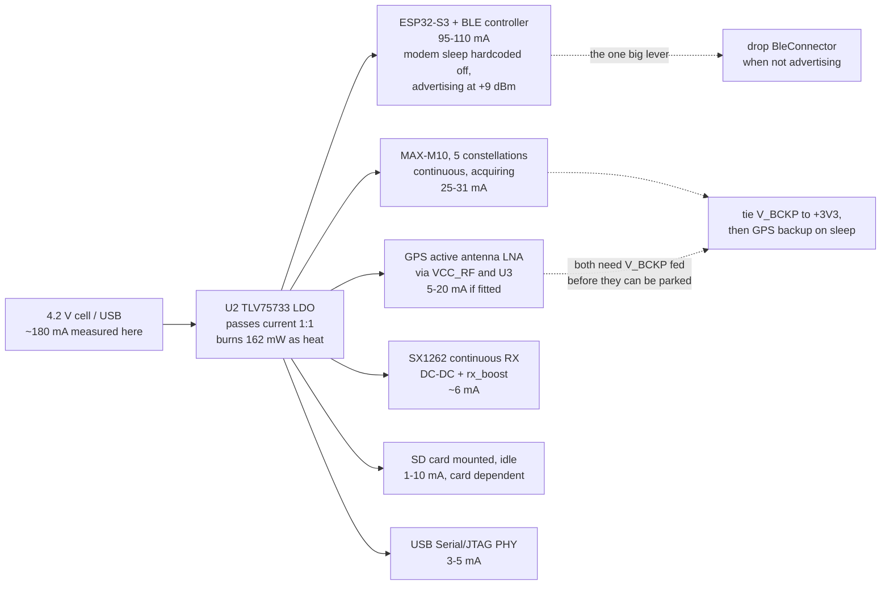

# Wio-S3 power investigation

Measured: **~180 mA at the 4.2 V regulator input**, awake and with nothing
transmitting, and deep sleep that does not look like sleep. This is a read
of the firmware and the two crates it delegates power to, against the
module's own numbers.

Nothing here is a single broken line. The board has no power management in
the awake state at all, one dependency silently removes the biggest saving
the chip offers, and the deep-sleep path can park exactly one of the loads
it would want to. The 180 mA is those facts added up.

## Where the measurement was taken, and what it means

The 4.2 V node is the output of the diode-OR (D3 battery / D4 USB, both
`DM3CS-SF` Schottky) and the input to **U2, a `TLV75733PDBVR`** - a linear
regulator, not a switcher. That settles the one thing the first draft of
this report left open, and it settles it the unhelpful way:

**An LDO passes its load current straight through.** Input current equals
output current plus a quiescent draw of about 25 uA. So the 180 mA is not a
higher-voltage-side number that divides down - it *is* the +3V3 load, and
the budget below has to account for all of it rather than for the ~140 mA a
switching regulator would have implied.

Two consequences the topology adds on its own, neither of them firmware's:

- **162 mW is burned as heat in U2** ((4.2 - 3.3) V x 180 mA), which is
  about 21% of the power drawn from the cell. A buck in that position would
  put roughly that fraction back - the same 3.3 V load would cost around
  150 mA at 4.2 V instead of 180 mA. In a SOT-23-5 it is also about a 30 C
  rise on the part itself.
- **The diode costs usable cell range.** The LDO needs ~3.35 V in to hold
  3.3 V out at this current; the Schottky drops ~0.3-0.4 V on top, so the
  rail starts sagging with the cell still around 3.7 V. That is well short
  of a LiPo's empty, and it is capacity that is simply not reachable.

## The module's own numbers, for calibration

`Wio-S3_Module_Datasheet_V1.0.pdf`, Table 7, all at 3.3 V:

| Mode | Data (avg) |
|-|-|
| LoRa RX, 915 MHz | 5.7 mA |
| LoRa TX, 915 MHz, 22 dBm | 127 mA |
| BLE advertising + LoRa TX 915 MHz 22 dBm | 158 mA |
| ESP32-S3 light sleep + LoRa standby | 1.43 mA |
| ESP32-S3 deep sleep + LoRa sleep | 9.3 uA |

The useful one is the third: 158 mA with the LoRa PA keyed at 22 dBm
(127 mA on its own) leaves about **31 mA for "BLE advertising"**. Seeed
measured that with ESP-IDF defaults, which enable BT modem sleep. This
firmware cannot get 31 mA, for the reason in finding 1.

## Where the 180 mA goes



| Load | Estimate at 3.3 V |
|-|-|
| ESP32-S3 + BLE controller, modem sleep off, advertising at +9 dBm | 95-110 mA |
| MAX-M10, five constellations, continuous, acquiring | 25-31 mA |
| GPS active antenna LNA, through the module's `VCC_RF` and U3 | 5-20 mA |
| SX1262 continuous RX, DC-DC and `rx_boost` on | ~6 mA |
| SD card mounted and idle | 1-10 mA |
| USB Serial/JTAG PHY | 3-5 mA |
| LEDs off, LDO quiescent, leakage | ~1 mA |
| **Total** | **136-183 mA** |

That brackets the measurement, with 180 mA sitting at the top of the range -
which is where a board with an active antenna, a card in the slot and USB
plugged in should sit.

The first draft of this report was ~30-50 mA short and blamed the
measurement path. It was wrong on both counts. The path is 1:1, and the two
things actually missing were **the GPS active antenna** - the module's
`VCC_RF` feeds it through the U3 load switch, so it is a load on +3V3 that
the receiver's own datasheet figure does not include - and the BLE
controller advertising at +9 dBm rather than the 0 dBm the datasheet figures
assume.

Worth stating plainly what that means for runtime: 180 mA is roughly three
to five hours from the LiPo sizes this board takes, and about a fifth of
that is heat in U2.

## 1. esp-radio hardcodes BLE modem sleep off - biggest single item

`esp-radio-0.17.0/src/ble/os_adapter_esp32c3_s3.rs`, in `create_ble_config`:

```rust
    // keep them aligned with BT_CONTROLLER_INIT_CONFIG_DEFAULT in ESP-IDF
    // ideally _some_ of these values should be configurable
    esp_bt_controller_config_t {
        ...
        sleep_mode: 0,
        sleep_clock: 0,
```

Literals, not config fields. ESP-IDF defaults `CONFIG_BT_CTRL_MODEM_SLEEP`
to on; esp-radio does not. With `sleep_mode: 0` the BT controller never
powers its PHY down between advertising events, so the part sits in
"RF working" - roughly 90-95 mA on an S3 - continuously, instead of the
~31 mA the module datasheet reports. There is no firmware knob for this in
esp-radio 0.17.

What there *is*: `BleConnector` owns a `PhyInitGuard`, and

```rust
impl Drop for BleConnector<'_> {
    fn drop(&mut self) {
        crate::ble::ble_deinit();
    }
}
```

**Dropping the connector powers the BLE modem down.** That is the lever.
Today `main` builds the connector once at
[main.rs:363-367](s3/src/bin/main.rs#L363-L367) and holds it for the life
of the program, so BLE is at full current even on a node that is only
beaconing over LoRa with no phone within a mile.

Restructuring `serve` so the trouble-host stack is built inside the
advertising window and torn down when the window closes is the single
largest saving available in the awake state - about 90 mA for the whole
time between windows. It is also the only way to get a useful "LoRa node,
no BLE" mode, which is what a deployed tracker actually is most of the
time.

Same file, and it looked free until it was tried: the BLE config is
`Default::default()`, and

```rust
    /// 9 dBm
    #[default]
    P9,
```

BLE TX power defaults to **+9 dBm**. A phone at arm's length does not need
that, and it is the worst possible current spike to have beside a LoRa PA -
which is exactly what `state::radio_busy()` exists to keep apart.

**It cannot be lowered.** `esp-radio` re-exports `Config` but not the
`TxPower` enum its own `with_default_tx_power` builder takes: both
`ble::npl` and `ble_os_adapter_chip_specific` are `pub(crate)`, so the
setter is public and its argument is unnameable from outside the crate.
Recorded in a comment at the construction site rather than worked around;
the workaround available is a raw vendor HCI command, which is not worth
its fragility for a spike this size.

## 2. The GPS is the whole deep-sleep budget, and V_BCKP is why it stays

[`enter_deep_sleep`](s3/src/bin/main.rs#L494) parks the radio and nothing
else, so a deep sleep measures around 25-31 mA rather than the datasheet's
9.3 uA. That is the number behind "not sleeping properly".

**The first draft of this report called that a defect and it is not.** The
obvious fix - send `Gps::sleep` (UBX-RXM-PMREQ backup) alongside the
existing `PrepareSleep`, since the machinery is already there - is wrong on
*this* board, and the board repo says why:

> **U5 V_BCKP** goes only to test point BCKP1. No 3V3 feed, no coin cell, so
> every power-up is a cold start with no almanac - minutes of TTFF instead
> of seconds. u-blox recommends tying it to 3V3.
>
> -- `wio-s3-max-gps/BOARD-REVIEW.md`

The M10's backup domain - the RTC, the BBR that holds the ephemeris, and the
UART-RX wake source itself - is supplied by V_BCKP. Unconnected, backup mode
has nothing keeping it alive. Two consequences, and the second is worse than
the power it would save:

- Every wake would be a **cold start**, minutes of TTFF. On a 60 s wake
  cadence a tracker that backs its GPS up between windows never gets a fix
  at all. Leaving the receiver running is what keeps it tracking across the
  MCU's sleep, and that is the trade the existing comment is describing when
  it calls the draw "a board fact rather than a firmware choice".
- The UART-RX wake source lives in that same unpowered domain, so it is not
  established that a board told to back its GPS up can wake it again without
  a power cycle. `CFG_GPS_SLEEP` (0x12) already exposes this and is the right
  place for it: an explicit lever someone chooses, not something the sleep
  path does on everyone's behalf.

**So the firmware change here is: none.** The fix is the board's - tie V_BCKP
to +3V3, already open in `BOARD-REVIEW.md`. This investigation raises its
priority sharply: it is not only "minutes of TTFF instead of seconds", it is
the gate on the entire sleep story. With V_BCKP fed, backing the GPS up
during deep sleep becomes both safe and obviously correct (BBR survives, so
wakes are warm starts), and deep sleep goes from ~30 mA to something near
the datasheet's 9.3 uA. Until then that is the floor and no amount of
firmware moves it.

The 4.2 V measurement makes this worth more than it first looked. The active
antenna's LNA is fed from the module's `VCC_RF` through U3, and U3's enable
is the GPS's own `LNA_EN` - so the antenna is powered exactly while the
receiver is, and no host GPIO can separate them. Parking the receiver is
therefore the only thing that parks the antenna too. What V_BCKP is blocking
is not 25-31 mA, it is **30-50 mA**: the whole GPS subsystem, and the single
largest load on a sleeping board by a wide margin.

## 3. Nothing is held across deep sleep, so two chips wake themselves up

esp-hal's S3 deep-sleep prep clears `dg_pad_force_unhold` and
`dg_pad_force_noiso` (`esp-hal-1.0.0/src/rtc_cntl/sleep/esp32s3.rs:641`),
so every pad the firmware has not explicitly held goes high-Z when the
digital domain drops. The firmware holds none. Two of those matter:

- **GPIO21, SX1262 NSS.** The SX1262 leaves sleep on a *falling edge* of
  NSS. A floating NSS on a board that is otherwise quiet will produce one.
  The radio that `PrepareSleep` just put into cold sleep comes back to
  STDBY_RC and sits there for the whole interval. GPIO21 is inside the S3's
  RTC GPIO range (0-21), so `RtcPin::rtcio_pad_hold(true)` covers it - the
  same trick the C6 firmware already uses for its LDO enable and WIO reset
  lines, including the "reconfigure first, then release" ordering on wake.
- **GPIO44, SD CS.** Not an RTC pin (S3 RTC GPIOs stop at 21), so it needs
  the digital pad hold register rather than `rtcio_pad_hold`, which esp-hal
  1.0 does not expose - a PAC write to `RTC_CNTL_DIG_PAD_HOLD`. A card left
  with CS undefined does not reliably return to standby.

GPIO43 and GPIO14 (the LED cathodes) also float, which is precisely the
"biased just under Vf" condition the pin sweep in `NOTES.md` fixed for the
awake case and then did not carry into sleep. GPIO14 is RTC-capable;
GPIO43 is not.

## 4. `PrepareSleep` can be missed, and the timeout then sleeps hot

```rust
    state::SLEEP_READY.reset();
    state::request(Request::PrepareSleep);
    // Far longer than the 10 ms pass the loop takes to notice; if it is
    // wedged, sleeping anyway beats staying awake at full current.
    let _ = with_timeout(Duration::from_secs(1), state::SLEEP_READY.wait()).await;
```

The 1 s budget assumes the hardware loop is at the top of its pass. It is
not always: `node.broadcast()` awaits for the length of a transmission,
which is 289 ms at the SF12/BW500 default and up to ~9.7 s at the slowest
settings `RadioConfig` accepts - the driver's own `tx_poll_timeout_ms`
comment says so. A `PrepareSleep` issued during a beacon is not seen for
that long, the timeout fires, and the board deep-sleeps with the SX1262
still in continuous RX. The MCU wakes and re-`init`s the radio, so nothing
looks wrong afterwards; the cost is 5.7 mA silently added to every sleep
interval that happened to start during a beacon.

Two ways out, and they compose: raise the timeout above
`cfg.tx_poll_timeout_ms()`, and have the beacon branch decline to start
when a sleep is pending rather than only when `transfer_active()`.

## 5. 240 MHz buys nothing this firmware uses

```rust
    let config = esp_hal::Config::default().with_cpu_clock(CpuClock::max());
```

[main.rs:186](s3/src/bin/main.rs#L186). `CpuClock::max()` on the S3 is
240 MHz. The workload is a 100 Hz poll loop, a 9600-baud UART, an 8 MHz SPI
burst per beacon and a 400 kHz SD bus. `CpuClock::_80MHz` or `_160MHz`
saves on the order of 10-15 mA for no loss - esp-radio needs 80 MHz, not
240. Second core is correctly left in reset (`esp_rtos::start` only, no
`start_second_core`), and the idle path is genuinely idle: esp-rtos's
Xtensa idle hook is `waiti 0`
(`esp-rtos-0.2.0/src/task/xtensa.rs:17`). The 10 ms poll loop is not the
problem and is not worth restructuring.

## 6. Sleep is off unless an app turns it on

`Stored::new()` has `sleep_interval_s: 0`, and `Window::next` returns
`Sleep` only when `sleep_interval_s > 0`. A board that has never been
configured over BLE **never deep-sleeps at all** - it advertises forever at
whatever the awake number is.

That is a deliberate policy (`an_unconfigured_board_is_awake_and_powered`
is a test, not an accident) and it is the right default for a board you
have to be able to reach. But if the measurement was taken on a
freshly-flashed board expecting it to sleep on its own, this is the
explanation, and it is a settings question rather than a bug. Confirm with
the console: a board that is sleeping prints
`deep sleep for N s (radio parked, gps still acquiring)`.

## 7. Two SPI MISO pads float, which the pin sweep missed

`esp-hal`'s `Spi::with_miso` applies `InputConfig::default()`, i.e.
`Pull::None`, and enables the input buffer
(`esp-hal-1.0.0/src/spi/master.rs:1042-1051`). An SPI peripheral only drives
MISO while its CS is low, so:

- **GPIO5** (SX1262 MISO) floats except during a transaction.
- **GPIO3** (SD MISO) floats permanently when no card is fitted.

This is exactly the mid-rail input-buffer condition the sweep in `NOTES.md`
chased across GPIO10-13, 15-18, 38-42, 47 and 48 - it just did not cover
the pins the peripherals had already claimed. Cost is small, sub-mA to a
few mA if the pad picks up enough noise to switch, but it is the cheapest
item on this list and the argument for fixing it is already written down.

## What has landed

Findings 3, 4, 5 and 7 are fixed, and sleep is now something a board can be
*told* to do rather than only left to:

| | |
|-|-|
| 3 | SX1262 NSS is pad-held through the sleep (GPIO21 is an RTC pin). SD CS on GPIO44 is not fixable this way - the S3's RTC pins stop at 21 - and is still open. |
| 4 | The park budget is the running config's own transmit deadline, and the hardware loop declines to start a beacon with a sleep pending. |
| 5 | 240 -> 160 MHz. |
| 7 | Both MISO pads pulled up, through a frozen `InputSignal` because `with_miso` overwrites the pull otherwise. |
| new | `CFG_SLEEP_NOW` (BLE), `SLEEP` (USB console), `pixi run wio-sleep`, and a Sleep now control on the app's Beacon page. |
| new | A wake counter in RTC RAM. A deep sleep is a full reset, so from the console a board on its cadence and a board resetting in a loop print the same banner - the wake number is what separates them. |

Finding 6 stands as designed - an unconfigured board never sleeping on its
own is the right default for something you have to be able to reach - but
finding a board that will not sleep no longer means reading the policy: the
sleep-now command works regardless of it.

## Order to work in

The measurement question is answered, so what is left is ranked by size.

1. **Duty-cycle the BLE controller.** 95-110 mA of a 180 mA budget, and the
   only lever is `BleConnector`'s `Drop` - build the trouble-host stack
   inside the advertising window and tear it down when the window closes.
   Biggest win by far, and the one that makes a LoRa-only deployed node
   possible at all: without BLE the same board is a ~40 mA device.
2. **Tie V_BCKP to +3V3 on the next board spin.** Unblocks parking the GPS
   *and* its antenna during deep sleep - 30-50 mA, and the difference
   between a sleep that measures 30 mA and one that measures microamps. No
   firmware substitutes for it.
3. **Consider a buck in place of U2.** 162 mW, about a fifth of everything
   drawn from the cell, is heat. This is the one item that gets cheaper the
   more the others succeed only in relative terms - it scales with whatever
   the load ends up being.
4. **Re-measure awake at 160 MHz**, and read the periodic status line while
   doing it. `radio rx` is the expected mode; `radio tx` or an `err` word
   with 0x0020 set would change this whole analysis.
5. **Measure a sleep, now that one can be asked for.** `pixi run wio-sleep
   --seconds 60`, or the app's Sleep now button. The console line on the far
   side (`woke from deep sleep #N`) confirms it was a sleep and not a reset.
   Expect ~30 mA until item 2 lands.
6. Pull the SD card and unplug USB for one reading each. Both are in the
   estimate as ranges rather than numbers, and between them they cover up to
   15 mA that nothing in the firmware controls.
