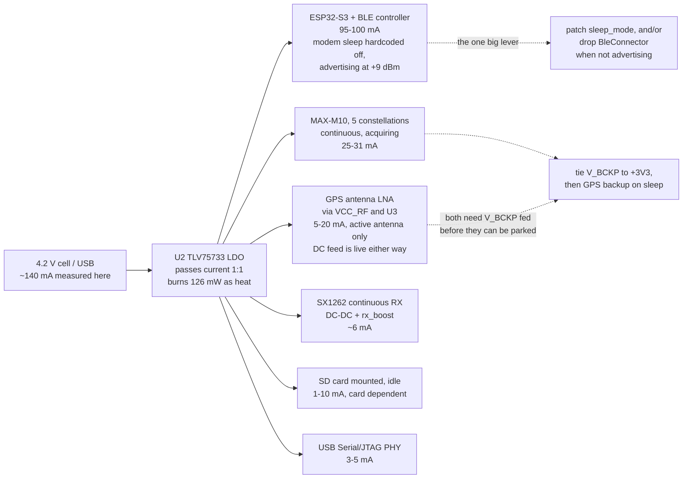

# Wio-S3 power investigation

Measured: **~140 mA at the 4.2 V regulator input**, awake, BLE connected,
GPS tracking and nothing transmitting. It was 180 mA before the clock came
down to 160 MHz and the unused pins were parked. The same scenario on the
two-MCU board this one replaces measures **66 mA**.

That comparison is the most useful number in this document and it arrived
after the first two drafts, so read this one as the corrected version. The
74 mA gap is not a firmware regression. Roughly 50 mA of it is the part
swap - an S3's BLE radio costs about twice a C6's for the same job - and
roughly 20 mA is a hardware feature the old board had and this one does
not: a GPIO under the GPS and LoRa rail. Neither board ever gets BLE modem
sleep, because the crate in the middle hardcodes it off, and that is where
the recoverable current is.

## Where the measurement was taken, and what it means

The 4.2 V node is the output of the diode-OR (D3 battery / D4 USB, both
`DM3CS-SF` Schottky) and the input to **U2, a `TLV75733PDBVR`** - a linear
regulator, not a switcher. That settles the one thing the first draft of
this report left open, and it settles it the unhelpful way:

**An LDO passes its load current straight through.** Input current equals
output current plus a quiescent draw of about 25 uA. So the 140 mA is not a
higher-voltage-side number that divides down - it *is* the +3V3 load, and
the budget below has to account for all of it rather than for the ~110 mA a
switching regulator would have implied.

Two consequences the topology adds on its own, neither of them firmware's:

- **126 mW is burned as heat in U2** ((4.2 - 3.3) V x 140 mA), which is
  about 21% of the power drawn from the cell. A buck in that position would
  put roughly that fraction back - the same 3.3 V load would cost around
  115 mA at 4.2 V instead of 140 mA. In a SOT-23-5 it is also about a 25 C
  rise on the part itself.
- **The diode costs usable cell range.** The LDO needs ~3.35 V in to hold
  3.3 V out at this current; the Schottky drops ~0.3-0.4 V on top, so the
  rail starts sagging with the cell still around 3.7 V. That is well short
  of a LiPo's empty, and it is capacity that is simply not reachable.

## The module's own numbers, for calibration

`Wio-S3_Module_Datasheet_V1.0.pdf`, Table 7, all at 3.3 V:

| Mode | Data (avg) |
|-|-|
| LoRa RX, 915 MHz | 5.7 mA |
| LoRa TX, 915 MHz, 22 dBm | 127 mA |
| BLE advertising + LoRa TX 915 MHz 22 dBm | 158 mA |
| ESP32-S3 light sleep + LoRa standby | 1.43 mA |
| ESP32-S3 deep sleep + LoRa sleep | 9.3 uA |

The useful one is the third: 158 mA with the LoRa PA keyed at 22 dBm
(127 mA on its own) leaves about **31 mA for "BLE advertising"**. Seeed
measured that with ESP-IDF defaults, which enable BT modem sleep. This
firmware cannot get 31 mA, for the reason in finding 1.

## The two-MCU board is the calibration that matters

`README.md` keeps the predecessor's bench figures. Two of them carry the
whole diagnosis:

| Scenario, old two-MCU board | |
|-|-|
| Everything running, no SD (BLE connected, fix, LoRa TX pulses) | 66 mA |
| ESP only, BLE connected | 46 mA |

The second line is the one to read twice. **46 mA is a C6 doing nothing but
BLE**, with the AP2112K on GPIO2 holding the GPS and the WIO-E5 off - that
firmware only raises the rail when a central actually connects. So the old
board's headline 66 mA is 46 mA of BLE plus 20 mA for an entire second MCU,
a GPS and a LoRa radio.

Lined up against this board:

| | Old (C6 + WIO-E5) | New (Wio-S3) |
|-|-|-|
| MCU + BLE, RF never sleeping | 46 mA measured | 95-100 mA, datasheet class |
| GPS + LoRa + second MCU | 20 mA measured | ~35 mA |
| Rail gate under GPS/LoRa | AP2112K on GPIO2 | **none - U2 feeds everything** |
| **Same scenario** | **66 mA** | **~140 mA** |

Two facts, and neither is a line of firmware anyone got wrong:

- **The S3's radio costs about twice the C6's.** Both parts run the same
  esp-radio with modem sleep hardcoded off, so both sit in "RF working"
  continuously rather than duty-cycling between advertising events. The
  C6's version of that state measures 46 mA; the S3's is a ~95 mA part
  figure. That is most of the gap, and it was bought with the module.
- **There is no rail to switch.** The old board could take its GPS and LoRa
  side to zero with one GPIO, and its best number is quoted with them
  there. Here U2 feeds the receiver, the SX1262, the panel and the card
  unconditionally, so that ~35 mA is in every reading this board can
  produce.

The consolation is that the single-module board should still win once BLE
is dealt with: 66 mA on the old board included a second MCU that no longer
exists.

## Where the 140 mA goes



| Load | Estimate at 3.3 V |
|-|-|
| ESP32-S3 + BLE controller, modem sleep off, advertising at +9 dBm | 95-100 mA |
| MAX-M10, five constellations, continuous, acquiring | 25-31 mA |
| SX1262 continuous RX, DC-DC and `rx_boost` on | ~6 mA |
| SD card mounted and idle | 1-10 mA |
| USB Serial/JTAG PHY | 3-5 mA |
| LEDs off, LDO quiescent, leakage | ~1 mA |
| 0.91" OLED on J5, *if fitted* (new) | 5-15 mA |
| GPS antenna LNA, *if an active antenna is fitted* | 5-20 mA |
| **Total, no card and no panel** | **130-143 mA** |
| **Total, panel fitted** | **135-158 mA** |

**That closes**, and it closes without needing an antenna theory to fill
it: 140 mA sits inside the range with a panel fitted and inside it without
one. The 17-49 mA the earlier draft could not place was the difference
between an *estimate* of the S3's BLE state and a *measurement* of the
equivalent state, and the two-MCU comparison above supplies the
measurement. The antenna section below stands as an open bench check
rather than as a load-bearing part of the budget.

Worth stating plainly what this means for runtime: 140 mA is roughly four
to six hours from the LiPo sizes this board takes, and about a fifth of
that is heat in U2.

### The antenna question

The board is built for an **active** antenna, and nothing in the firmware
says otherwise:

- The bias tee is populated and unconditional - `U5.VCC_RF` -> U3
  (SiP32431) -> R15 10R -> L1 27nH -> the SMA J2 center pin.
- U3's enable is the GPS's own `LNA_EN`, not a host GPIO, so the DC feed is
  live whenever the receiver's RF section is on.
- `Gps::configure` writes signal enables, `CFG-PM-OPERATEMODE`,
  `CFG-RATE-MEAS`, `CFG-NAVSPG-DYNMODEL` and the NMEA message rates. It
  writes **no `CFG-HW-ANT_*` key at all**, so the antenna supervisor is at
  its factory default and nothing has ever told this receiver which kind of
  antenna is on the end of the cable.

So with a passive antenna fitted, DC is still being pushed at the SMA center
pin, and what that costs depends entirely on the antenna's DC path:

- **DC-open feed** (a series cap, most whips and monopoles): nothing flows.
  The 5-20 mA line comes out of the budget and the 17-49 mA gap above is
  real and still unexplained.
- **DC-shorted feed** (very common on passive patches, where the feed is a
  shorted stub): 3.3 V across R15's 10 ohm is a ~330 mA demand into a dead
  short, clamped by U3's current limit and by the M10's own `VCC_RF`
  regulator. That is not a power line item, it is a fault - and it would
  show up on +3V3 as exactly the sort of tens-of-milliamps the budget cannot
  otherwise place.

**One measurement settles it:** DC volts on the SMA center pin, and DC volts
*across R15*. R15 at ~0 V means nothing is being drawn and the antenna is
DC-open. Volts across R15 means current is flowing - which is correct and
expected for an active antenna, and a short for a passive one.

### There is no "configure for passive", and the manual is explicit

The plan was `CFG-HW-ANT_CFG_VOLTCTRL = 0` as a new `GpsConfig` key. The
MAX-M10N integration manual (UBXDOC-304424225, Table 22) says that does not
do what we both assumed:

| Mode/feature | LNA_EN state |
|-|-|
| Normal operation | **High** |
| Software standby mode | Low |
| Hardware backup mode | Low |
| LEAP mode | Duty cycling high-low |
| Antenna supervisor: supply power down on short detect | Low |

**LNA_EN is high in normal operation regardless of the antenna supervisor.**
The supervisor does not gate it - it can only pull it *low*, and only on a
detected short, which needs a sense circuit on `CFG-HW-ANT_SUP_SHORT_PIN`
that this board does not have. `VOLTCTRL` is already disabled by default
(section 3.4.1: an unconfigured receiver reports antenna status "DON'T
KNOW"), so writing 0 to it changes nothing at all.

The pin also has no polarity control - "The polarity cannot be changed" -
and it is shared with the module's *internal* LNA, so it is not a pin the
firmware may repurpose.

So the honest answer is: **the DC feed cannot be turned off in firmware**,
and no config key has been added, because a setting that does nothing is
worse than no setting.

What the options actually are:

- **Depopulate R15.** The 10 ohm in the bias tee's DC path is the whole
  feed; removing one 0402 breaks it and costs nothing else. This is the
  correct build option for a passive antenna and it belongs in the board
  notes as one.
- **Leave it.** With a wire antenna the SMA center pin is DC-open, so the
  feed drives nothing and the cost is zero. This is the current state and
  it is fine.
- `CFG-PM-OPERATEMODE` set to a power-save mode duty-cycles LNA_EN as a
  side effect (the LEAP row above). That is a receiver power decision that
  happens to touch the antenna, not an antenna setting, and `power_mode` is
  already a config key.

**With the wire antennas in use, this is a non-issue and not a saving.** The
line stays out of the budget, and the 17-49 mA gap is still open.

## 1. esp-radio hardcodes BLE modem sleep off - biggest single item

`esp-radio-0.17.0/src/ble/os_adapter_esp32c3_s3.rs`, in `create_ble_config`:

```rust
    // keep them aligned with BT_CONTROLLER_INIT_CONFIG_DEFAULT in ESP-IDF
    // ideally _some_ of these values should be configurable
    esp_bt_controller_config_t {
        ...
        sleep_mode: 0,
        sleep_clock: 0,
```

Literals, not config fields. ESP-IDF defaults `CONFIG_BT_CTRL_MODEM_SLEEP`
to on; esp-radio does not. With `sleep_mode: 0` the BT controller never
powers its PHY down between advertising events, so the part sits in
"RF working" - roughly 90-95 mA on an S3 - continuously, instead of the
~31 mA the module datasheet reports. There is no firmware knob for this in
esp-radio 0.17.

What there *is*: `BleConnector` owns a `PhyInitGuard`, and

```rust
impl Drop for BleConnector<'_> {
    fn drop(&mut self) {
        crate::ble::ble_deinit();
    }
}
```

**Dropping the connector powers the BLE modem down.** That is the lever.
Today `main` builds the connector once at
[main.rs:363-367](s3/src/bin/main.rs#L363-L367) and holds it for the life
of the program, so BLE is at full current even on a node that is only
beaconing over LoRa with no phone within a mile.

Restructuring `serve` so the trouble-host stack is built inside the
advertising window and torn down when the window closes is the single
largest saving available in the awake state - about 90 mA for the whole
time between windows. It is also the only way to get a useful "LoRa node,
no BLE" mode, which is what a deployed tracker actually is most of the
time.

Same file, and it looked free until it was tried: the BLE config is
`Default::default()`, and

```rust
    /// 9 dBm
    #[default]
    P9,
```

BLE TX power defaults to **+9 dBm**. A phone at arm's length does not need
that, and it is the worst possible current spike to have beside a LoRa PA -
which is exactly what `state::radio_busy()` exists to keep apart.

**It cannot be lowered.** `esp-radio` re-exports `Config` but not the
`TxPower` enum its own `with_default_tx_power` builder takes: both
`ble::npl` and `ble_os_adapter_chip_specific` are `pub(crate)`, so the
setter is public and its argument is unnameable from outside the crate.
Recorded in a comment at the construction site rather than worked around;
the workaround available is a raw vendor HCI command, which is not worth
its fragility for a spike this size. Note that the vendored copy in the
next section reaches this too - the same fork that sets `sleep_mode` can
call `with_default_tx_power`, since inside the crate the enum is nameable.

### The cheaper route to most of the same current: patch the two literals

Dropping the connector saves ~90 mA *between* advertising windows and
nothing at all while a phone is connected. Modem sleep saves ~60 mA in both
states, and the entire change is two values in a vendored esp-radio:

```rust
// esp-radio-0.17.0/src/ble/os_adapter_esp32c3_s3.rs, create_ble_config
sleep_mode: 1,   // ESP-IDF CONFIG_BT_CTRL_SLEEP_MODE_EFF, which defaults on
sleep_clock: 1,  // ESP-IDF main-XTAL low-power clock
```

plus a `[patch.crates-io]` entry pointing at the copy. Confirm both values
against ESP-IDF's `esp_bt.h` for the S3 before trusting them; the point is
that the module datasheet's implied ~31 mA for BLE advertising is what
ESP-IDF gets with whatever these are, so the target is known rather than
guessed.

**It is unproven and may simply not work.** The C3/S3 path runs through
`npl.rs`, whose init calls
`ble_os_adapter_chip_specific::disable_sleep_mode()` - and for this chip
that function's whole body is the comment `// nothing`. The sleep phase
callbacks (`btdm_sleep_enter_phase1` and the rest) are present in the OSI
table, but nothing in the crate exercises them, and a controller that asks
to sleep and gets a stub back hangs rather than saves.

It is still the first thing to try, because it is an afternoon against a
restructuring, it helps in the connected state that dropping the connector
cannot touch, and it fails loudly: the board either advertises at ~35 mA or
stops advertising.

## 2. The GPS is the whole deep-sleep budget, and V_BCKP is why it stays

[`enter_deep_sleep`](s3/src/bin/main.rs#L494) parks the radio and nothing
else, so a deep sleep measures around 25-31 mA rather than the datasheet's
9.3 uA. That is the number behind "not sleeping properly".

**The first draft of this report called that a defect and it is not.** The
obvious fix - send `Gps::sleep` (UBX-RXM-PMREQ backup) alongside the
existing `PrepareSleep`, since the machinery is already there - is wrong on
*this* board, and the board repo says why:

> **U5 V_BCKP** goes only to test point BCKP1. No 3V3 feed, no coin cell, so
> every power-up is a cold start with no almanac - minutes of TTFF instead
> of seconds. u-blox recommends tying it to 3V3.
>
> -- `wio-s3-max-gps/BOARD-REVIEW.md`

The M10's backup domain - the RTC, the BBR that holds the ephemeris, and the
UART-RX wake source itself - is supplied by V_BCKP. Unconnected, backup mode
has nothing keeping it alive. Two consequences, and the second is worse than
the power it would save:

- Every wake would be a **cold start**, minutes of TTFF. On a 60 s wake
  cadence a tracker that backs its GPS up between windows never gets a fix
  at all. Leaving the receiver running is what keeps it tracking across the
  MCU's sleep, and that is the trade the existing comment is describing when
  it calls the draw "a board fact rather than a firmware choice".
- The UART-RX wake source lives in that same unpowered domain, so it is not
  established that a board told to back its GPS up can wake it again without
  a power cycle. `CFG_GPS_SLEEP` (0x12) already exposes this and is the right
  place for it: an explicit lever someone chooses, not something the sleep
  path does on everyone's behalf.

**So the firmware change here is: none.** The fix is the board's - tie V_BCKP
to +3V3, already open in `BOARD-REVIEW.md`. This investigation raises its
priority sharply: it is not only "minutes of TTFF instead of seconds", it is
the gate on the entire sleep story. With V_BCKP fed, backing the GPS up
during deep sleep becomes both safe and obviously correct (BBR survives, so
wakes are warm starts), and deep sleep goes from ~30 mA to something near
the datasheet's 9.3 uA. Until then that is the floor and no amount of
firmware moves it.

If an active antenna is fitted this is worth more than it first looked. Its
LNA is fed from the module's `VCC_RF` through U3, and U3's enable is the
GPS's own `LNA_EN` - so the antenna is powered exactly while the receiver
is, and no host GPIO can separate them. Parking the receiver is therefore
the only thing that parks the antenna too, and what V_BCKP blocks is the
whole subsystem at 30-50 mA rather than the receiver's 25-31.

With a passive antenna it is 25-31 mA, which is still the largest single
load on a sleeping board by a wide margin, and the argument is unchanged.

## 3. Nothing is held across deep sleep, so two chips wake themselves up

esp-hal's S3 deep-sleep prep clears `dg_pad_force_unhold` and
`dg_pad_force_noiso` (`esp-hal-1.0.0/src/rtc_cntl/sleep/esp32s3.rs:641`),
so every pad the firmware has not explicitly held goes high-Z when the
digital domain drops. The firmware holds none. Two of those matter:

- **GPIO21, SX1262 NSS.** The SX1262 leaves sleep on a *falling edge* of
  NSS. A floating NSS on a board that is otherwise quiet will produce one.
  The radio that `PrepareSleep` just put into cold sleep comes back to
  STDBY_RC and sits there for the whole interval. GPIO21 is inside the S3's
  RTC GPIO range (0-21), so `RtcPin::rtcio_pad_hold(true)` covers it - the
  same trick the C6 firmware already uses for its LDO enable and WIO reset
  lines, including the "reconfigure first, then release" ordering on wake.
- **GPIO44, SD CS.** Not an RTC pin (S3 RTC GPIOs stop at 21), so it needs
  the digital pad hold register rather than `rtcio_pad_hold`, which esp-hal
  1.0 does not expose - a PAC write to `RTC_CNTL_DIG_PAD_HOLD`. A card left
  with CS undefined does not reliably return to standby.

GPIO43 and GPIO14 (the LED cathodes) also float, which is precisely the
"biased just under Vf" condition the pin sweep in `NOTES.md` fixed for the
awake case and then did not carry into sleep. GPIO14 is RTC-capable;
GPIO43 is not.

## 4. `PrepareSleep` can be missed, and the timeout then sleeps hot

```rust
    state::SLEEP_READY.reset();
    state::request(Request::PrepareSleep);
    // Far longer than the 10 ms pass the loop takes to notice; if it is
    // wedged, sleeping anyway beats staying awake at full current.
    let _ = with_timeout(Duration::from_secs(1), state::SLEEP_READY.wait()).await;
```

The 1 s budget assumes the hardware loop is at the top of its pass. It is
not always: `node.broadcast()` awaits for the length of a transmission,
which is 289 ms at the SF12/BW500 default and up to ~9.7 s at the slowest
settings `RadioConfig` accepts - the driver's own `tx_poll_timeout_ms`
comment says so. A `PrepareSleep` issued during a beacon is not seen for
that long, the timeout fires, and the board deep-sleeps with the SX1262
still in continuous RX. The MCU wakes and re-`init`s the radio, so nothing
looks wrong afterwards; the cost is 5.7 mA silently added to every sleep
interval that happened to start during a beacon.

Two ways out, and they compose: raise the timeout above
`cfg.tx_poll_timeout_ms()`, and have the beacon branch decline to start
when a sleep is pending rather than only when `transfer_active()`.

## 5. 240 MHz buys nothing this firmware uses

```rust
    let config = esp_hal::Config::default().with_cpu_clock(CpuClock::max());
```

[main.rs:186](s3/src/bin/main.rs#L186). `CpuClock::max()` on the S3 is
240 MHz. The workload is a 100 Hz poll loop, a 9600-baud UART, an 8 MHz SPI
burst per beacon and a 400 kHz SD bus. `CpuClock::_80MHz` or `_160MHz`
saves on the order of 10-15 mA for no loss - esp-radio needs 80 MHz, not
240. Second core is correctly left in reset (`esp_rtos::start` only, no
`start_second_core`), and the idle path is genuinely idle: esp-rtos's
Xtensa idle hook is `waiti 0`
(`esp-rtos-0.2.0/src/task/xtensa.rs:17`). The 10 ms poll loop is not the
problem and is not worth restructuring.

## 6. Sleep is off unless an app turns it on

`Stored::new()` has `sleep_interval_s: 0`, and `Window::next` returns
`Sleep` only when `sleep_interval_s > 0`. A board that has never been
configured over BLE **never deep-sleeps at all** - it advertises forever at
whatever the awake number is.

That is a deliberate policy (`an_unconfigured_board_is_awake_and_powered`
is a test, not an accident) and it is the right default for a board you
have to be able to reach. But if the measurement was taken on a
freshly-flashed board expecting it to sleep on its own, this is the
explanation, and it is a settings question rather than a bug. Confirm with
the console: a board that is sleeping prints
`deep sleep for N s (radio parked, gps still acquiring)`.

## 7. Two SPI MISO pads float, which the pin sweep missed

`esp-hal`'s `Spi::with_miso` applies `InputConfig::default()`, i.e.
`Pull::None`, and enables the input buffer
(`esp-hal-1.0.0/src/spi/master.rs:1042-1051`). An SPI peripheral only drives
MISO while its CS is low, so:

- **GPIO5** (SX1262 MISO) floats except during a transaction.
- **GPIO3** (SD MISO) floats permanently when no card is fitted.

This is exactly the mid-rail input-buffer condition the sweep in `NOTES.md`
chased across GPIO10-13, 15-18, 38-42, 47 and 48 - it just did not cover
the pins the peripherals had already claimed. Cost is small, sub-mA to a
few mA if the pad picks up enough noise to switch, but it is the cheapest
item on this list and the argument for fixing it is already written down.

## What has landed

Findings 3, 4, 5 and 7 are fixed, and sleep is now something a board can be
*told* to do rather than only left to:

| | |
|-|-|
| 3 | SX1262 NSS is pad-held through the sleep (GPIO21 is an RTC pin). SD CS on GPIO44 is not fixable this way - the S3's RTC pins stop at 21 - and is still open. |
| 4 | The park budget is the running config's own transmit deadline, and the hardware loop declines to start a beacon with a sleep pending. |
| 5 | 240 -> 160 MHz. |
| 7 | Both MISO pads pulled up, through a frozen `InputSignal` because `with_miso` overwrites the pull otherwise. |
| new | `CFG_SLEEP_NOW` (BLE), `SLEEP` (USB console), `pixi run wio-sleep`, and a Sleep now control on the app's Beacon page. |
| new | A wake counter in RTC RAM. A deep sleep is a full reset, so from the console a board on its cadence and a board resetting in a loop print the same banner - the wake number is what separates them. |

Finding 6 stands as designed - an unconfigured board never sleeping on its
own is the right default for something you have to be able to reach - but
finding a board that will not sleep no longer means reading the policy: the
sleep-now command works regardless of it.

## Two things that look like levers and are not

**Unused peripherals are already clock-gated, and not by luck.**
`esp_hal::init` calls `system::disable_peripherals()`
(esp-hal-1.0.0/src/system.rs:37), which gates and resets every peripheral
outside a small `KEEP_ENABLED` set. Each driver then holds a refcounted
`PeripheralGuard` that enables on construction and disables on `Drop`
(same file, 54-77). This firmware constructs TIMG0, SPI2, SPI3, I2C0,
UART1, USB_DEVICE, BT, LPWR and FLASH; every other block - the spare
UARTs, I2S, LCD_CAM, RMT, PCNT, TWAI, MCPWM, LEDC, the crypto
accelerators, unclaimed DMA - was never turned on to begin with. There is
no saving here, and the pin sweep already covered the pads. The one
exception worth a line is `USB_DEVICE`: its PHY is 3-5 mA and is only
useful with a cable attached, so dropping the driver when unplugged would
gate it. Small, and only helps on battery.

**ESP-IDF's power management API does not exist on this stack.**
`esp_pm_configure` - DFS between a min and max frequency, plus automatic
light sleep on tickless idle, arbitrated by PM locks that drivers take -
is an ESP-IDF facility. esp-hal 1.0 sets `CpuClock` once at `init` and has
no runtime DFS, and esp-rtos 0.2's idle hook is a bare `waiti 0`
(esp-rtos-0.2.0/src/task/xtensa.rs:17): a WFI with every clock still
running, not tickless idle. `Rtc::sleep_light` exists
(esp-hal-1.0.0/src/rtc_cntl/mod.rs:415) but it is manual, and entering it
with the BLE controller up is precisely what `sleep_mode`/`sleep_clock`
are supposed to arrange. The IDF document is describing the machinery that
finding 1's two literals opt out of, which is one more argument for
patching them first.

## Order to work in

Ranked by current recovered per unit of work, with the old board's 66 mA as
the number to beat.

1. **Try BLE modem sleep.** Two literals in a vendored esp-radio, ~60 mA if
   it takes, and the only lever that helps while a phone is connected. It
   fails loudly, so the experiment is cheap. Do this before anything
   structural.
2. **Duty-cycle the BLE controller** - if modem sleep does not take, and
   worth having as well as it if it does. ~90 mA whenever no central is
   connected, through `BleConnector`'s `Drop`. This is what makes a
   deployed LoRa-only node possible at all: the same board with the BLE
   modem down is a ~45 mA device.
3. **Push `power_mode = psmct` and measure.** The key already exists
   (`CFG-PM-OPERATEMODE`, `PowerMode::PsmCyclic`) and defaults to `full`;
   cyclic tracking holds a fix at a fraction of the receiver's continuous
   25-31 mA. No code at all, so measure it before writing any.
4. **Next board spin: tie V_BCKP to +3V3, and add a load switch under the
   GPS and SX1262.** The old board's 46 mA reading exists because it had
   one, and this board cannot reach its own equivalent without it. V_BCKP
   is separately the gate on the whole deep-sleep story (finding 2). No
   firmware substitutes for either.
5. **160 -> 80 MHz**, worth ~10 mA, once the items above have settled.
   esp-radio is validated at the S3's ESP-IDF default of 160, so change
   this last and re-test BLE after it.
6. **Consider a buck in place of U2.** 126 mW, about a fifth of everything
   drawn from the cell, is heat - and it scales with whatever the load
   ends up being.
7. **Confirm the wire antennas are DC-open** - one probe across R15, which
   should read ~0 V. No longer load-bearing for the budget, but still the
   difference between a bias tee driving nothing and a short through
   10 ohm.
8. **Measure a sleep.** `pixi run wio-sleep --seconds 60`, or the app's
   Sleep now button; `woke from deep sleep #N` on the far side confirms it
   was a sleep and not a reset. Expect ~30 mA until item 4 lands.
