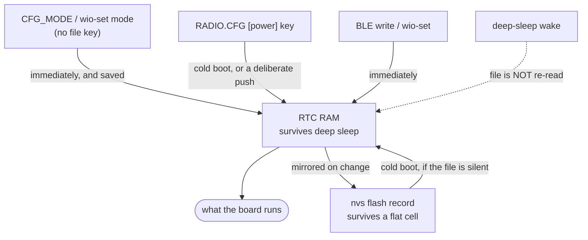

# Power settings

Every knob that changes what the Wio-S3 draws, what it costs, and where it
is set. All of them live in `RADIO.CFG` - the TOML file in the root of the
SD card, documented key by key in `RADIO.example.toml`.

This is the reference. `docs/POWER-S3.md` is the investigation behind the
numbers: how they were measured, and what was ruled out.
`docs/POWER-AUDIT.md` reads that investigation critically and lists the
levers it left unpulled, in the order they are worth pulling.

## The budget these settings act on

Measured at the 4.2 V input, awake, BLE advertising, GPS tracking, LoRa
listening, nothing transmitting:

| | Draw | Set by |
|-|-|-|
| BLE controller | **71 mA** | `ble_off_s` (its lifetime is the only lever) |
| MAX-M10 GPS | ~30 mA | `power_mode`, `meas_rate_ms`, constellations |
| S3 core, never sleeping | ~12 mA | not configurable, see below |
| USB Serial/JTAG PHY | 3-5 mA | not configurable |
| SX1262 listening | ~6 mA | `role`, `rx_boost` |
| SD card, mounted idle | 1-10 mA | `sd_enabled` |
| **Total** | **~126 mA** | |

Plus one 288 ms LoRa transmit per `interval_s` at 127 mA, which averages
to about 37 mA at the 1 s default - the price of a position every second,
and the one line in this table the config moves by tens of milliamps. A
node with no fix pings on `ping_interval_s` instead, 248 ms every 5 s, or
about 6 mA.

Two things to take from that table. The BLE controller is more than half of
everything, and the GPS is most of what is left - so those are the two
settings that matter and the rest is trimming. And the regulator is an LDO,
so this is the current drawn from the cell, not a higher-voltage figure that
divides down.

## The mode decides which knobs apply

The board has three modes, and each duty-cycle knob belongs to exactly one
of them. Set the mode first; the rest of this document is what each mode
then reads.

| Mode | What is up | Its knob | Left by |
|-|-|-|-|
| **stored** | nothing but a wake check on a cadence | `sleep_interval_s` (cadence), `adv_window_s` (each check) | a connect during a check - which promotes it to idle |
| **idle** | BLE only: GPS in backup, radio in cold sleep, card mounted | `idle_timeout_s` | the timeout (into stored) or `CFG_MODE tracking` |
| **tracking** | everything: GPS, beacon, receiver, logging | `ble_off_s` (modem duty cycle) | `CFG_MODE` only |

The mode is a command, never a file key: a card that said "tracking" would
put every board it was ever copied into onto the air. Set it from the app,
or from a bench with `pixi run wio-set mode tracking`.

Two consequences worth having in mind before reading the tables below:

- **`sleep_interval_s` is ignored while tracking.** Deep sleep stops the
  beacon, the logging and the listening, and a tracker doing that is not
  tracking. Before the modes existed both duty cycles were tested in one
  place and deep sleep always won, which made `ble_off_s` dead config on any
  board that had a wake-check cadence.
- **`sleep_interval_s = 0` means the board never stores itself on its
  own.** With no cadence to sleep on, the idle timeout has nowhere to send
  it, so it stays awake and reachable. That is the bench setting, and it is
  what an unconfigured board does. A board *told* `mode stored` still
  sleeps, on the 5 min ceiling - the command is not ambiguous, so it is not
  read as a refusal.

Tracking is also the only mode that survives a power cycle. A board put down
tracking comes back tracking - which is the point, since a brownout on the
object is exactly when it must - and everything else comes back **idle**,
reachable for one timeout before it stores itself. That is the rescue window
for a board recovered from a flat cell, and it is why a cold boot no longer
comes up with its GPS running.

## The settings

### The two that matter

| Key | Range | Default | Effect |
|-|-|-|-|
| `ble_off_s` | 0, or 5-300 | 0 | Seconds the BLE controller is powered **down** between advertising windows. **Saves ~70 mA while down.** 0 keeps it up continuously. |
| `power_mode` | `full`, `psmoo`, `psmct` | `full` | GPS receiver power mode. `psmct` is cyclic tracking, `psmoo` acquires a fix then powers down until the next update. Saves up to ~25 mA; costs fix latency. |

`ble_off_s` is the blunt lever: it destroys the controller and rebuilds it,
so the modem goes to nothing and the board cannot be connected to until the
next window. The board drops to **60 mA** while BLE is down.

The sharp one is not a setting. The controller's own modem sleep powers the
PHY down between advertisements, and between the connection events of an
idle connection, without the board becoming unreachable - see the note
below. Every number in this document was measured before it existed, so
treat the ones with BLE up as an upper bound until they are taken again. LoRa, GPS and SD logging all keep running - it is still a working
tracker throughout, just not a reachable one.

The average is whatever `adv_window_s` and `ble_off_s` make it:

| `adv_window_s` / `ble_off_s` | Average | Worst-case wait to connect |
|-|-|-|
| 15 / 0 (default) | 130 mA | none |
| 15 / 30 | ~83 mA | 30 s |
| 10 / 60 | ~70 mA | 60 s |
| 5 / 60 | ~65 mA | 60 s |
| 5 / 300 | ~61 mA | 5 min |

Past about a minute of off time the returns are gone - the average
asymptotes to the 60 mA dark reading, so the last few milliamps cost
minutes of unreachability. **60/30 is the setting to reach for.**

`power_mode` is untested on this board, because it has never held a fix
indoors. `psmct` is zero code and worth trying first; `psmoo` risks a cold
start on every cycle, which for a tracker is worse than the current it
saves.

### The duty cycle

| Key | Mode | Range | Default | Effect |
|-|-|-|-|-|
| `ble_off_s` | tracking | 0, or 5-300 | 0 | above |
| `adv_window_s` | stored, tracking | 0, or 1-60 | 0 (= 15 s) | Seconds each advertising window lasts: the whole of the time a stored board is reachable, and the on-half of the modem cycle while tracking. |
| `sleep_interval_s` | stored, idle | 0, or 5-300 | 0 | Seconds between wake checks while stored, and the sleep an idle board takes when its timeout runs out. 0 never deep-sleeps, and so never stores the board. |
| `idle_timeout_s` | idle | 0, or 10-3600 | 0 (= 600 s) | Seconds a reachable board waits before storing itself. |

Deep sleep is the larger saving and the larger cost. It takes the whole chip
down - and now the receiver into backup, the radio into cold sleep and the
card off the bus with it - but the board stops beaconing, stops logging, and
every wake is a full reset. It is what a board being stored does; a board
that is tracking never does it.

What a stored board's floor actually is has not been measured. The old ~30 mA
figure was the ungated GPS still acquiring through the sleep, which the mode
work parks; what a MAX-M10 in backup costs on `VCC` alone is unknown, because
`V_BCKP` is unfed on this board. `docs/STATES-PLAN.md` is where that
measurement is owed.

These four are the only keys in the file the board also keeps its own copy
of - see "Where a setting lives" below.

### The radio

| Key | Range | Default | Effect |
|-|-|-|-|
| `role` | `leaf`, `repeater`, `tx_only`, `rx_only` | `leaf` | `tx_only` never enables the receiver: **saves ~6 mA continuously** and the node hears nobody. `repeater` doubles the traffic it forwards. |
| `interval_s` | 0-3600 | 1 | Position period with a fix. Each beacon is 288 ms at 127 mA, so this is ~37 mA at the default, ~1.3 mA at 20 s and ~0.4 mA at 60 s. 0 silences the node, pings included. |
| `ping_interval_s` | 0-3600 | 5 | No-fix ping period. 248 ms at 127 mA, so ~6 mA at the default. 0 sends no pings. |
| `power_dbm` | -9 to 22 | 22 | Transmit power. Only paid during those 288 ms, so dropping it buys little and costs range. |
| `rx_boost` | bool | `true` | ~+2 dB of sensitivity for a few mA while listening. Free on a `tx_only` node. |
| `spreading_factor` | 5-12 | 12 | Lower is shorter on air, so less energy per beacon, at less range. |
| `dcdc_enabled` | bool | `true` | The SX1262 internal switcher, roughly halving its RX and TX current. Leave it on - the module has the inductor. |

The beacon is the wrong place to look for current. A transmit is 1% of the
time at the default interval; a receiver that is always on is 100% of it.
`role = "tx_only"` is the real radio saving, and it is only available to a
node nobody needs to track *from*.

### The GPS

| Key | Range | Default | Effect |
|-|-|-|-|
| `power_mode` | enum | `full` | above |
| `meas_rate_ms` | 25-10000 | 1000 | Fix rate. Raising it to 5000 lets the receiver idle between solutions in a power-save mode; it does nothing in `full`. |
| `glonass_enabled` | bool | `false` | Each extra constellation is more correlator work. |
| `galileo_enabled` | bool | `true` | " |
| `beidou_enabled` | bool | `true` | " |
| `qzss_enabled` | bool | `true` | " |
| `sbas_enabled` | bool | `true` | " |

The MAX-M10 is ungated on this board: there is no GPIO under its rail, so
the firmware cannot turn it off, only ask it to use less. Dropping
constellations is worth a few mA and costs time to first fix, which is the
wrong trade for a tracker that struggles for a fix at all.

The receiver *can* be parked with a timed `UBX-RXM-PMREQ` backup, and it
wakes itself on its own timer despite this board leaving `V_BCKP`
unconnected. That is not exposed as a setting yet, because whether the
ephemeris survives the backup is unknown - if every wake is a cold start it
is useless for a tracker.

### The rest

| Key | Range | Default | Effect |
|-|-|-|-|
| `sd_enabled` | bool | `true` | Stops logging and the card's 1-10 mA. Card-dependent and worth measuring on the specific card before relying on it. |
| `verbose` | bool | `true` | Console detail. Costs nothing when nothing is attached. |

## Where a setting lives

Most keys are read from the card at boot and that is the whole story. The
four under `[power]` are different: the board also keeps them in RTC RAM,
so they survive a deep sleep, and in flash, so they survive a flat cell -
and an app can change them live over BLE, which no other key can.

That makes them the one place precedence matters:



The rules that come out of it:

- **An absent `[power]` key changes nothing.** Everywhere else in the file
  an absent key means "the default"; here it means "leave the board's live
  value alone". Otherwise pushing an unrelated radio change would silently
  undo a duty cycle somebody set from the app. This is why all four ship
  commented out in `RADIO.example.toml`.
- **An explicit `0` is a request, not an absence.** Writing `ble_off_s = 0`
  is how a file turns a duty cycle off.
- **A cold boot adopts the file.** It is what survives a reflash; the RTC
  copy is not.
- **A deep-sleep wake does not.** Re-reading the card every interval would
  undo a live change once per wake, forever.
- **A live change lasts until the next cold boot**, where an uncommented key
  in the file takes over again.

One lag worth knowing: the first advertising window's length is fixed before
the card is mounted, so an `adv_window_s` from the file takes effect from the
second window on. `ble_off_s` is re-read at the end of every window and has
no such delay.

## Setting them

Push the whole file, which is what a card would carry:

```
cd tools
pixi run wio-config --set ble_off_s=30 --set adv_window_s=10
pixi run wio-config --set power_mode=psmct
pixi run wio-config --dry-run --save ../RADIO.CFG   # write a card instead
```

This sends a *whole file*, not a patch: anything absent from it reverts to
its default. `--file` starts from settings of your own rather than the
reference. The `[power]` keys are the exception - absent still means "leave
alone" for those four.

Change one of the four live, without touching the file, or set the mode
(which no file can):

```
cd tools
pixi run wio-set mode tracking
pixi run wio-set mode stored        # acks, then the port disappears
pixi run wio-set ble-off 30
pixi run wio-set adv-window 10
pixi run wio-set idle-timeout 600
```

That is the same path a BLE config write takes. The settings last until the
next cold boot, where an uncommented file key takes over again; the mode has
no file key, so it lasts until something changes it.

## What is not configurable, and why

- **CPU clock.** Pinned at 80 MHz, the documented floor for the radio, in
  `firmware/src/bin/main.rs`. It cannot come from the file: the clock is
  configured before the SPI bus that reads the card exists. Worth ~10-15 mA
  against 160 MHz, which is already taken.
- **BLE modem sleep.** On, always, and not a setting. `esp-radio` ships it
  unimplemented - the controller's sleep callbacks are `todo!()` in every
  published version through 1.0.0-beta.0 - so it is a local patch to the
  vendored copy, ported from ESP-IDF. It is off in a
  `--features iso-ble-no-modem-sleep` build, which exists so the A/B can be
  measured, and there is no reason to ship that. What it saves is
  unmeasured; ESP-IDF's own numbers put BLE advertising near 31 mA rather
  than the 71 this board reads with the PHY up continuously. The console
  says `ble modem sleep on` (or `off`) once, at the first advertising
  window, and it asks the controller rather than the build flags - so a
  board that came up without it says so.
- **Light sleep.** The ~12 mA of S3 core that never halts for long. Needs
  tickless integration between `embassy-time` and the RTC, which `esp-rtos`
  does not provide. Design work, not a setting.
- **The GPS and LoRa rail.** The old two-MCU board had a GPIO under it; this
  one does not. Both parts sit on +3V3 and cannot be switched off, which is
  most of why this board's floor is 60 mA and the old one's was 46.
