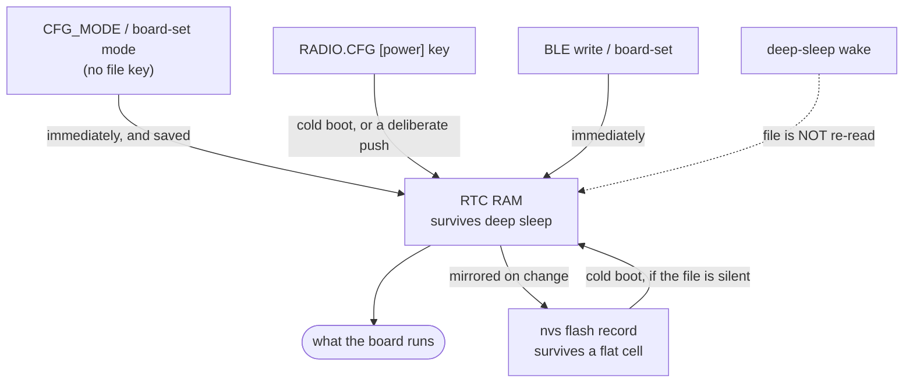

# Power settings

Every knob that changes what the Wio-S3 draws, what it costs, and where it
is set. All of them live in the radio config - the TOML-shaped file a push
writes into the board's flash, documented key by key in
`RADIO.example.toml`.

This is the reference: the settings first, then how the numbers were
taken, then the levers not yet pulled, in the order they are worth
pulling.

## The budget these settings act on

Measured at the 4.2 V input, awake, BLE advertising, GPS tracking, LoRa
listening, nothing transmitting:

| | Draw | Set by |
|-|-|-|
| BLE controller | **71 mA** | `ble_off_s` (its lifetime is the only lever) |
| MAX-M10 GPS | ~30 mA by datasheet; **~10 mA** on the bench, see below | `power_mode`, `meas_rate_ms`, constellations |
| S3 core, never sleeping | ~12 mA | not configurable, see below |
| USB Serial/JTAG PHY | 3-5 mA | not configurable |
| SX1262 listening | ~6 mA | `role`, `rx_boost` |
| **Total** | **~126 mA** | |

The SD card the earlier firmware mounted cost 1-10 mA idle, card dependent;
the firmware no longer drives the slot.

Plus one 288 ms LoRa transmit per `interval_s` at 127 mA, which averages
to about 37 mA at the 1 s default - the price of a position every second,
and the one line in this table the config moves by tens of milliamps. A
node with no fix pings on `ping_interval_s` instead, 248 ms every 5 s, or
about 6 mA.

Two things to take from that table. The BLE controller is more than half of
everything, and the GPS is most of what is left - so those are the two
settings that matter and the rest is trimming. And the regulator is an LDO,
so this is the current drawn from the cell, not a higher-voltage figure that
divides down.

## The mode decides which knobs apply

The board has four modes, and each duty-cycle knob belongs to exactly one
of them. Set the mode first; the rest of this document is what each mode
then reads.

| Mode | What is up | Its knob | Left by |
|-|-|-|-|
| **stored** | nothing but a wake check on a cadence | `sleep_interval_s` (cadence), `adv_window_s` (each check) | a connect during a check - which promotes it to idle |
| **idle** | BLE only: GPS in backup, radio in cold sleep, card mounted | `idle_timeout_s` | the timeout (into stored) or `CFG_MODE tracking` |
| **tracking** | everything: GPS, beacon, receiver, logging | `ble_off_s` (modem off), `ble_on_s` (modem on) | `CFG_MODE` only |
| **listening** | everything but the transmitter, BLE up throughout | none | `CFG_MODE` only |

The mode is a command, never a file key: a card that said "tracking" would
put every board it was ever copied into onto the air. Set it from the app,
or from a bench with `pixi run board-set mode tracking`.

Two consequences worth having in mind before reading the tables below:

- **`sleep_interval_s` is ignored while tracking.** Deep sleep stops the
  beacon, the logging and the listening, and a tracker doing that is not
  tracking. Before the modes existed both duty cycles were tested in one
  place and deep sleep always won, which made `ble_off_s` dead config on any
  board that had a wake-check cadence.
- **`sleep_interval_s = 0` means the board never stores itself on its
  own.** With no cadence to sleep on, the idle timeout has nowhere to send
  it, so it stays awake and reachable. That is the bench setting, and it is
  what an unconfigured board does. A board *told* `mode stored` still
  sleeps, on the 5 min ceiling - the command is not ambiguous, so it is not
  read as a refusal.

Tracking and listening are the modes that survive a power cycle. A board
put down tracking comes back tracking - which is the point, since a brownout on the
object is exactly when it must - and everything else comes back **idle**,
reachable for one timeout before it stores itself. That is the rescue window
for a board recovered from a flat cell, and it is why a cold boot no longer
comes up with its GPS running.

## The settings

### The two that matter

| Key | Range | Default | Effect |
|-|-|-|-|
| `ble_off_s` | 0, or 5-300 | 0 | Seconds the BLE controller is powered **down** between advertising windows. **Saves ~70 mA while down.** 0 keeps it up continuously. |
| `power_mode` | `full`, `psmoo`, `psmct` | `full` | GPS receiver power mode. `psmct` is cyclic tracking, `psmoo` acquires a fix then powers down until the next update. Saves up to ~25 mA; costs fix latency. |

`ble_off_s` is the blunt lever: it destroys the controller and rebuilds it,
so the modem goes to nothing and the board cannot be connected to until the
next window. The board drops to **60 mA** while BLE is down.

The sharp one is not a setting. The controller's own modem sleep powers the
PHY down between advertisements, and between the connection events of an
idle connection, without the board becoming unreachable - see the note
below. Every number in this document was measured before it existed, so
treat the ones with BLE up as an upper bound until they are taken again. LoRa, GPS and SD logging all keep running - it is still a working
tracker throughout, just not a reachable one.

The average is whatever `adv_window_s` and `ble_off_s` make it:

| `adv_window_s` / `ble_off_s` | Average | Worst-case wait to connect |
|-|-|-|
| 15 / 0 (default) | 130 mA | none |
| 15 / 30 | ~83 mA | 30 s |
| 10 / 60 | ~70 mA | 60 s |
| 5 / 60 | ~65 mA | 60 s |
| 5 / 300 | ~61 mA | 5 min |

Past about a minute of off time the returns are gone - the average
asymptotes to the 60 mA dark reading, so the last few milliamps cost
minutes of unreachability. **60/30 is the setting to reach for.**

`power_mode` is untested on this board, because it has never held a fix
indoors. `psmct` is zero code and worth trying first; `psmoo` risks a cold
start on every cycle, which for a tracker is worse than the current it
saves.

### The duty cycle

| Key | Mode | Range | Default | Effect |
|-|-|-|-|-|
| `ble_off_s` | tracking | 0, or 5-300 | 0 | above |
| `adv_window_s` | stored | 0, or 1-60 | 0 (= 15 s) | Seconds each wake check advertises: the whole of the time a stored board is reachable. |
| `ble_on_s` | tracking | 0, or 1-60 | 0 (= 15 s) | Seconds the modem stays up between off periods while tracking: long enough to connect, read the roster and let go. |
| `sleep_interval_s` | stored, idle | 0, or 5-300 | 0 | Seconds between wake checks while stored, and the sleep an idle board takes when its timeout runs out. 0 never deep-sleeps, and so never stores the board. |
| `idle_timeout_s` | idle | 0, or 10-3600 | 0 (= 600 s) | Seconds a reachable board waits before storing itself. |

Deep sleep is the larger saving and the larger cost. It takes the whole chip
down - and now the receiver into backup, the radio into cold sleep and the
card off the bus with it - but the board stops beaconing, stops logging, and
every wake is a full reset. It is what a board being stored does; a board
that is tracking never does it.

What a stored board's floor actually is has not been measured. The old ~30 mA
figure was the ungated GPS still acquiring through the sleep, which the mode
work parks; what a MAX-M10 in backup costs on `VCC` alone is unknown, because
`V_BCKP` is unfed on this board. `TODO.md` is where that measurement is
owed.

These five (with `ble_on_s`) are the only keys in the file the board also
keeps its own copy of - see "Where a setting lives" below.

### The radio

| Key | Range | Default | Effect |
|-|-|-|-|
| `role` | `leaf`, `repeater`, `tx_only`, `rx_only` | `leaf` | `tx_only` never enables the receiver: **saves ~6 mA continuously** and the node hears nobody. `repeater` doubles the traffic it forwards. |
| `interval_s` | 0-3600 | 1 | Position period with a fix. Each beacon is 288 ms at 127 mA, so this is ~37 mA at the default, ~1.3 mA at 20 s and ~0.4 mA at 60 s. 0 silences the node, pings included. |
| `ping_interval_s` | 0-3600 | 5 | No-fix ping period. 248 ms at 127 mA, so ~6 mA at the default. 0 sends no pings. |
| `power_dbm` | -9 to 22 | 22 | Transmit power. Only paid during those 288 ms, so dropping it buys little and costs range. |
| `rx_boost` | bool | `true` | ~+2 dB of sensitivity for a few mA while listening. Free on a `tx_only` node. |
| `spreading_factor` | 5-12 | 12 | Lower is shorter on air, so less energy per beacon, at less range. |
| `dcdc_enabled` | bool | `true` | The SX1262 internal switcher, roughly halving its RX and TX current. Leave it on - the module has the inductor. |

The beacon is the wrong place to look for current. A transmit is 1% of the
time at the default interval; a receiver that is always on is 100% of it.
`role = "tx_only"` is the real radio saving, and it is only available to a
node nobody needs to track *from*.

### The GPS

| Key | Range | Default | Effect |
|-|-|-|-|
| `power_mode` | enum | `full` | above |
| `meas_rate_ms` | 25-10000 | 1000 | Fix rate. Raising it to 5000 lets the receiver idle between solutions in a power-save mode; it does nothing in `full`. |
| `glonass_enabled` | bool | `false` | Each extra constellation is more correlator work. |
| `galileo_enabled` | bool | `true` | " |
| `beidou_enabled` | bool | `true` | " |
| `qzss_enabled` | bool | `true` | " |
| `sbas_enabled` | bool | `true` | " |

The MAX-M10 is ungated on this board: there is no GPIO under its rail, so
the firmware cannot turn it off, only ask it to use less. Dropping
constellations is worth a few mA and costs time to first fix, which is the
wrong trade for a tracker that struggles for a fix at all.

The receiver *can* be parked with a timed `UBX-RXM-PMREQ` backup, and it
wakes itself on its own timer despite this board leaving `V_BCKP`
unconnected. That is not exposed as a setting yet, because whether the
ephemeris survives the backup is unknown - if every wake is a cold start it
is useless for a tracker.

### The rest

| Key | Range | Default | Effect |
|-|-|-|-|
| `verbose` | bool | `true` | Console detail. Costs nothing when nothing is attached. |

## Where a setting lives

Most keys are read from the stored config at boot and that is the whole
story. The
five under `[power]` are different: the board also keeps them in RTC RAM,
so they survive a deep sleep, and in flash, so they survive a flat cell -
and an app can change them live over BLE, which no other key can.

That makes them the one place precedence matters:



The rules that come out of it:

- **An absent `[power]` key changes nothing.** Everywhere else in the file
  an absent key means "the default"; here it means "leave the board's live
  value alone". Otherwise pushing an unrelated radio change would silently
  undo a duty cycle somebody set from the app. This is why all five ship
  commented out in `RADIO.example.toml`.
- **An explicit `0` is a request, not an absence.** Writing `ble_off_s = 0`
  is how a file turns a duty cycle off.
- **A cold boot adopts the file.** It is what survives a reflash; the RTC
  copy is not.
- **A deep-sleep wake does not.** Re-reading the stored config every
  interval would undo a live change once per wake, forever.
- **A live change lasts until the next cold boot**, where an uncommented key
  in the file takes over again.

One lag worth knowing: the first advertising window's length is fixed before
the stored config is read, so an `adv_window_s` from the file takes effect
from the second window on. `ble_off_s` is re-read at the end of every window
and has no such delay.

## Setting them

Push the whole file, which is what a card would carry:

```
cd tools
pixi run board-config --set ble_off_s=30 --set adv_window_s=10
pixi run board-config --set power_mode=psmct
pixi run board-config --dry-run --save ../RADIO.CFG   # write a card instead
```

This sends a *whole file*, not a patch: anything absent from it reverts to
its default. `--file` starts from settings of your own rather than the
reference. The `[power]` keys are the exception - absent still means "leave
alone" for those five.

Change one of the five live, without touching the file, or set the mode
(which no file can):

```
cd tools
pixi run board-set mode tracking
pixi run board-set mode stored        # acks, then the port disappears
pixi run board-set ble-off 30
pixi run board-set adv-window 10
pixi run board-set idle-timeout 600
pixi run board-set ble-on 10
```

That is the same path a BLE config write takes. The settings last until the
next cold boot, where an uncommented file key takes over again; the mode has
no file key, so it lasts until something changes it.

## What is not configurable, and why

- **CPU clock.** Pinned at 80 MHz, the documented floor for the radio, in
  `firmware/src/bin/main.rs`. It cannot come from the file: the clock is
  configured before the flash that holds the config is claimed. Worth
  ~10-15 mA against 160 MHz, which is already taken.
- **BLE modem sleep.** On, always, and not a setting. `esp-radio` ships it
  unimplemented - the controller's sleep callbacks are `todo!()` in every
  published version through 1.0.0-beta.0 - so it is a local patch to the
  vendored copy, ported from ESP-IDF. It is off in a
  `--features iso-ble-no-modem-sleep` build, which exists so the A/B can be
  measured, and there is no reason to ship that. What it saves is
  unmeasured; ESP-IDF's own numbers put BLE advertising near 31 mA rather
  than the 71 this board reads with the PHY up continuously. The console
  says `ble modem sleep on` (or `off`) once, at the first advertising
  window, and it asks the controller rather than the build flags - so a
  board that came up without it says so.
- **Light sleep.** The ~12 mA of S3 core that never halts for long. Needs
  tickless integration between `embassy-time` and the RTC, which `esp-rtos`
  does not provide. Design work, not a setting.
- **The GPS and LoRa rail.** The old two-MCU board had a GPIO under it; this
  one does not. Both parts sit on +3V3 and cannot be switched off, which is
  most of why this board's floor is 60 mA and the old one's was 46.

## How the numbers were taken

Measured at the 4.2 V node: the output of the diode-OR (D3 battery / D4
USB) and the input to U2, a `TLV75733` linear regulator, which passes its
load current straight through - so the reading *is* the +3V3 load, and
about a fifth of the power drawn from the cell is heat in U2
(`docs/HARDWARE.md`).

The module datasheet (Table 7, at 3.3 V) for calibration: LoRa RX 5.7 mA,
LoRa TX at 22 dBm 127 mA, BLE advertising plus LoRa TX 158 mA - which leaves
about 31 mA for "BLE advertising", a subtraction across two rows with the
conditions unstated. ESP32-S3 light sleep with the radio in standby is
1.43 mA and deep sleep 9.3 uA.

### The isolation builds

Four flashes from `firmware/`, same supply and same room, card out and J5
unplugged:

```
cargo run --release                                    # baseline
cargo run --release --features iso-no-ble
cargo run --release --features iso-no-app
cargo run --release --features iso-no-ble,iso-no-app
```

| Build | What runs | Reading |
|-|-|-|
| baseline | everything | **126 mA** |
| `iso-no-app` | BLE only - no LoRa driver, GPS UART, card or panel | **120 mA** |
| both | bare chip, USB console only | **49 mA** |

So, with no estimates left in the top-level split: **BLE 71 mA**, **the
whole application 6 mA** (about 5 of which is the SX1262 moving from
standby into continuous receive, so the loop itself is on the order of
1 mA), **floor 49 mA**. The port's architecture is fine; BLE is the entire
problem, and it is one subsystem.

Inside the 49 mA floor, by subtraction and estimate: the free-running
MAX-M10, the S3 core around 12 mA, the USB PHY 3-5, the idle SX1262 about 2,
leakage about 1. The GPS term was carried as the datasheet's 25-31 mA until
2026-08-31, when toggling `gps_sleep` on the bench moved the board by a
consistent **~10 mA** - so the receiver is a third of what every earlier
draft assumed, and the rest of the decomposition has to absorb the
difference. `--features iso-gps-backup` is the confirmation still owed.
That same bench run found `UBX-RXM-PMREQ` going out without the `force`
flag the MAX-M10N requires for software standby, so parks held only
sometimes; every floor reading taken before it may be either value.

Neither isolation flag powers the GPS down - it sits on the ungated +3V3 -
so roughly the receiver's draw is inside every reading above. An isolation
build is missing a subsystem on purpose; do not flash one and leave it on
a board.

### The duty cycle, measured

With `adv-window` at its 15 s default and `ble-off 30`: **~126-130 mA**
while a window is open, **60 mA** through the dark period, spiking to
~100 on each LoRa beacon (127 mA for 288 ms, ~1.3 mA averaged at a 30 s
interval). A supply that averages heavily turns this board into nonsense -
the same firmware read "150 mA for 40 s then 50 mA" on one meter and a
clean 60 with spikes on another - so read plateaus off a slow instrument
and transitions off a fast one. The advertising window should be visible
as a ~15 s plateau near 126 mA; a board that sits at 60 with only beacon
spikes has a modem that is not coming back, which is a fault.

### What the console retired

A 95-minute run of the real firmware: `radio rx err 0000` - the SX1262 in
receive with no device errors, so the stuck-PA theory that would have
explained everything at 127 mA is dead. 189 beacons in 5684 s is 1% of
127 mA, so transmit duty cycle is not where the current goes. `gps 6807
nmea` is a sentence count at exactly the 1.15 per second a 1 Hz nav rate
with the extra sentences silenced produces, so the receiver is healthy;
`fix 0 sats 0` throughout is the bench being a basement, not the antenna.

### Ruled out by inspection

| Suspect | Finding |
|-|-|
| LED left biased on | D2/D5 are cathode-to-GPIO with 5.1k ballast and `LED_OFF` is `High`; a stuck-on LED would still be ~0.25 mA. |
| GPS antenna bias tee | U3 is DNP; the DC path is open. 0 mA. |
| GPIO45 strapping / VDD_SPI at 1.8 V | R17 is DNP, so GPIO45 has no pull-up and the strap reads low. |
| Unused peripherals left clocked | `esp_hal::init` gates everything outside `KEEP_ENABLED` and each driver refcounts its own guard; only TIMG0, SPI2, SPI3, I2C0, UART1, USB_DEVICE, BT, LPWR and FLASH are enabled. |
| A task busy-looping instead of awaiting | No loop body without an `.await`; the HCI transport is waker-driven. |
| The vendored esp-radio not in the build | `cargo tree -p esp-radio` resolves to `vendor/esp-radio`. |
| PHY powered independently of BLE | `enable_phy()` is called inside `ble_init`, so the guard dies with `BleConnector`. |
| SD polled at 100 Hz keeping a card awake | `SdLog::poll` returns at once unless a flush is due (5 s) or no card is mounted (60 s retry). |
| ESP-IDF's power management API | Does not exist on this stack: esp-hal sets the clock once, esp-rtos idles at a bare `waiti`. Light sleep is manual and is item 7 below. |

### What has landed

- 240 -> 160 -> 80 MHz; 80 is esp-radio's documented floor.
- Both SPI MISO pads pulled up through a frozen input signal, and every
  unused pad parked.
- NSS and UART TX pad-held through the sleep; SD CS (GPIO44) is not an RTC
  pin and stays open.
- The park before a sleep waits for the running config's own worst-case
  transmit plus a margin, twice, and the loop declines to start a beacon
  with a sleep pending; a sleep that still happened over an unfinished park
  is counted (`parks_missed`, on the boot line and in the telemetry).
- `CFG_SLEEP_NOW`, `board-sleep`, the app's Sleep now control, and a wake
  counter in RTC RAM.
- The vendored esp-radio: `TxPower` re-exported so BLE transmits at 0 dBm
  rather than +9; the controller's modem sleep implemented as a port of
  ESP-IDF's sequence (upstream ships every callback as `todo!()`), on by
  default with `--features iso-ble-no-modem-sleep` as the control; the
  stale HCI state cleared at `ble_init` so the second window does not open
  on the first window's leftovers; the modem power domain put back down
  when the connector drops. The copy is `vendor/esp-radio.patch` against
  the 0.17.0 release, with a script that regenerates and checks it.

## Levers not yet pulled, in order

The estimates in this document have been wrong three times in the same
direction; everything below item 1 is provisional until it is done.

1. **Measure modem sleep, both halves.** The largest unknown: the port has
   landed and nothing has read it. Advertising, then connected and idle,
   against `--features iso-ble-no-modem-sleep`. The console says `ble modem
   sleep on` at the first window if the controller really took it, so a
   run that says `off` is a finding rather than a measurement. ESP-IDF's
   own numbers put BLE advertising near 31 mA rather than 71.
2. **Re-measure the dark period.** The modem power domain is now powered
   down when the connector drops; the dark reading was predicted to fall
   from 60 to ~55 mA.
3. **Run `--features iso-gps-backup`**, under open sky. It puts the
   receiver into a timed backup 20 s after boot; the drop across the gap is
   the receiver's own draw, and the sentence counter climbing again is the
   proof that backup is usable on a board whose `V_BCKP` is unfed. The
   bench reading says ~10 mA. What it cannot show indoors: whether the
   ephemeris survives, which is the whole question for a tracker.
4. **`power_mode = "psmct"`, and drop BeiDou/QZSS/SBAS.** No code; needs a
   fix to measure against.
5. **The stored floor.** `board-set sleep-interval 60`, `board-set mode
   stored`, and read the meter across the interval. Low single-digit
   milliamps means storage life in weeks; tens means the plan shrinks to
   idle plus promotion, and it is a board finding.
6. **Cache the PHY calibration data across windows**
   (`esp_radio::set_phy_calibration_data`). Latency in front of the first
   advertisement rather than current.
7. **Light sleep during the BLE-dark period**, woken by DIO1 (GPIO9, inside
   the RTC range) or the beacon timer. The S3 core idles at `waiti` with
   every clock running, 12-20 mA of the dark period; during `ble_off_s`
   there is no controller to coordinate with, which is exactly when
   `Rtc::sleep_light` is legal. The cost is resyncing embassy's timebase
   and restructuring the hardware loop around it - a week, and the only
   path below ~40 mA without a respin.
8. **`SetRxDutyCycle`** on the SX1262 for a leaf that mostly listens: ~5 mA
   down to ~1-2, at the cost of picking a sleep/RX ratio against the beacon
   interval. The larger version of the same command is wake-on-LoRa, where
   the radio duty-cycles while the chip is in deep sleep and DIO1 wakes it -
   which removes the wake-check burst this document's stored figures are
   dominated by. Designed in `WAKE-ON-LORA.md`; item 5 above is one of its
   inputs.
9. **The board:** `V_BCKP` to +3V3, a load switch under the GPS and the
   SX1262 (the old board's 46 mA floor exists because it had one), a buck
   in place of U2. No firmware substitutes for any of them.

One thing the shipped default leaves on the table: `Stored::new()` has
`sleep_interval_s = 0` and `ble_off_s = 0`, so out of the box the board sits
at 126-130 mA indefinitely and both levers are opt-in. For deep sleep that
is right - an unconfigured board must be reachable. For the BLE duty cycle
the argument is weaker, since it only makes the board intermittently
connectable; `adv_window 15 / ble_off 30` would take the out-of-box figure
to ~83 mA for a 30 s worst-case wait.
