# Radio audit: hopping, BLE and the loop that runs both

*2026-09-07. Firmware at `ac77067` plus the fixes below.*

The complaint: since channel hopping landed, both the LoRa link and the
BLE link look erratic - a node's position arrives some seconds and not
others, the phone's updates stutter. The suspicion was that a clock
message for the hop plan was colliding with ordinary transmissions.

The whole radio path was read end to end, then rebuilt in a discrete
event simulator (`tools/radio_sim.py`) that hops exactly as the firmware
does - its hop clock is a line-for-line port of `proto/src/hop.rs`,
checked against vectors the crate prints - and models the SX1262 receive
path, the hardware loop's 10 ms pass, the GPS UART, the SD card flushes
and the BLE notifier. Every finding below has a number from that model,
and every fix was measured in it before it was written into the firmware.

## The short version

**There is no clock message.** The hop clock travels as a four-byte sync
word inside every frame's header. Nothing extra is transmitted for it, so
nothing extra can collide. The suspicion was the right instinct about the
wrong mechanism: the clock does interfere, but through the receiver's
timing rather than the air.

What actually happened, in order of damage:

| # | Finding | Effect before | Effect after | Fix |
|---|---|---|---|---|
| 1 | Two nodes beaconing every second picked random starts in the same 512 ms window. The listen-before-talk gate only sees a preamble ~60 ms in, so starts closer than that both commit. | Frames overlapped in **20% of slots**; every overlap loses both frames (each node is transmitting through the other's). Delivery 76%. | 0 overlaps, delivery 99.6-100% | Turns: the window is cut into as many lean beacons as fit (2 at SF12); the address picks the turn and, on a longer interval, the slot. Half the turn's slack is a guard between neighbors. |
| 2 | The BLE position notifier `continue`d past its tick while the radio was transmitting. With a beacon every second and 289 ms on air, whether a tick landed inside a transmit depended only on its phase in the slot. | **23% of position notifications skipped** on average, anywhere from 0% to 57% per session; gaps up to 7 s | 0 skipped, max gap 1.3 s (one lost sentence) | Wait out the transmit, then notify. |
| 3 | The GPS UART was drained by the hardware loop, which is held for 289 ms on every transmit, up to a slot on a deferred one, and tens to hundreds of ms on a card flush. The S3's FIFO is 128 bytes: 133 ms at 9600 baud. | **11-13% of NMEA sentences lost** at a 1 s beacon - a position not reported over BLE or logged, and a hop time mark not taken | 1.6% on one core (the slow card flushes), 0% on two | An async byte pump task moves bytes into a 512-byte pipe on the executor the loop never holds. |
| 4 | A pass that came late - after a transmit, a flush - stamped whatever it read with the time the pass ran, not the time it arrived, and that time set the hop clock: GPS marks on a stratum-0 node, sync words on a follower. | GPS nodes disagreed by **up to 450 ms** for a second at a time (p99 100 ms); followers p99 160 ms against a 100 ms guard | GPS-GPS p99 42 ms, max 69; followers p99 42 | A late pass (more than 40 ms since the previous) does not discipline a clock that is already set. |
| 5 | The sync word was stamped for the instant the transmit command was written; from a cold oscillator the preamble left 10 ms later. The receiver's retune also paid the 10 ms TCXO start every slot. | 10-15 ms of clock error handed down per stratum; receiver deaf 11 ms per slot boundary | ~1 ms both | Listening nodes keep the oscillator up between modes (`STDBY_XOSC`, fallback likewise); the stamp and the record are for the RF start. |
| 6 | A preamble detection held the receiver's hop, and the transmit gate, for the longest frame the modulation allows (452 ms), and the detector fires on noise. | A false detection at the end of a slot pinned the receiver on the wrong channel for up to 45% of the next slot | Bounded by the header time (166 ms + 20) until a valid header lands | Two-stage hold. |
| 7 | A beacon deferred past its window by an arriving frame, or by a clock that re-anchored, waited inside `send()` for the next window - up to a slot - holding the loop, the receiver and the UART. | 10-15 s of the loop held per 300 s, per node, on top of 3 | 0 | Re-plan instead of waiting; the wait in `send()` is a last resort. |
| 8 | Everything - BLE host, USB, hardware loop - shared one executor on one core. The loop's blocking work (card flush, SPI polls, a 100 ms UART flush on a GPS config) held the BLE host; the host's work landed inside the loop's 10 ms pass. | Notification latency spikes of up to 250 ms; late passes (see 4) | Isolated | The hardware loop runs on the S3's second core with its own executor (`dual-core` feature, on by default). |

Two findings are limits rather than bugs, and the simulation makes them
concrete:

- **Capacity.** At SF12/BW500 a 1 s slot holds two 289 ms beacons, so
  two nodes may beacon every second, ten every five seconds, and so on:
  `2 x interval_s` addresses. A fleet larger than that shares turns, and
  the two nodes in a shared turn overlap on the air every slot - they
  cannot hear each other at all, and everybody else loses both. Four
  trackers at 1 Hz are over the air's capacity whatever the schedule
  (4 x 289 ms > 800 ms); the old random schedule delivered 21%, the turns
  deliver 11% to most nodes and 0% between the sharing pair. At 2 s the
  same four deliver 99.8%. The firmware now says `hop: node N shares this
  node's turn` when it hears such a node, and the app's Radio page shows
  how many addresses the plan carries.
- **Join.** A node with no fix and no clock hears the network only when
  its free-running channel coincides with the network's: one slot in
  fifty, and only if a whole frame falls inside the coincident slot. Two
  nodes beaconing every second give a mean join of about 60 s; every five
  seconds, about two minutes. None of the fixes change this - it is the
  price of the plan - and the two cheap ways out are unchanged from
  `TODO.md`: the phone's GPS time written over BLE, or a fix on the
  listening node.

## What was checked and found sound

- The sync word is embedded, stamped at the last moment by the radio,
  and re-stamped by a repeater with its own clock. Frame decode, dedup and
  the repeater path are unaffected by hopping.
- The adoption rules (lower stratum, equal from a lower address, GPS
  never adopts) and the aging converge in every scenario, including two
  fixless nodes settling on the lower address.
- `hop_tick` retunes only at a slot boundary and holds for a frame in
  progress; the "one transmission per slot" rule holds for beacons and
  repeats.
- The GATT notifier's `next_notify = max(next, now)` cannot spin.
- The critical-section order in esp-storage is safe for a second core:
  it parks the other core before taking its own lock, so a parked core
  cannot be holding what the writer needs.

## The model

`tools/radio_sim.py`, standard library only. Run `--selftest` after any
change to `proto/src/hop.rs` (regenerate `tools/hop_vectors.json` with
`cargo run --example hop_vectors` in `proto/`).

What it models, from the firmware where a number exists and marked as an
estimate where one does not:

| Thing | Model | Source |
|---|---|---|
| Hop clock, plan, turns, sync word | exact port | `hop.rs` |
| Time on air | exact port | `radiocfg.rs` |
| Hardware loop | one pass per 10 ms: GPS drain, beacon, receive poll, card, panel | `main.rs` |
| Transmit | command, lead to RF (10.3 ms cold TCXO, 0.4 ms warm), airtime, TxDone polled at 1 ms; loop held throughout | `radio.rs`, datasheet |
| Retune | standby, set frequency, re-arm: 0.8 ms plus the oscillator lead | `radio.rs` |
| Preamble detection | receiver on channel by 2 symbols in, IRQ at 6 symbols in | estimate |
| Reception | on channel from 2 symbols in to the end, no overlapping frame within 6 dB | estimate (capture) |
| Hold on a preamble | 452 ms (longest frame) before; header time until a header after | `radio.rs` |
| Card flush | every 5 s, 40 ms, one in ten 250 ms; blocks the loop and, on one core, the executor | estimate |
| Panel | 11 ms every 500 ms, awaited | `main.rs` |
| GPS | RMC+GGA, 150 bytes at 960 B/s, starting 180 ms after the epoch (25 ms per-board bias, 15 ms jitter); 128-byte FIFO drained by whatever drains it | estimate; FIFO size from the S3 |
| Clocks | boards boot at unrelated instants, crystals within 20 ppm | - |
| BLE notifier | 1 s ticks at a random phase; skip or wait on busy; on one core delayed by the loop's blocking work | `main.rs` |
| Executor contention | one core with a phone connected: 0.5 ms mean per pass, 2% of passes 15 ms | estimate |

Frames on different channels never interact: adjacent-channel rejection
at 500 kHz spacing is not modeled.

## Results

300 s per run, six seeds, averaged. `legacy` is the firmware as it was;
`fixed` is every fix on one core; `dual` adds the second core. "Heard" is
frames delivered as a share of frames the node could have heard; "sentence
lost" is NMEA sentences the node failed to parse per 300; sync error is
against node 1's clock.

### Two trackers, beacon every second (A)

| variant | overlaps / 300 slots | heard | sentences lost | GPS-GPS sync p99 / max |
|---|---|---|---|---|
| legacy | 60 | 77%, 76% | 34, 27 | 101 / 435 ms |
| fixed | 0 | 99.6%, 100% | 0, 5 | 42 / 69 ms |
| dual | 0 | 99.6%, 100% | 0, 0 | 42 / 69 ms |

### Two trackers and a listening node without a fix (B)

| variant | listener heard | listener join | listener sync p99 / max |
|---|---|---|---|
| legacy | 53% | 92 s | 159 / 427 ms |
| fixed | 81% | 61 s | 42 / 65 ms |
| dual | 81% | 61 s | 40 / 62 ms |

### A tracker with the phone on it (D)

| variant | notifications / 300 s | skipped | longest gap |
|---|---|---|---|
| legacy | 208 | 69 | 7.0 s |
| fixed | 300 | 0 | 1.3 s |
| dual | 300 | 0 | 1.3 s |

### Four trackers (C at 1 s, C2 at 2 s) and three at 1 s (G)

| scenario | variant | overlaps | trackers heard | listener heard |
|---|---|---|---|---|
| C, 1 s (over capacity) | legacy | 616 | 21% | 11% |
| C, 1 s | fixed | 466 | 10-12% | 4-5% |
| C2, 2 s | legacy | 114 | 62% | 45% |
| C2, 2 s | fixed | 0 | 99.7-99.9% | 89% |
| G, 1 s (one turn short) | legacy | 270 | 36-38% | 27% |
| G, 1 s | fixed | 233 | 56%, 11%, 56% | 32% |

### Slow beacons and pings (E, F)

| scenario | variant | trackers heard | listener heard | listener join |
|---|---|---|---|---|
| E, two fixless nodes pinging every 5 s | legacy | 64%, 65% | 67% | 80 s |
| E | fixed | 79%, 78% | 69% | 93 s |
| F, beacons every 5 s | legacy | 99%, 99% | 51% | 117 s |
| F | fixed | 100%, 100% | 60% | 124 s |

### Four seconds of air, before and after

Scenario B, 120 s in. Both nodes are on GPS time; node 3 is listening. In
the first chart the two beacons on channel 19 overlap and both are lost.
In the second the turns put node 1 in the first 155 ms of the window and
node 2 after 500 ms.

```mermaid
gantt
    title Scenario B, legacy: 4 s of air, ms from 120 s
    dateFormat x
    axisFormat %L
    section node 1
    ch 31 beacon :active, 2964, 288ms
    ch 19 beacon OVERLAP :crit, 3482, 288ms
    section node 2
    ch 31 beacon :active, 2652, 288ms
    ch 19 beacon OVERLAP :crit, 3464, 288ms
    section node 3 rx
    on ch 15 :done, 0, 387ms
    on ch 48 :done, 398, 999ms
    on ch 1 :done, 1409, 968ms
    on ch 31 :done, 2388, 986ms
    on ch 19 :done, 3386, 613ms
```

```mermaid
gantt
    title Scenario B, fixed: 4 s of air, ms from 120 s
    dateFormat x
    axisFormat %L
    section node 1
    ch 31 beacon :active, 2484, 288ms
    ch 19 beacon :active, 3488, 288ms
    section node 2
    ch 1 beacon :active, 1861, 288ms
    ch 31 beacon :active, 2838, 288ms
    ch 19 beacon :active, 3878, 288ms
    section node 3 rx
    on ch 15 :done, 0, 334ms
    on ch 48 :done, 335, 996ms
    on ch 1 :done, 1333, 992ms
    on ch 31 :done, 2326, 1016ms
    on ch 19 :done, 3344, 655ms
```

## The fixes, where they live

| Fix | Where |
|---|---|
| Turns by address; slot of the interval by address; `turns()` capacity; inter-turn guard | `proto/src/hop.rs` (`Plan::sub_slots`, `turn_slot`, `sub_slot_of`, `start_range_for`, `Clock::turn_due`, `tx_start`, `wait_for_window_ms`), `RadioConfig::hop_unit_airtime_us` |
| Driver: turns, `tx_wait_ms`, staged hold, late-poll guard, warm oscillator, RF-start stamp, `shares_turn` | `firmware/src/radio.rs` |
| Notifier waits | `firmware/src/bin/main.rs`, `gatt_session` |
| Beacon re-plan, late-pass guard on GPS marks, shared-turn warning | `firmware/src/bin/main.rs`, `hardware_task` |
| GPS byte pump | `firmware/src/gps.rs` (`pump`, `RX` pipe), spawned in `main` |
| Second core | `firmware/src/bin/main.rs`, `dual-core` feature in `firmware/Cargo.toml` |
| Radio page: turn fit and address capacity | `gps-gui-rs/src/radio.rs`, `src/app/ui/pages/radio.rs` |

Wire formats did not change: the sync word, the frame and the config blob
are as they were, so a mixed fleet keeps hearing each other. Only the
schedule changed, and a node on the old firmware in a new fleet simply
picks random starts as before.

## Dual core

**What it is.** `esp_rtos::start_second_core` brings up the S3's second
core with a second embassy executor, and the hardware task - radio, GPS
parser, card, panel - is spawned there. The BLE host, the USB console and
the GPS byte pump stay on the first core beside the BLE controller's own
thread, which esp-radio pins there. Every shared value already went
through `critical_section` or an embassy `Signal`/`Channel` on
`CriticalSectionRawMutex`; on this chip those are spinlocks both cores
honor, so nothing in `state.rs` changed.

**What it helps, per the model.** On one core the hardware loop's blocking
work stalls the BLE host: a card flush is 40 ms of SPI at 400 kHz and
occasionally 250 ms while the card wear-levels, a GPS configuration is a
100 ms blocking UART flush, and a receive poll's SPI is a few hundred
microseconds a hundred times a second. The host's work in turn lands in
the loop's pass and makes it late. With two cores the notifier's delay
spikes disappear, the loop's passes are never late for the host's sake,
and the byte pump keeps draining the GPS FIFO through a card flush -
which is the last 1.6% of lost sentences in the table above.

**Listening mode specifically.** It benefits the most: it is the node
with a phone attached and a receiver that has to be polled on time, and
it is the node that relays every other node's report over BLE. The
mechanism is the same in every awake mode, so the feature is not
mode-scoped; Stored deep-sleeps the whole chip and is unaffected.

**What it does not help.** The loop still blocks itself: a card flush
still delays the receive poll and the hop retune by its own length. The
next step, if that shows on the bench, is the card on a task of its own
(the loop already hands it lines through a buffer).

**Costs and hazards.** A mostly idle second core costs a few milliamps.
Flash writes park the other core for their duration
(`multicore_auto_park`, already set): a settings save or a config push
from the phone freezes the hardware loop for tens of milliseconds, and a
config save from the hardware loop freezes the BLE controller's core for
the same - both rare, both documented, neither expected to drop a
connection. The idle counter on the status line now counts both cores'
idle entries. esp-rtos 0.2's SMP scheduler is young; if the board
misbehaves in a way that smells of scheduling, build with
`--no-default-features` to put everything back on one core.

**Bench checklist for the first flash.**

1. Console says `hardware loop on the second core` and then the usual
   `tracking:` line; the 10 s status line keeps printing.
2. `hop: clock on gps time` on a board with a fix, then `hop: clock from
   node N` on one without, and the channel index moving.
3. Two boards at 1 s: the status line's `rx` count on each climbs by about
   one per second and `dropped:` stays flat.
4. A phone on a tracker: position updates every second with the beacon
   running, no 2-3 s holes.
5. `dropped: ... malformed` stays at 0 while beaconing: the byte pump is
   keeping up with the GPS.
6. Push a config from the phone with the beacon running: the connection
   survives the flash write.
7. The `idle N Hz` figure roughly doubles; that is both cores counting.

## Still open

- **BLE transmit power.** The controller runs at 0 dBm, lowered from the
  +9 dBm default on a supply-noise argument (`main.rs`). The board's 2.4 GHz
  port is a test point with no antenna, so the link is marginal, and 9 dB
  is 9 dB of margin in the board-to-phone direction whatever the antenna.
  Worth an A/B on the bench (`TxPower::P9`); the notifier no longer
  competes with the LoRa PA in any case.
- **Join time** for a listener with no fix: phone GPS time over BLE, or
  CAD-based channel scanning, per `TODO.md`.
- **Capacity in the open.** A fleet past `turns x interval_s` needs
  renumbering or a longer interval; the firmware warns and the app shows
  the number, but nothing enforces it.
- **Receive timestamps** are still the poll instant, up to 10 ms after the
  packet end; a DIO1 edge timestamp would take that to microseconds.
- **The card on its own task**, if a flush shows up in the receive
  counters on the bench.
