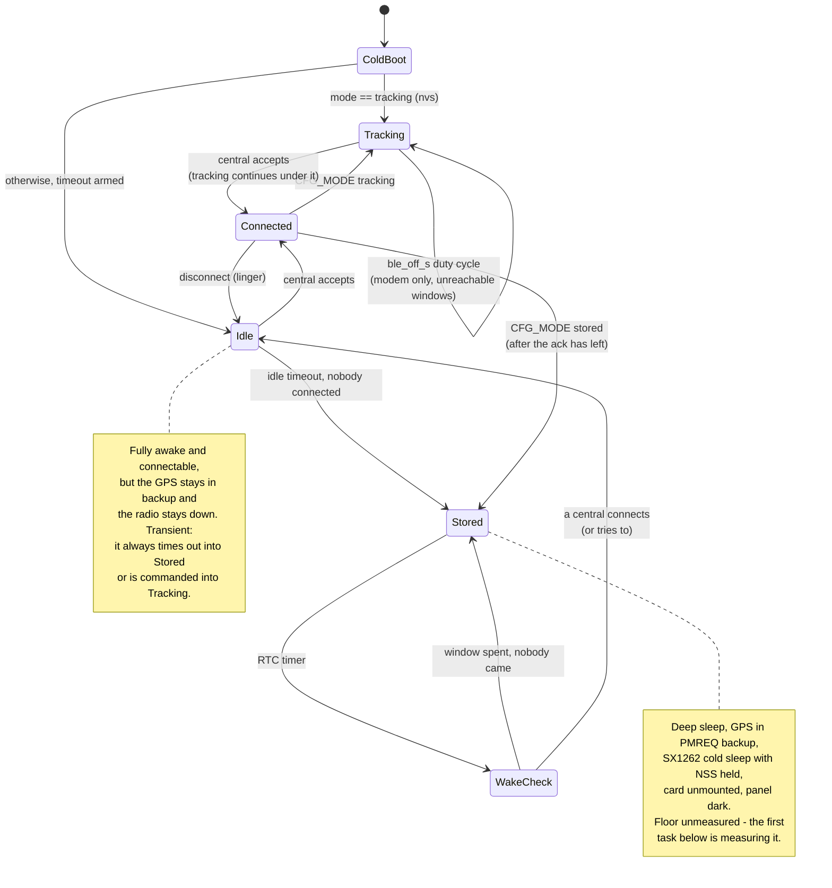

# The states this device should have

> **Status (2026-08-29): implemented, except the measurements.** Steps 1
> and 3-6 of the work order are in the firmware - the SD flush, the mode
> enum and its nvs record, the three boot flavors, the wake-check
> promotion, and the knob scoping. Step 2 (the two current measurements)
> and step 7 (the soak) need a board on a meter and are still owed; the
> Stored floor this plan hangs on remains unmeasured. Two hazards from the
> list below are also closed: GPIO2 is held across the sleep alongside NSS,
> and the card is flushed and unmounted by the park path. The app toggle
> lives in `gps-gui-rs` and is not done here - and that app must be rebuilt
> against this crate either way, because the settings blob is version 5 now.
> What follows is the plan as written, unchanged.

The device tracks an object. Its life is three unequal parts: mostly it
sits in a bag drawing as close to nothing as the board allows, sometimes
it is awake so a phone can talk to it, and while it matters it is a
tracker. The current firmware has only the third of these as a real
state; this plan names all three, and compares each against what the
code does today.

## Requirements, restated

1. **Stored.** The default. No radios, no GPS, as low power as the board
   permits. Wakes briefly on a cadence to ask "does anyone want me?", and
   goes straight back down when nobody does.
2. **Awake.** Reachable over BLE. An app can connect, configure, monitor,
   pull logs, push firmware - everything the app does - without the board
   burning tracker current the whole time.
3. **Tracking.** Commanded from a connection. GPS acquiring, positions
   out over LoRa, pings when there is no fix, SD logging. Keeps tracking
   after the phone walks away - that is the point of it.

## Proposed states

Two of these persist across reboots and flat cells (`mode` in RTC RAM
mirrored to nvs): **Stored** and **Tracking**. **Idle** is deliberately
transient - it is "awake because someone might want me", it always ends
by timeout or by command, and making it survive a reboot would leave a
board stuck at awake current with nobody coming.

### Stored

Everything the firmware can lower, lowered:

| Load | State | How |
|-|-|-|
| S3 | deep sleep, RTC timer wake | exists today |
| BLE | controller does not exist | exists today |
| SX1262 | cold sleep, 9.3 uA, NSS pad-held | exists today |
| MAX-M10 | PMREQ backup, re-issued per wake | **new** - today it acquires through every sleep |
| SD | unmounted, buffer flushed first | flush is a known bug, mount deferral is new |
| OLED | blanked | exists today |

The cadence: sleep `sleep_interval_s`, wake into a check, advertise
`adv_window_s`, and if nobody comes, re-issue the GPS backup request and
go back down. The check must *not* run `gps.configure` - UART RX is one
of the M10's wake sources, so today's boot path wakes the receiver just
to re-sleep it, and the receiver restarts acquisition for nothing every
single wake. Same for the radio: leave NSS held, skip `init`, never
touch it.

What Stored draws is the number this plan hangs on, and it has never
been measured, because today's deep sleep leaves the GPS acquiring and
the floor at ~30 mA. Guessing at the components: S3 deep sleep is
microamps, the SX1262 is microamps, the M10 in backup on VCC alone is
unknown (V_BCKP is not fed - the timed-PMREQ experiment proves the
backup domain survives, not what it costs), the idle card is unknown,
and the LDO quiescent is fixed. If the answer lands in low single-digit
milliamps, storage life moves from hours to weeks or months; if the card
or the LDO dominates, that is a board finding worth having in
BOARD-V1-ISSUES.md.

### WakeCheck, and the question of what wakes the board

Today a wake check advertises, and a completed connection is the only
thing that keeps the board up - the session holds it awake, and five
seconds after the disconnect it is falling asleep again. To fully wake a
stored board you must catch the window, connect, and then keep the
connection or keep reconnecting.

Change that: **a connection during a wake check promotes the board to
Idle**, with the idle timeout armed. The connection itself becomes a
doorbell rather than a leash - even if the first connect drops
immediately (phones flub first attempts routinely), the board is now
awake and connectable for minutes, and the app can take its time. A
promotion that turns out to be a misfire costs one idle timeout of awake
current, bounded and small.

Promote on the connect *attempt*, not only on a completed session: the
intent was unambiguous either way, and the failure mode of the stricter
rule is a board that goes back down for five minutes because one
connection handshake fizzled.

What this does not solve: waking without advertising. A BLE peripheral
cannot cheaply observe that someone is looking for it - scanning is the
expensive side, and trouble-host does not surface scan requests - so
advertise-and-connect stays the only remote wake this hardware has. The
physical alternatives are all respin items already on the board-changes
list: a wake button on an RTC GPIO, and GPS EXTINT. Until then the
wake-check cadence is also the reachability guarantee, which is why
`sleep_interval_s` should keep a cap (300 s today; raising it lengthens
the worst wait to catch a stored board, and there is no button to
shortcut it).

### Idle

New, and the piece the current firmware genuinely lacks. Fully booted,
BLE advertising continuously (no duty cycle - the state exists to be
reachable), GPS still in backup, radio still asleep, card mounted so
config reads and log pulls work. Entered from a wake-check promotion or
from any cold boot whose stored mode is not Tracking - which gives a
recovered flat-cell board, or a freshly flashed one, a rescue window of
reachability before it stores itself.

Draw is BLE-dominated: roughly the measured 126 mA minus the GPS
(~25-30), the LoRa RX (~6) and the app loop (~6) - call it on the order
of 90 mA, unmeasured. That estimate carries the same 71 mA of BLE that
dominates every other state, and it was drawn before the controller had
modem sleep; how much of the 71 the sleep takes back in a state that
advertises and nothing else is exactly the reading this mode is waiting
on. The idle timeout is what makes it affordable meanwhile: minutes of
it, not days. Default something like 10 minutes,
`0` meaning never (a bench board).

Everything in the app works here. The one thing an app cannot see is
live position - the GPS is in backup - and that is correct: monitoring
a stored object's configuration should not cost an acquisition.

### Connected

Unchanged in shape from today: one central, the session suspends the
idle timeout, disconnect re-arms it after the linger. All the current
machinery - config push, OTA, log pull, the transfer interlocks - stays
exactly as it is. What is new is one config write, `CFG_MODE`
(tracking / idle / stored), replacing the current pair of independent
sleep flags as the thing an app actually means.

### Tracking

Today's firmware, nearly verbatim: GPS full power, beacon with a fix,
ping without one, continuous RX unless the role says otherwise, SD
logging, telemetry. The differences are policy, not machinery:

- **Entered by command, not by default.** A cold boot only lands here if
  nvs says `mode == tracking` - so tracking survives a brownout on the
  object, which is the one time it must.
- **`ble_off_s` is Tracking's knob.** The modem duty cycle exists so a
  tracker that nobody is talking to does not pay 71 mA for reachability.
  It applies here and nowhere else: Idle exists to be reachable, Stored
  has no modem at all.
- **`sleep_interval_s` is Stored's knob.** Deep sleep while tracking
  stops the beacon, the logging and the listening - POWER.md already
  says it is for a board being stored. Under this model that sentence
  becomes structure: the two duty cycles stop being settings that
  compete inside one state (today deep sleep silently wins and
  `ble_off_s` is dead config) and become properties of different modes.

Leaving Tracking is a command (`CFG_MODE` over BLE, or the USB console
for a board on the bench). There is no automatic exit: no battery sense
on this board, so no low-cell fallback to Stored is possible, and a
timeout that silently stops tracking a flying object is worse than a
flat cell.

## Against the current firmware

| Proposed | Today | Delta |
|-|-|-|
| Stored | deep-sleep cycle, but GPS acquires through it (~30 mA) | GPS backup folded into the sleep path; wake checks that do not touch GPS or radio; SD flushed and unmounted; mode persisted |
| WakeCheck | advertise window; only a held connection keeps the board up | connection promotes to Idle instead of holding a leash |
| Idle | does not exist; nearest thing is `wio_sleep` + `gps_sleep` flags set by hand | a coherent state with a timeout, entered automatically |
| Connected | gatt session | + `CFG_MODE`; otherwise unchanged |
| Tracking | the default and only awake mode | becomes commanded and persisted; `ble_off_s` scoped to it |

What already exists is most of the machinery: the raise/lower paths
(`Request::GpsSleep`, `Request::RadioStandby`) are exactly the Idle <->
Tracking transitions; the settings store already does RTC + nvs
mirroring; the serve loop's Window/linger logic carries into WakeCheck
and Idle nearly unchanged; PMREQ backup and the NSS hold are written and
partially proven. What is genuinely new is the mode enum and its policy:
timeouts, promotion, what each boot flavor raises, and one inversion -
today the sleep flags are deliberately *not* mirrored to nvs because "a
board that cold-boots with its GPS running is the safer failure". For a
tracker that is right; for a stored device it drains the cell. The mode
enum resolves it: cold boot into Idle (reachable, GPS down) is safe in
both senses, and only an explicit nvs `tracking` raises everything.

## Prerequisites and open risks

1. **Measure the Stored floor.** `iso-gps-backup` plus deep sleep is the
   reading everything above hangs on. If backup-on-VCC-alone costs tens
   of milliamps, Stored barely beats today's sleep and the plan shrinks
   to Idle + promotion.
2. **TTFF after backup.** Unknown whether ephemeris survives PMREQ
   backup without V_BCKP. For Stored it does not matter - a cold start
   on activation is acceptable - but it decides whether short GPS naps
   are ever worth it inside Tracking.
3. **The SD flush bug.** `PrepareSleep` discards up to 5 s of buffered
   fixes today (NOTES.md 2026-08-28). Stored's park path must flush
   before the card is abandoned; fix it before building on that path.
4. **UART TX pad during deep sleep.** The S3 releases unheld pads, and
   GPIO2 (UART1 TX into the M10's RX) floating against a wake-on-UART
   receiver risks waking the GPS mid-storage. GPIO2 is inside the RTC
   hold range; hold it high (UART idle) across the sleep, release after
   re-init, exactly as NSS is handled.
5. **SD CS during deep sleep.** GPIO44 is outside the RTC hold range, so
   the card's CS floats through every sleep. Unfixable in esp-hal 1.0;
   measure whether it costs anything, note it for the respin if so.
6. **Wake-check boot cost.** Boot has never been timed. Each check pays
   full init at ~90+ mA; at a 300 s cadence even a couple of seconds is
   fine, but the number should exist before the cadence is tuned.

## Order of work

1. Fix the SD flush in `PrepareSleep` (small, standalone, already owed).
2. Run the two measurements: `iso-gps-backup` (TODO already lists it)
   and backup + deep sleep together. These decide everything.
3. Add `mode` to `Stored` + nvs record (version bump), `CFG_MODE` write,
   USB console command, app toggle.
4. Teach the boot path its three flavors: wake-check (raise nothing),
   idle (raise BLE + card), tracking (raise everything). This is where
   `gps.configure`-before-`gps.sleep()` gets untangled.
5. Promotion: wake-check connect -> Idle with timeout; idle timeout ->
   Stored via the (now flushing) park path.
6. Scope the knobs: `ble_off_s` honored only in Tracking,
   `sleep_interval_s` only as Stored cadence; document in POWER.md and
   RADIO.example.toml.
7. Soak: a week of Stored on a cell, wake counter and heap checked, then
   a tracked walk that ends in `CFG_MODE stored` from the phone.
