# The state space, walked

*2026-09-08. Firmware at `b2fb2ef`, app at the matching commit. Nothing
here has run on a board; the bench items are at the end.*

The request was exhaustive state space testing of everything around the
two radios and whatever can interrupt them, in the firmware and in the
app, maintainable and easy to extend. `tools/radio_sim.py` already covers
the timing - who overlaps whom on the air, how late a poll comes. What
nothing covered was the discrete interleavings: a mode written while the
hardware loop is inside a transmit, a sleep commanded between the park
and the chip going down, a request landing on a full queue, a press
landing between a connect and its subscribes. Those need every ordering,
not a handful of scenarios, and every ordering is what a breadth-first
walk over a finite model gives.

## What was built

| Piece | Where | What it is |
|---|---|---|
| `midair-explore` | `explore/` | The harness. A `Machine` trait (initial states, enabled events, step, invariants), a breadth-first walk that stops at the first violation with the shortest trace to it, liveness, coverage, and a mermaid gantt of any trace. No dependencies. |
| `session::Serve`, `session::dispatch` | `proto/src/session.rs` | The serve loop's policy: what a connect, a fizzled handshake, an expiry, a nap and a moved mode mean on each mode's budget, and what a config write sets in motion. The firmware's `serve()` is now a driver of it. |
| `posture::Posture`, `posture::Requests` | `proto/src/posture.rs` | What the hardware task has up and what each request changes, as effects the task carries out; and the queue between the two, one slot per kind so it cannot overflow, drained in a fixed order. |
| `rxgate::RxGate` | `proto/src/rxgate.rs` | What the receiver has seen of an arriving frame and how long a hop or a transmit waits for it. |
| Composed board model | `proto/tests/statespace_firmware.rs` | `Serve` x `Posture` x `Requests` x the sleep-now cell, the mode signal, the transfer lock, a transmit in flight, the deep sleep and the wake. |
| Receive gate model | `proto/tests/statespace_rxgate.rs` | Every interrupt combination at every phase of a hold, against slot boundaries and transmits. |
| Roster model | `proto/tests/statespace_roster.rs` | Every record, take, replay and passage of time against a one-line ledger of what the table should hold. |
| Worker model | `gps-gui-rs/src/ble/statespace.rs` | Every press against every link event and every point the worker and the UI get around to noticing, on the real `Inbox`, `Wanted`, `ConfigPush` and `stale()`. |

The machines are the code the firmware and the app run, not copies of
it. That is the maintainability argument in one line: a new mode, request
or effect that a model does not handle fails to compile before it fails to
explore, and the trace a failure prints is a sequence of the firmware's own
requests.

## What the walk covers

| Model | States | Transitions | Depth | Time |
|---|---|---|---|---|
| Board | 692,936 | 9,799,496 | 21 | ~20 s |
| Receive gate | 18,828 | 349,116 | 30 | 0.2 s |
| Roster, three nodes | 471 | 2,591 | 10 | - |
| Roster, nine nodes from a full table | 31,974 | 69,234 | 6 (bounded) | 0.5 s |
| Worker | 6,558 | 30,586 | 25 | 0.1 s |

Depth is events from an initial state to the deepest state, so every
state of the board is at most 21 events from a cold boot.

The board model starts from every persisted mode (stored, tracking,
listening) with every override flag combination, on a bench board (no
cadence, no off period, no idle timeout) and a deployed one (120 s
cadence, 15 s window, 600 s idle timeout, 30 s off after 20 s on). Its
events are a connect, a fizzled handshake, a budget expiry, a disconnect,
the off period ending, nine config writes (four modes, the two overrides
each way, a nap) over BLE and over the console, a pass of the hardware
loop, a transmit starting and ending, a transfer opening on either
transport and completing as a config or a firmware image, the park
finishing, the chip sleeping and the timer waking it.

What it checks in every state:

- the posture is consistent with the settings, once the loop has drained:
  a tracking board has its receiver and its radio exactly where the two
  override flags say, an idle board and a wake check have both down, a
  board parked for sleep has everything down;
- a sleeping board is fully parked and the park finished - it cannot be
  lost, skipped or undone by anything that arrives while it is happening;
- a listening node never transmits; nothing transmits into a transfer or
  over a pending sleep;
- the hardware loop is in the mode the settings report once it has
  drained;
- the modem is only ever down in the one mode that has an off period;
- a pass never leaves a request behind.

And what it checks of the whole space: from every state the board can
still be advertised, still be commanded into tracking with its radio up,
and still be put to sleep. That is "the board is never left dark for
good", as a test.

Time in the board model is two-valued. Every event happens either before
the serve budget's deadline or at it, which is all the policy ever asks,
so the deadline is one of a handful of values and the state stays finite.

## What it found

Nine changes, each forced by a trace or by a rule the model needed in
order to state its invariant. None has been flashed.

| # | Finding | Where | What changed |
|---|---|---|---|
| 1 | The GPS was polled while the radio was up. `CFG_GPS_SLEEP=0` with the radio in standby woke a receiver nothing drained: ~10 mA, no position, and the settings retry never ran. | `main.rs` hardware task | Polling is gated on the receiver's own state (`Posture::gps_awake`), the radio work on the radio's (`radio_up`). |
| 2 | A mode commanded on top of an override flag ignored it. `CFG_GPS_SLEEP=1` then `CFG_MODE tracking`: the app showed "GPS in backup" beside a receiver that was acquiring. | `main.rs` request handling | `Posture::on(Mode)` lands on the flags the way the boot path always did; the overrides are no-ops outside a tracking posture and honored when tracking is next commanded. |
| 3 | A request could be dropped on a full queue (`Channel<_, 4>`, `try_send`), and the dropped one could be the park before a deep sleep - which then happened over a radio in continuous receive. | `state.rs` | `posture::Requests`: one slot per kind, a newer replaces an older, never full. Drained mode first, park after everything that raises. |
| 4 | A `CFG_MODE tracking` over the console between the park and the chip going down raised the receiver and the radio for the sleep to happen over. | `posture.rs` | A parked posture ignores everything but another park or a reboot. |
| 5 | The one-channel default retuned at every slot boundary: through standby to the carrier it was already on, a millisecond deaf a second, and a preamble landing there was a frame lost. | `radio.rs` `hop_tick` | `Plan::retunes` says whether the carrier changes; the boundary is only noted when it does not. |
| 6 | `Clock::tx_start` planned "the next slot" on a multi-slot interval - another node's slot, where nothing is owed - so the plan was dropped and the beacon waited a whole interval. Any pass that came late at the start of the node's slot. | `hop.rs`, `main.rs` | It plans the node's own next slot, and the hardware loop keeps a plan that is still ahead across the slots between rather than discarding it on the first one that is not the node's; a test walks every address, interval and phase. The simulator's port and its vectors follow. |
| 7 | A valid header seen after a stale preamble's hold had lapsed inherited the stale start, so its hold could already be spent. Reachable where preamble and header land in one poll. | `rxgate.rs` | A header after a lapsed hold starts a fresh one. |
| 8 | A config pushed during a wake check was written to a card that had never been mounted. | `posture.rs` | The apply mounts the card first. |
| 9 | Repeats were not gated on a pending sleep the way beacons are. | `main.rs` | `Posture::may_transmit` gates both. |

On the app side:

| # | Finding | Where | What changed |
|---|---|---|---|
| 10 | The Android transport swallowed a disconnect during setup and waited every setup step out to its own timeout: a board that went away during service discovery cost close to a minute of "connecting". The worker model reproduces it in eight events. | `ble/android.rs` `wait_cb` | A wait that sees the link drop says so, and the session ends there. The model has the old behavior behind a flag and shows the trace. |
| 11 | The Radio page applied the hop-visit budget to any plan, the one-channel default included, so a frame that is legal on a single 500 kHz carrier was warned about. | `radio.rs` `airtime` | The rule keys on `channels > 1`; a one-channel plan is the single carrier it is. |

## A trace, read

The shortest trace to finding 4, before the rule that closes it. The
model prints these; this one is drawn as the gantt the harness emits, one
lane per component.

```mermaid
gantt
    title Finding 4 - a mode raised over a park
    dateFormat x
    axisFormat %L
    section app
    Write(Ble; Mode(Stored)) :e1, 1, 1ms
    section ble
    SessionEndsForSleep :e2, 2, 1ms
    section hardware loop
    LoopPass (parks everything; signals ready) :e3, 3, 1ms
    section usb
    Write(Usb; Mode(Tracking)) :e4, 4, 1ms
    section hardware loop
    LoopPass (raises GPS and radio) :e5, 5, 1ms
    section power
    Sleep :e6, 6, 1ms
```

Five events from a connected tracker to a chip asleep with its receiver
acquiring and its radio in continuous receive. The window is real - the
park waits up to `tx_worst_case_ms + 1500` for the card - and the console
is alive throughout.

## What the walk cannot say

- **Timing.** A hold that is a millisecond too short, a poll that comes
  late, two nodes that overlap: `tools/radio_sim.py`. The models take the
  timing as given and check what is decided from it.
- **The hardware.** Whether the SX1262 honors a standby, whether the M10
  takes the park, whether the card flush finishes inside the budget. The
  bench items below.
- **The transports' inline phases.** The worker model's scan, connect,
  subscribe and pump phases are a model of the shape `desktop.rs` and
  `android.rs` share, not the code; the `Inbox`, `Wanted`, `ConfigPush`
  and `stale()` it drives are the code. Extracting the phases into a
  shared machine is the next step if a transport bug shows up.
- **The Android build.** `cargo check --target aarch64-linux-android`
  stops at a C dependency that needs the NDK compiler, which this machine
  does not have. The `wait_cb` change was reviewed by hand; it needs an
  xbuild pass.

## Adding to it

A new request: add the variant to `posture::Request`, a slot to
`Requests` (and its place in the drain order), an arm to `Posture::on`.
The board model's `events()` and the firmware's `effect!` macro both fail
to compile until they handle it.

A new mode: add it to `ble::Mode`, and `Posture::at_boot`,
`Posture::consistent` and `Stored::at_expiry` stop compiling until they
say what it raises, what it may have up and what a spent budget does. Add
it to the model's write set and it is explored.

A new invariant: a line in `check` (a property of one state) or
`check_step` (a property of one transition). Add an `assert_some` beside
it for the states it is about, so it cannot pass because they were never
reached.

A new machine: implement `Machine`, keep the state small and canonical
(no counters, no times - events that stand for them), and `explore` it.
The state count the test prints is the number to watch; the board model
at ~700k states and 20 s is about as large as a test should be.

## Bench

1. Flash the default build. `tracking: node N (leaf), gps up, radio up`
   after a `CFG_MODE tracking`, and `gps in backup` or `radio standby` in
   that line when the matching override flag is set; `radio: standby` and
   `gps: backup mode` only while tracking; a wake check a phone connects
   to prints `promoted to idle`.
2. `wio-set gps-sleep 0` with `wio-set wio-sleep 1` set: the receiver
   reports sentences and a fix with the radio in standby.
3. `wio-set mode stored` while beaconing, then `wio-set mode tracking`
   typed within a second: the board sleeps, and the meter says the
   receiver and the radio stayed down.
4. Two boards at 1 s on the one-channel default: the status line's `rx`
   climbs by one a second, and `dropped:` stays flat. This is finding 5.
5. A phone that walks out of range during the app's connect: the
   Bluetooth page says so within seconds, not a minute. This is finding
   10, on Android.
