# The state space, walked

*2026-09-08. Written at firmware `b2fb2ef`; the models and the numbers
below are as of the system audit's rework the same day (firmware
`f2e1383`, app `62e4888`). Nothing here has run on a board; the bench
items are at the end.*

The request was exhaustive state space testing of everything around the
two radios and whatever can interrupt them, in the firmware and in the
app, maintainable and easy to extend. `tools/radio_sim.py` already covers
the timing - who overlaps whom on the air, how late a poll comes. What
nothing covered was the discrete interleavings: a mode written while the
hardware loop is inside a transmit, a sleep commanded between the park
and the chip going down, a request landing on a full queue, a press
landing between a connect and its subscribes. Those need every ordering,
not a handful of scenarios, and every ordering is what a breadth-first
walk over a finite model gives.

## What was built

| Piece | Where | What it is |
|---|---|---|
| `midair-explore` | `explore/` | The harness. A `Machine` trait (initial states, enabled events, step, invariants), a breadth-first walk that stops at the first violation with the shortest trace to it, liveness, coverage, and a mermaid gantt of any trace. No dependencies. |
| `session::Serve`, `session::dispatch` | `proto/src/session.rs` | The serve loop's policy: what a connect, a fizzled handshake, an expiry, a nap and a moved mode mean on each mode's budget, and what a config write sets in motion. The firmware's `serve()` is now a driver of it. |
| `posture::Posture`, `posture::Requests` | `proto/src/posture.rs` | What the hardware task has up and what each request changes, as effects the task carries out; and the queue between the two, one slot per kind so it cannot overflow, drained in a fixed order. |
| `rxgate::RxGate` | `proto/src/rxgate.rs` | What the receiver has seen of an arriving frame and how long a hop or a transmit waits for it. |
| `beacon::Planner` | `proto/src/beacon.rs` | When the next beacon goes out: owed on the schedule, planned into the node's turn, re-planned when stale, kept across other nodes' slots. |
| `dedup::SeenTable`, `dedup::RepeatQueue` | `proto/src/dedup.rs` | The frames seen and the frames waiting to be repeated, which is what keeps a repeater from becoming a storm. |
| Composed board model | `proto/tests/statespace_firmware.rs` | `Serve` x `Posture` x `Requests` x the serve command channel, the transfer lock, a transmit in flight, the deep sleep and the wake. |
| Receive gate model | `proto/tests/statespace_rxgate.rs` | Every interrupt combination at every phase of a hold, against slot boundaries and transmits. |
| Beacon model | `proto/tests/statespace_beacon.rs` | Every phase of every slot against every pattern of transmit gates, frames arriving and late passes, at a one-slot and a three-slot interval. |
| Dedup model | `proto/tests/statespace_dedup.rs` | Every frame by every path, every repeat and every passage of time against a ledger, on small tables. |
| Roster model | `proto/tests/statespace_roster.rs` | Every record, take, replay and passage of time against a one-line ledger of what the table should hold. |
| `supervise::Supervisor` | `proto/src/supervise.rs` | Which tasks are watched, how long each may go quiet, and what is written down when one stops: the monitor's policy. Added 2026-09-11; see *What it could not find*. |
| `evlog::Record`, `evlog::Ring` | `proto/src/evlog.rs` | The record the board writes about itself into its own flash, and the ring it is kept in. |
| Supervision model | `proto/tests/statespace_supervise.rs` | Either loop stops, the monitor stops, the monitor blocks after writing the crumb; the watchdog behind all of it, and the same board with nothing watching. |
| `ble::session::Session`, `Link` | `gps-gui-rs/src/ble/session.rs` | The scan-connect-subscribe-pump shape both transports run, over a trait whose every call returns within a poll. |
| `board::BoardLink` | `gps-gui-rs/src/board.rs` | The app's side of the link: what a press drops, what an event sets. |
| Worker model | `gps-gui-rs/src/ble/statespace.rs` | Every press against every link event and every point the worker and the UI get around to noticing, stepping the real `Session` over a link the model controls. |
| Board link model | `gps-gui-rs/src/board.rs` (tests) | Every ordering of presses, fresh events and the stale tail of the session before, on the real `BoardLink`. |

The machines are the code the firmware and the app run, not copies of
it. That is the maintainability argument in one line: a new mode, request
or effect that a model does not handle fails to compile before it fails to
explore, and the trace a failure prints is a sequence of the firmware's own
requests.

## What the walk covers

| Model | States | Transitions | Depth | Time |
|---|---|---|---|---|
| Board | 604,536 | 9,013,328 | 21 | ~17 s |
| Receive gate | 18,828 | 349,116 | 30 | 0.2 s |
| Beacon, one-slot interval | 3,579 | 12,720 | 26 | - |
| Beacon, three-slot interval | 8,748 | 33,552 | 58 | - |
| Dedup | 581,261 | 5,456,189 | 19 | ~17 s |
| Roster, three nodes | 471 | 2,591 | 10 | - |
| Roster, nine nodes from a full table | 31,974 | 69,234 | 6 (bounded) | 0.5 s |
| Worker | 14,514 | 46,828 | 25 | 0.1 s |
| Board link | 893 | 11,314 | 11 | - |
| Supervision | 3,604 | 7,079 | 15 | - |
| Supervision, nothing watching | 378 | 729 | 9 | - |

Depth is events from an initial state to the deepest state, so every
state of the board is at most 21 events from a cold boot.

The board model starts from every persisted mode (stored, tracking,
listening) with every override flag combination, on a bench board (no
cadence, no off period, no idle timeout) and a deployed one (120 s
cadence, 15 s window, 600 s idle timeout, 30 s off after 20 s on). Its
events are a connect, a fizzled handshake, a budget expiry, a disconnect,
the off period ending, nine config writes (four modes, the two overrides
each way, a nap) over BLE and over the console, a pass of the hardware
loop, a transmit starting and ending, a transfer opening on either
transport and completing as a config or a firmware image, the park
finishing, the chip sleeping and the timer waking it.

What it checks in every state:

- the posture is consistent with the settings, once the loop has drained:
  a tracking board has its receiver and its radio exactly where the two
  override flags say, an idle board and a wake check have both down, a
  board parked for sleep has everything down;
- a sleeping board is fully parked and the park finished - it cannot be
  lost, skipped or undone by anything that arrives while it is happening;
- a listening node never transmits; nothing transmits into a transfer or
  over a pending sleep;
- the hardware loop is in the mode the settings report once it has
  drained;
- the modem is only ever down in the one mode that has an off period;
- a pass never leaves a request behind.

And what it checks of the whole space: from every state the board can
still be advertised, still be commanded into tracking with its radio up,
and still be put to sleep. That is "the board is never left dark for
good", as a test.

Time in the board model is two-valued. Every event happens either before
the serve budget's deadline or at it, which is all the policy ever asks,
so the deadline is one of a handful of values and the state stays finite.

## What it found

Eleven changes from the first walk, each forced by a trace or by a rule the
model needed in order to state its invariant, and two more from the models
the audit's rework added. None has been flashed.

| # | Finding | Where | What changed |
|---|---|---|---|
| 1 | The GPS was polled while the radio was up. `CFG_GPS_SLEEP=0` with the radio in standby woke a receiver nothing drained: ~10 mA, no position, and the settings retry never ran. | `main.rs` hardware task | Polling is gated on the receiver's own state (`Posture::gps_awake`), the radio work on the radio's (`radio_up`). |
| 2 | A mode commanded on top of an override flag ignored it. `CFG_GPS_SLEEP=1` then `CFG_MODE tracking`: the app showed "GPS in backup" beside a receiver that was acquiring. | `main.rs` request handling | `Posture::on(Mode)` lands on the flags the way the boot path always did; the overrides are no-ops outside a tracking posture and honored when tracking is next commanded. |
| 3 | A request could be dropped on a full queue (`Channel<_, 4>`, `try_send`), and the dropped one could be the park before a deep sleep - which then happened over a radio in continuous receive. | `state.rs` | `posture::Requests`: one slot per kind, a newer replaces an older, never full. Drained mode first, park after everything that raises. |
| 4 | A `CFG_MODE tracking` over the console between the park and the chip going down raised the receiver and the radio for the sleep to happen over. | `posture.rs` | A parked posture ignores everything but another park or a reboot. |
| 5 | The one-channel default retuned at every slot boundary: through standby to the carrier it was already on, a millisecond deaf a second, and a preamble landing there was a frame lost. | `radio.rs` `hop_tick` | `Plan::retunes` says whether the carrier changes; the boundary is only noted when it does not. |
| 6 | `Clock::tx_start` planned "the next slot" on a multi-slot interval - another node's slot, where nothing is owed - so the plan was dropped and the beacon waited a whole interval. Any pass that came late at the start of the node's slot. | `hop.rs`, `main.rs` | It plans the node's own next slot, and the hardware loop keeps a plan that is still ahead across the slots between rather than discarding it on the first one that is not the node's; a test walks every address, interval and phase. The simulator's port and its vectors follow. |
| 7 | A valid header seen after a stale preamble's hold had lapsed inherited the stale start, so its hold could already be spent. Reachable where preamble and header land in one poll. | `rxgate.rs` | A header after a lapsed hold starts a fresh one. |
| 8 | A config pushed during a wake check was written to a card that had never been mounted. | `posture.rs` | The apply mounts the card first. |
| 9 | Repeats were not gated on a pending sleep the way beacons are. | `main.rs` | `Posture::may_transmit` gates both. |

On the app side:

| # | Finding | Where | What changed |
|---|---|---|---|
| 10 | The Android transport swallowed a disconnect during setup and waited every setup step out to its own timeout: a board that went away during service discovery cost close to a minute of "connecting". The worker model reproduced it in eight events. | `ble/android.rs` | A wait that sees the link drop says so, and the session ends there. Since the rework the setup is the shared `Session`, which checks the link at every step, so the old shape cannot be written. |
| 11 | The Radio page applied the hop-visit budget to any plan, the one-channel default included, so a frame that is legal on a single 500 kHz carrier was warned about. | `radio.rs` `airtime` | The rule keys on `channels > 1`; a one-channel plan is the single carrier it is. |

From the models the rework added:

| # | Finding | Where | What changed |
|---|---|---|---|
| 12 | An ack left pending across a dropped link stayed pending through the reconnect: the Bluetooth page's controls were disabled until the user pressed something. The board link model states "waiting for an ack nothing is owed" and finds it in six events. | `board.rs` `on_event` | A fresh link owes nothing: `Connected(true)` clears the pending ack. |
| 13 | A push replaced mid-transfer by a newer push has no timeout of its own to answer: the newer one is started and answered instead. Not a bug, but the worker model's first statement of "a push that timed out is answered" was wrong about it, and the corrected invariant says what actually holds. | `ble/statespace.rs` | The check exempts a push with a replacement queued. |

## What it could not find, and why

*2026-09-11.* A tracker beaconing every second, a phone trying to
connect: the transmit LED stopped blinking and stayed on, the phone
never connected, and the board stayed that way. The question was why
none of the above found it.

Because none of it can. A breadth-first walk over enabled events walks
what the machines *decide*; a loop that stops deciding is the absence of
an event, and no `events()` list contains "nothing, ever again". The
board model's hardware loop always takes its next pass and its serve
loop always answers its next accept, because those are the events the
policy has - the policy has no failure in it, and the model was faithful
to the policy. The liveness check, "the board is advertising is reachable
from every state", holds trivially in such a model: every state has a
next event, so every state has a path. And the platform under the policy
- the heap the controller allocates from, the spinlock both cores share,
the flash driver that stalls the other core to write - is outside the
model by construction, as *What the walk cannot say* said.

What the LED said, read against the code, is narrower than "a hang". D2
is lit at the start of a transmit and put out at the top of the next
pass; a transmit is 289 ms at the default settings and the blink is
20 ms, so a lit D2 means the hardware loop stopped inside a transmit,
which it does not do on its own: the transmit waits on the radio's
interrupt with a deadline and a 1 ms sleep. What stops a loop inside a
sleep is the core it runs on stopping. On this chip a panic on either
core did exactly that to *both*: the backtrace crate's panic handler
spun the panicking core forever in an interrupt-free loop holding
whatever critical section it held, and the other core followed at its
next critical section - which the hardware loop takes every pass and the
BLE host takes every event. A phone connecting is when the controller
allocates, the host attaches, and every cause that ends in a panic or a
fault gets its chance; the console that would have named it was not
plugged in. Which cause it was is what the event log is for, and it is
not established: the finding is that nothing was armed to say.

A second cause, found by reading the flash driver: it parks the other
core to write, *before* taking its own lock and unparking *after*
releasing it. An interrupt on the writing core in either gap that needs
the critical-section spinlock the parked core was holding spins on it
forever. Closed by holding the critical section around every program and
erase. It is not the connect freeze - nothing on a plain connect writes
flash - but a bulk transfer makes a hundred of those windows.

### What was added

Three mechanisms, one policy, one model:

- **Heartbeats.** Each loop says what it is doing and that it still is
  ([`supervise::Phase`]): at the top of every pass, and from inside any
  wait that is allowed to last - advertising with nobody interested, a
  quiet connected phone, the modem's off period, the park before a sleep
  - which are wrapped so the beat continues for as long as they run. A
  wait that is *not* allowed to last - a notify, a flash write, the
  controller's init - is left uncovered, so it looks like the stall it is.
- **A monitor** that reads them every 500 ms, feeds a timer-group
  watchdog while every task is inside its bound, and on a stall writes the
  task and the phase to RTC RAM first (atomics, no lock), to flash second,
  and resets. If the flash write blocks - the dead core may hold the lock
  it needs - the watchdog, unfed, resets the board with the RTC copy
  intact. The panic handler does the same for a panic, with the message,
  location and the top of the backtrace, and the HAL routes CPU
  exceptions through it.
- **The event log**, a ring of 128-byte records in a `coredump`
  partition: every boot with its reset reason and what the last boot
  left, every panic, every stall, and the faults worth a line. The boot
  prints its tail; `pixi run board-log` reads it back; it outlives a
  reflash.

The supervision model is those three against every way they can fail. A
task is alive or stopped for good; live tasks beat inside every tick, so
silence in the model is only ever a stopped task's and a false alarm is
provable rather than unlikely. The monitor ticks and runs the real
`Supervisor::check`; on a stall it may reset, or block after the crumb;
it may also stop on its own. Checked in every state: a stopped task is
detected within its bound; the watchdog fires within its bound; a crumb
names a task that stopped, in the phase it stopped in; a reset the
watchdog caused still carries the crumb the monitor wrote; and from every
state both loops come back. The same model with nothing watching fails
the last one in one event:

```mermaid
gantt
    title A loop stops and nothing brings it back
    dateFormat x
    axisFormat %L
    section hardware loop
    Stall(Loop) :e1, 1, 1ms
```

That is the whole trace, and it is the trace the firmware could not
print. With the supervisor, the shortest recovery from the same stall:

```mermaid
gantt
    title The same stall, watched
    dateFormat x
    axisFormat %L
    section hardware loop
    Work(Loop; TxSend) :e1, 1, 1ms
    Stall(Loop) :e2, 2, 1ms
    section time
    Tick :e3, 3, 1ms
    Tick :e4, 4, 1ms
    Tick :e5, 5, 1ms
    Tick (check says Loop stalled in TxSend; crumb written) :e6, 6, 1ms
    section monitor
    Reset (boot logs "hardware loop silent in tx send") :e7, 7, 1ms
```

### What this does not settle

Which of the causes a connect can reach was the one. The log answers
that at the next occurrence, and the bench item is to make it happen: a
build with a deliberate panic in the attach path, and a read of the log
after. What the walk also cannot say is whether the bounds are right -
15 s for the hardware loop, 20 s for the serve loop, 30 s for the
watchdog - against what the hardware actually takes: a card that retries
its mount for seconds, the controller's init. A bound that is too short
is a board that resets itself while working, and the log would show a
stall in `card` or `ble init` at the same uptime on every boot. That is
the reading to check first.

## A trace, read

The shortest trace to finding 4, before the rule that closes it. The
model prints these; this one is drawn as the gantt the harness emits, one
lane per component.

```mermaid
gantt
    title Finding 4 - a mode raised over a park
    dateFormat x
    axisFormat %L
    section app
    Write(Ble; Mode(Stored)) :e1, 1, 1ms
    section ble
    SessionEndsForSleep :e2, 2, 1ms
    section hardware loop
    LoopPass (parks everything; signals ready) :e3, 3, 1ms
    section usb
    Write(Usb; Mode(Tracking)) :e4, 4, 1ms
    section hardware loop
    LoopPass (raises GPS and radio) :e5, 5, 1ms
    section power
    Sleep :e6, 6, 1ms
```

Five events from a connected tracker to a chip asleep with its receiver
acquiring and its radio in continuous receive. The window is real - the
park waits up to `tx_worst_case_ms + 1500` for the card - and the console
is alive throughout.

## What the walk cannot say

- **Timing.** A hold that is a millisecond too short, a poll that comes
  late, two nodes that overlap: `tools/radio_sim.py`. The models take the
  timing as given and check what is decided from it.
- **The hardware.** Whether the SX1262 honors a standby, whether the M10
  takes the park, whether the card flush finishes inside the budget. The
  bench items below.
- **The platform under the session.** The worker model steps the real
  `Session` over a `FakeLink`; what btleplug and the Java shim do inside
  one `Link` call - whether a connect lands, whether a subscribe is
  answered - is the transports' and the bench's.
- **The Android build.** `cargo check --target aarch64-linux-android`
  stops at a C dependency that needs the NDK compiler, which this machine
  does not have. `AndroidLink` was reviewed by hand; it needs an xbuild
  pass.

## Adding to it

A new request: add the variant to `posture::Request`, a slot to
`Requests` (and its place in the drain order), an arm to `Posture::on`.
The board model's `events()` and the firmware's `Hardware::effect` both
fail to compile until they handle it.

A new setting: a row in `session::KNOBS` (name, id, range, what zero
means, record and wire offsets), and the flash record, the BLE blob, the
config write, the `[power]` key and the RTC copy all follow; the test
`every_knob_writes_reads_and_persists` walks the row. A new config key: a
row in `radiocfg::KEYS`, then regenerate `RADIO.example.toml`
(`cargo run --example radio_example`) - the test that compares the two
fails until it is.

A new link event in the app: an arm in `BoardLink::on_event`, and a
`Said` variant in the board link model so it is walked.

A new mode: add it to `ble::Mode`, and `Posture::at_boot`,
`Posture::consistent` and `Stored::at_expiry` stop compiling until they
say what it raises, what it may have up and what a spent budget does. Add
it to the model's write set and it is explored.

A new invariant: a line in `check` (a property of one state) or
`check_step` (a property of one transition). Add an `assert_some` beside
it for the states it is about, so it cannot pass because they were never
reached.

A new supervised task: a variant in `supervise::Task` with its bound, and
`Task::ALL`; the firmware's heartbeat arrays are sized from it, and the
model walks it. A new phase: a variant in `supervise::Phase` with its wire
byte and name; a stall record carries the byte, the tool prints the name.
A new event kind: a variant in `evlog::Kind`, then regenerate
`tools/wire_consts.json` so `board-log` names it.

A new machine: implement `Machine`, keep the state small and canonical
(no counters, no times - events that stand for them), and `explore` it.
The state count the test prints is the number to watch; the board model
at ~700k states and 20 s is about as large as a test should be. A machine
that has to say "this task stopped" says it with an event that removes
the task's other events, and a liveness check is what finds the state it
leaves behind; `Explored::trap` is the non-asserting form, for a model
that expects to find one.

## Bench

1. Flash the default build. `tracking: node N (leaf), gps up, radio up`
   after a `CFG_MODE tracking`, and `gps in backup` or `radio standby` in
   that line when the matching override flag is set; `radio: standby` and
   `gps: backup mode` only while tracking; a wake check a phone connects
   to prints `promoted to idle`.
2. `board-set gps-sleep 0` with `board-set radio-standby 1` set: the
   receiver reports sentences and a fix with the radio in standby.
3. `board-set mode stored` while beaconing, then `board-set mode tracking`
   typed within a second: the board sleeps, and the meter says the
   receiver and the radio stayed down.
4. Two boards at 1 s on the one-channel default: the status line's `rx`
   climbs by one a second, and `dropped:` stays flat. This is finding 5.
5. A phone that walks out of range during the app's connect: the
   Bluetooth page says so within seconds, not a minute. This is finding
   10, on Android.
6. Two boards at a five-second interval: each beacons in its own slot of
   the five, and a board whose loop was busy at the top of its slot (a
   card flush, say) still beacons in that slot rather than five seconds
   later. This is the beacon model's regression test, on the air.
7. Drop the link mid-write (walk out of range with a setting in flight),
   let the app reconnect: the controls are live again without a press.
   This is finding 12.
8. Flash, let it boot, and `pixi run board-log`: a `boot` record with
   `reset: power on` or `software`. Then a build with a `panic!` placed
   after the attribute server attaches, connect a phone: the board resets
   within a second, the boot line says `evlog: last boot left:` with the
   panic's file and line, and `board-log` shows a `panic` record and a
   `boot` record with `(panic)`. Then the same with a `loop {}` in the
   hardware loop's pass: a `stall` record naming `hardware loop` and the
   phase, about fifteen seconds in.
9. A tracker left beaconing for a day with a phone connecting now and
   then: `board-log` shows one `boot` record. More than one, each with a
   `stall` before it in `card` or `ble init` at the same uptime, is a
   bound that is too short; a `panic` before it is the freeze, named.
