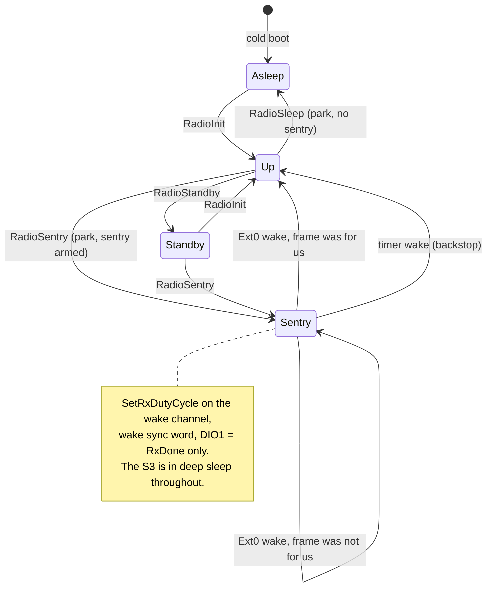
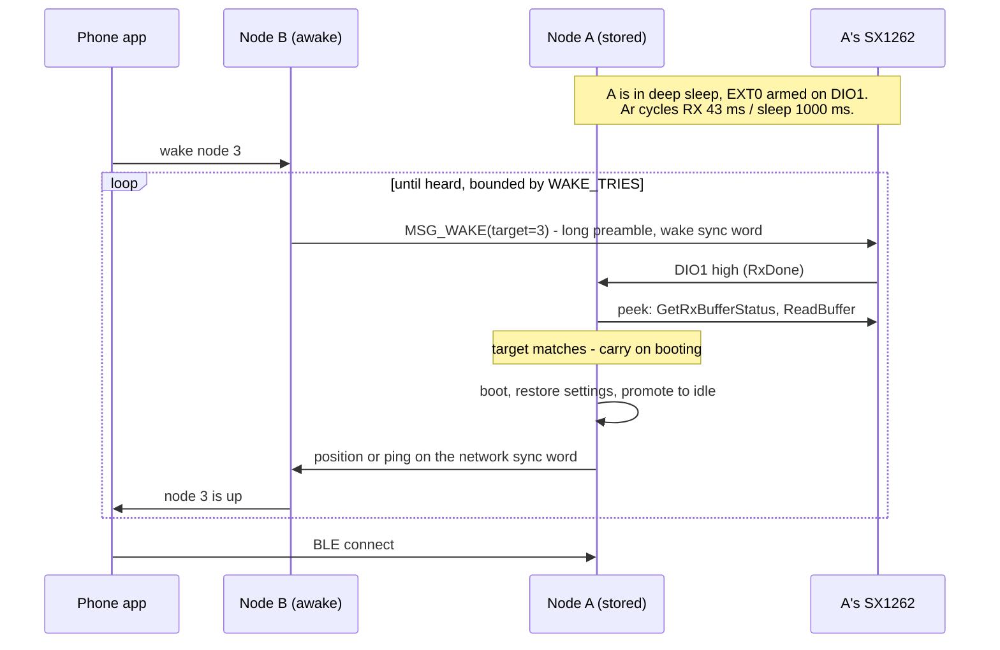

# Wake on LoRa

A plan for making the radio, not the RTC timer, the thing that brings a
stored board back - so a board in a pack is reachable on demand instead of
on a cadence, and costs microamps between wakes instead of a boot every
minute.

Nothing below is built. This is the design, the arithmetic, the parts that
have to be measured before the rest is worth writing, and the order.

## What it replaces

Today a stored board is reachable only during a wake check:
`enter_deep_sleep` registers `TimerWakeupSource` and nothing else, so
nothing over the air can interrupt a sleep. The board wakes every
`sleep_interval_s`, boots, advertises for `adv_window_s`, and goes back
down. A phone that connects during that window promotes the board to idle.

Two costs follow from that, and both are structural rather than tuning:

- **The wake check is the whole budget.** At `sleep_interval_s = 60` and
  `adv_window_s = 15` the board is awake for the boot plus the window -
  call it 19 s in 60 at something near 80 mA with the GPS parked, so
  roughly 25 mA averaged. The deep-sleep floor underneath it is
  irrelevant at that ratio: shortening the window or lengthening the
  interval is the only lever, and both make the board less reachable.
- **Reachability is a lottery.** The worst case wait to reach a board is a
  whole `sleep_interval_s`, which is why the clamp ceiling is 5 min and
  why that ceiling has always felt like a compromise rather than a
  setting.

Wake on LoRa removes both. The SX1262 keeps listening while the S3 is in
deep sleep, on its own timers, and pulls DIO1 when a frame addressed to
the board arrives. The S3 registers that pin as a wake source. The
cadence then exists only as a backstop - a board whose radio wedged still
comes back - and can be hours rather than a minute.

What it does not do: a phone cannot send LoRa. The wake comes from another
node or a bench dongle, and what the woken board does is bring BLE up so
the phone can then connect. The chain is LoRa doorbell, BLE session.

## The two mechanisms, and why the second

**Scheduled LoRa listen.** Keep the timer wake, and spend the wake check
listening on LoRa rather than advertising on BLE. Cheap to write - it is
the existing boot path with a different posture - but it changes nothing
structural: the board still boots every interval and is still only
reachable on a cadence. Worth having as a fallback if the SX1262's duty
cycle mode turns out not to hold across the S3's sleep, and not otherwise.

**Sentry: SX1262 `SetRxDutyCycle` plus an S3 EXT0 wake.** The radio cycles
RX and sleep-with-retention on its own RTC, holds its configuration
throughout, and asserts DIO1 on `RxDone`. The S3 sleeps until that pin
goes high. This is the design below.

The hardware allows it, and that is not obvious from the board:

- **DIO1 is GPIO9**, which is inside the S3's RTC GPIO range (0-21), so it
  can be an EXT0 wake source. `esp-hal` 1.0 has `Ext0WakeupSource<P:
  RtcIoWakeupPinType>` behind `cfg(esp32s3)`, and `wakeup_cause()` returns
  `SleepSource::Ext0`, so the boot path can tell a radio wake from a timer
  wake without a breadcrumb.
- **The radio has no rail gate on this board.** The thing that makes the
  stored floor expensive - the SX1262 and the GPS sitting directly on
  +3V3 - is what makes this possible at all: the radio is still powered
  while the S3 is gone, so it can still be listening.
- **NSS is already held.** `enter_deep_sleep` pad-holds GPIO21 high so a
  floating edge does not wake the radio out of cold sleep. The same hold
  is what keeps a falling NSS from yanking the radio out of duty cycle
  mode into `STDBY_RC`. No change needed, and the reason gets stronger.

The one cost `Ext0` carries: its `apply` calls
`sleep_config.set_rtc_peri_pd_en(false)`, so the RTC peripheral domain
stays powered through the sleep. That is tens of microamps on top of the
S3's deep-sleep floor, and it is swamped by the radio's own sentry
average.

## The false-wake problem, and the sync word that solves it

A duty-cycled receiver that wakes the MCU on any frame is unusable in a
fleet: every other node's beacon is a wake, and a board stored next to a
tracker beaconing once a second would never sleep. This is the part of the
design that has to be right before anything else is worth writing.

Three filters, in the order they cost:

1. **A distinct LoRa sync word for wake frames.** The driver already
   writes `LORA_SYNC_WORD_MSB/LSB` (0x0740/0x0741) with the private
   0x1424. A sentry writes a different word - call it `WAKE_SYNC` - and
   the chip then does not detect ordinary traffic at all. No MCU wake, no
   MCU involvement, nothing but the RX window's own current. This is the
   filter that matters; the rest are belt and braces.
2. **DIO1 masked to `RxDone` alone.** Not `PreambleDetected`, not
   `HeaderValid`, and specifically not `Timeout` - a timeout reaching DIO1
   would wake the board every sentry cycle, which is the failure mode most
   likely to look like "deep sleep is broken" rather than like an IRQ
   mask. `RxDone` also implies a valid explicit header, so noise does not
   reach it.
3. **An address in the wake payload, checked before the board really
   boots.** A broadcast wake and a targeted wake are both wanted, so the
   frame names its target and the fast-reject path below throws away the
   ones that are not for this board.

## The wake frame

A new payload tag beside `MSG_POSITION` (0x51) and `MSG_PING` (0x52):

```text
MSG_WAKE = 0x53
[0] tag      0x53
[1] target   node address to wake, 0 = broadcast
[2] flags    what the woken board should come up as
[3] nonce    so a repeated burst is one wake, not several
```

Sent inside the ordinary `lora::Frame` header, so `src` says who is
calling and the dedup keys work unchanged. Three differences from every
other transmission this firmware makes:

- **The wake sync word**, not the network's.
- **A long preamble**, sized against the sentry sleep period (below).
  `set_lora_packet_params` currently hardcodes 8 symbols; it grows a
  preamble argument.
- **A fixed channel.** A sleeping board has no disciplined hop clock -
  that is the whole point - so the wake frame goes on a rendezvous
  channel, not a hopped one. At the default `hop_channels = 1` that is
  simply `frequency_hz`; with a plan running it is a `wake_channel` index
  the config names, and the sentry parks there.

## The sentry arithmetic

`SetRxDutyCycle` (0x94) puts the chip in RX for `rxPeriod`, then sleep
with retention for `sleepPeriod`, repeating. For a transmission never to
fall entirely into a sleep phase, the preamble has to span a whole cycle.
The datasheet's condition, conservatively:

```text
T_preamble >= 2 * T_sleep + T_rx
```

`T_rx` has to cover the symbols the chip needs to declare a preamble -
`SetLoRaSymbNumTimeout` (0xA0), four symbols is the usual floor - plus the
TCXO startup, which on this module is `tcxo_startup_ms = 10` and is paid
on **every** RX window, because DIO3 drops the oscillator during the
radio's own sleep.

That fixed 10 ms is what shapes the table. At the SF12/BW500 default a
symbol is 8.192 ms, so four symbols is 33 ms and the TCXO is a third of
the window; at SF7/BW500 a symbol is 256 us, four symbols is 1 ms, and the
TCXO is the window.

| Wake modulation | T_sleep | Preamble needed | Wake frame on air | Radio-on per cycle | Sentry average |
|-|-|-|-|-|-|
| SF12/BW500 | 1 s | 250 sym / 2.05 s | ~2.2 s | 43 ms | ~0.25 mA |
| SF12/BW500 | 2 s | 494 sym / 4.05 s | ~4.2 s | 43 ms | ~0.13 mA |
| SF7/BW500 | 1 s | 4000 sym / 1.02 s | ~1.1 s | 11 ms | ~0.07 mA |
| SF7/BW500 | 2 s | 7900 sym / 2.02 s | ~2.1 s | 11 ms | ~0.04 mA |

Against ~25 mA averaged for a 60 s wake-check cadence. Every figure in
that table is arithmetic from 6 mA of RX current and the datasheet's
timings, not a measurement; the sentry average in particular ignores the
SMPS and the wake transient, and the estimates in `POWER.md` have been
wrong three times in the same direction.

Two things to read off it.

**The duty cycle is not what picks the spreading factor - the TCXO is.**
Halving the symbol time does not halve the duty, because the 10 ms
oscillator startup does not move. SF7 is roughly 4x cheaper to listen on
than SF12 for exactly that reason.

**But SF7 is about 10 dB less sensitive**, so a wake link at SF7 is
substantially shorter than the SF12 telemetry link, and a board that can
be heard cannot necessarily be woken. That is the wrong failure to design
in. Default the wake modulation to the link's own, so wake range and
telemetry range are the same number, and expose the low-SF variant as a
config key for someone who knows their boards are close.

**The preamble is a long transmission, and that is a band question.** At
`hop_channels = 1` the node is a digital modulation system under
15.247(a)(2) and there is no dwell limit, so a 2 s preamble is fine. With
hopping on it is a frequency hopping system, capped at 400 ms per channel
per 20 s, and a 2 s wake frame is not legal on one carrier. So: wake
frames are a single-carrier feature, and the config refuses to arm a
sentry whose wake frame would not fit the plan it is running - the same
shape as the DIO2/DIO3 refusals, which is the precedent for the firmware
declining a config rather than obeying it.

## The fast-reject path

A wake that is not for this board must not cost a full boot. The boot path
gains a branch ahead of everything expensive:

```text
wakeup_cause() == Ext0
  -> bring up SPI and the SX1262 only, no reset, no init
  -> GetIrqStatus, GetRxBufferStatus, ReadBuffer
  -> decode: is this MSG_WAKE, and is target us or 0?
       no  -> clear IRQ, re-arm the sentry, deep sleep again
       yes -> clear IRQ, note the caller, carry on into a normal boot
```

The detail that will bite: **`init` pulses NRST, and that wipes the frame
that woke the board.** The chip is sitting in `STDBY_RC` after `RxDone`
with its configuration and its RX buffer intact, so the payload has to be
read before anything touches the radio's reset line. A `peek_wake` on the
driver that takes the existing `Sx1262` and does nothing but read is the
shape; `init` runs afterwards, on the yes branch only.

An alternative was considered and rejected: treat any DIO1 wake as a
doorbell, boot normally, and let the ordinary receive path hear the next
frame of the burst. Simpler, and it removes the peek entirely - but it
depends on the sync word filter being perfect, and it turns one stray
detection into a full boot plus an advertising window. The peek is perhaps
two hundred milliseconds and makes a false wake nearly free, which is what
makes the whole scheme safe to leave armed for weeks.

## The waker

A board is told to wake another. Over BLE from the app, or over the
console for the bench, and the transmission is a burst rather than one
frame, because the target takes seconds to boot and answer.

```text
for attempt in 0..WAKE_TRIES:
    send MSG_WAKE(target, nonce) with the long preamble on the wake channel
    listen for WAKE_BURST_GAP_MS for a position or a ping from target
    if heard: stop
```

The gap has to cover the target's boot, and the boot time on this board
has never been measured - the Gantt charts in `ARCHITECTURE.md` say four
seconds and say it is illustrative. Measure it before choosing the gap;
until then the number is a guess with the word guess attached.

Bounded, because a waker that never gives up is a transmitter that never
stops, and both the band and the waker's own battery care.

## States and effects

`Posture` grows one radio state. The policy lives in `proto` and the state
space tests walk it, like `Serve` and `RxGate`.



The pieces:

- `proto/src/posture.rs`: `Radio::Sentry`, `Effect::RadioSentry`. The
  `PrepareSleep` arm chooses `RadioSleep` or `RadioSentry` on whether a
  sentry is configured and the config permits one.
- `proto/src/sentry.rs` (new): the policy. What arms, what the timings
  have to satisfy, what a decoded wake frame means, the waker's burst
  schedule, and the refusal when the frame will not fit the hop plan.
  Pure, host-tested, no timers.
- `proto/src/lora.rs`: `MSG_WAKE` and its encode/decode, beside `Ping`.
- `proto/src/radiocfg.rs`: the new keys - `wake_enabled`,
  `wake_sleep_ms`, `wake_channel`, `wake_sf` - each one row of the key
  table, and the `RADIO.example.toml` text that goes with them.
- `proto/src/session.rs`: `Next::Sleep` says whether the sleep is armed,
  so the serve loop hands `enter_deep_sleep` the sentry decision rather
  than deciding it there.

Firmware:

- `firmware/src/sx1262.rs`: `SET_RX_DUTY_CYCLE` (0x94),
  `SET_LORA_SYMB_NUM_TIMEOUT` (0xA0), a preamble argument on
  `set_lora_packet_params`, a sync word setter that takes a word rather
  than always writing the private one.
- `firmware/src/radio.rs`: `arm_sentry(...)`, `send_wake(...)`,
  `peek_wake(...)`. `time_on_air_us` in `radiocfg` has to learn the
  preamble length, since it currently computes from a fixed 8 symbols and
  the two are documented as having to agree.
- `firmware/src/sleep.rs`: register `Ext0WakeupSource(GPIO9,
  WakeupLevel::High)` alongside the timer when the sentry is armed, and
  do not pad-hold GPIO9. Keep both holds that are there.
- `firmware/src/bin/main.rs`: the fast-reject branch, ahead of
  `esp_radio::init` and the hardware task.
- `firmware/src/hardware.rs`: carry out `Effect::RadioSentry`.
- `tools/board_wake.py` and a `board-wake` pixi task.

## What one cycle looks like

`wake_sleep_ms = 1000`, the sentry armed, one wake arriving at 40 s.

```mermaid
gantt
    title Sentry - the S3 is gone, the radio is not
    dateFormat X
    axisFormat %M:%S

    section Board state
    Park                    :crit,  a1, 0, 1s
    Deep sleep - EXT0 armed :done,  a2, 1, 42s
    Fast reject - not for us :crit, a3, 20, 1s
    Deep sleep - re-armed   :done,  a4, 21, 22s
    Boot on the wake        :active, a5, 43, 4s
    Advertise               :active, a6, 47, 15s

    section SX1262
    RX 43 ms every 1043 ms  :active, r1, 1, 19s
    stray RxDone            :milestone, r2, 20, 0s
    RX 43 ms every 1043 ms  :active, r3, 21, 22s
    wake frame - 2.2 s preamble :crit, r4, 41, 2s
    RxDone - DIO1 high      :milestone, r5, 43, 0s
    continuous RX           :active, r6, 47, 15s

    section GPS
    backup throughout the sleep :done, g1, 1, 46s
    acquiring                   :active, g2, 47, 15s

    section BLE
    down                    :done, b1, 0, 47s
    reachable by a phone    :active, b2, 47, 15s
```



The two `Deep sleep` bands are the whole point: between them the board
costs the sentry average, not a boot. The `Fast reject` band is one
stray frame costing a fraction of a second instead of a wake check.

## The handshake, end to end



## Risks, in the order they would sink it

1. **`SetRxDutyCycle` with a TCXO.** The chip restarts DIO3 and waits
   `tcxo_startup_ms` on every RX window, and the interaction between that
   delay and the duty cycle timer is the part of the datasheet most worth
   reading twice. If the startup is charged against `rxPeriod` rather than
   added to it, a 43 ms window is 33 ms of oscillator and 10 ms of
   listening, and the sentry misses preambles it should hear. Verify with
   a current probe before trusting any of the arithmetic above: the RX
   phases should be visible as a square wave.
2. **The radio not surviving the S3's sleep.** Nothing has ever left the
   SX1262 running while the S3 was gone. The pad holds should make it
   safe, but a supply transient at the chip's sleep entry, or some other
   edge on NSS, would show up as a sentry that is simply in `STDBY_RC`
   when the board comes back - and it would look like "the wake never
   arrived" rather than like a radio that dropped out. Log the chip's
   mode byte on every wake, so the failure names itself.
3. **The GPS backup floor.** `POWER.md` lever 5: nobody has measured what
   the M10 in backup costs on this board, where `V_BCKP` is unfed. If it
   is milliamps, the sentry's 0.25 mA is noise and the storage life is
   whatever the receiver decides. That does not make this plan wrong - it
   removes the periodic wake burst and the cadence lottery either way -
   but it decides whether the result is weeks or hours, and it is one
   afternoon with a meter.
4. **Preamble length against the band.** Settled above for one carrier;
   an unresolved question for a hopping plan, and the refusal is the
   answer rather than a workaround.
5. **`wakeup_cause()` after a sentry re-arm.** The fast-reject path sleeps
   again from inside the boot, which is a code path nothing else in this
   firmware has: the second sleep has to re-register both wake sources and
   re-apply both pad holds, from a boot that has not brought the hardware
   task up. Get this wrong and a board rejects one frame and never wakes
   again.

## Order of work

Each phase ends somewhere the board still works, and each has a bench test
that fails loudly if the phase did not land.

**0. Measure, before writing anything.** The GPS backup floor (lever 5)
and the board's real boot time. Both are inputs to the design, both are
currently guesses, and one of them decides whether phase 4 is worth doing.

**1. The transmit side alone.** `MSG_WAKE`, the preamble argument, the
sync word setter, `send_wake`, `board-wake`. No sleeping, no sentry: a
second board in listening mode with the wake sync word set should hear the
frame and print it. Proves the long preamble and the second sync word
work before anything depends on them.

**2. The sentry, awake.** `SetRxDutyCycle` and the symbol timeout, armed
on a board that is not sleeping, DIO1 watched by the ordinary poll. Board
B wakes board A while A is awake. Proves the duty cycle detects a long
preamble at all, and is where risk 1 either appears or does not - with the
console alive to say so.

**3. The EXT0 wake.** `Ext0WakeupSource` in `enter_deep_sleep`, the sentry
armed by `PrepareSleep`, the boot path telling `Ext0` from the timer and
saying which on the boot line. No fast reject yet: every wake is a full
boot. Proves the radio survives the S3's sleep, which is risk 2.

**4. The fast reject.** The peek, the address check, the re-arm and the
second sleep. This is risk 5 and the one to be most careful in, because
its failure is a board that does not come back.

**5. The policy and the config.** `proto/src/sentry.rs`, the four config
keys, `Radio::Sentry` in the posture, the state space tests, the
`RADIO.example.toml` text. Deliberately last: the mechanism has to be
known to work before its knobs are worth arguing about, and the state
space is what stops the knobs from producing a posture nobody intended.

**6. Measure it.** An `iso-sentry` feature beside the existing `iso-*`
builds, arming a sentry and doing nothing else, so the average is readable
against `POWER.md`'s table. Then the entry in that document's lever list
goes from an estimate to a number.
